# 1. 项目简介

## 1.1 ArceOS介绍

ArceOS是一个用rust语言编写的组件化操作系统。可形成不同特征、形态、架构的操作系统内核。具有易于定制、性能、安全、易于开发、易于复用等优点。

**Arceos设计目标：**

* 兼容 rust api 和 rust 应用程序

* 在 unikernel 支持 tokio，提高 IO 性能


**Arceos 模块**

- crate: 一些与 OS 设计的公共模块，也可以在构建其他内核/hypervisor 中使用

- modules:

- - 一些对于公共模块的封装：axalloc，axdriver
  - 一些 OS 设计耦合模块：axtask，axnet

- 必选模块：

- - axruntime: 启动，初始化，模块总体管控
  - axhal：硬件抽象层
  - axlog：打印日志

- 可选模块：

- - axalloc：动态内存分配
  - axtask：多任务、线程
  - axdriver：设备驱动
  - axnet：网络

**当执行了 `make A=apps/net/httpserver ARCH=aarch64 LOG=info NET=y SMP=1 run` 发生了什么？**

根据 cargo 不同的 feature 来进行条件编译。

- Makefile：根据不同参数进行选择，`FS/NET/GRAPHIC` 是否为 y，如果为 y 的话放在条件编译里面进行编译，见 `cargo.mk`:

```text
features-$(FS) += libax/fs
features-$(NET) += libax/net
features-$(GRAPHIC) += libax/display
```

- `_cargo_build`: 首先根据不同的语言，选择不同的编译方法，例如对于 rust，调用 `call cargo_build,--manifest-path $(APP)/Cargo.toml`，其中 `$(APP)` 表示目前要运行的应用程序。

- 以 `httpserver` 为例，查看 unikernel 如何条件编译，首先在 `httpserver` 中的 `Cargo.toml` 的依赖项为：`libax = { path = "../../../ulib/libax", features = ["paging", "multitask", "net"] }`,这个表明需要编译 `libax` 并且有以上三个 features

- 查看 `libax`，找到以上三个 features，发现：

- - `paging = ["axruntime/paging"]`
  - `multitask = ["axruntime/multitask", "axtask/multitask", "axsync/multitask"]`
  - `net = ["axruntime/net", "dep:axnet"]`
  - 这里涉及到 `axruntime` ，`axtask`，`axsync` 等 module，并对这些 module 进行条件编译

- `cargo.mk`：这个文件里描述了如何使用 cargo 进行条件编译的方法，build 参数如下：

```text
build_args := \
  -Zbuild-std=core,alloc -Zbuild-std-features=compiler-builtins-mem \
  --config "build.rustflags='-Clink-arg=-T$(LD_SCRIPT)'" \
  --target $(TARGET) \
  --target-dir $(CURDIR)/target \
  --features "$(features-y)" \
```

`cargo_build`:

```text
define cargo_build
  cargo build $(build_args) $(1)
endef
```

这也就回到了最上层关于 `_caro_build` 命令的封装，将 `$(APP)/Cargo.toml` 作为顶层模块，引用其他模块，并进行条件编译构建 unikernel。

- 查看 `Makefile` 发现 `make run` 指令需要执行 `build` 和 `justrun`，build 指令在上面梳理完成，`justrun` 需要调用 `run_qemu` 命令，然后跳转到 `qemu.mk` 发现 qemu 构建类似 cargo 构建，不过更加简单一些，如此一来一个单地址空间（不区分内核空间和用户空间）的应用程序就编译完成。
- 运行时首先 Arceos 先进行一些引导启动，例如在 riscv64 的环境中执行：

```text
#[naked]
#[no_mangle]
#[link_section = ".text.boot"]
unsafe extern "C" fn _start() -> ! {
    extern "Rust" {
        fn rust_main();
    }
    // PC = 0x8020_0000
    // a0 = hartid
    // a1 = dtb
    core::arch::asm!("
        mv      s0, a0                  // save hartid
        mv      s1, a1                  // save DTB pointer
        la      sp, {boot_stack}
        li      t0, {boot_stack_size}
        add     sp, sp, t0              // setup boot stack

        call    {init_boot_page_table}
        call    {init_mmu}              // setup boot page table and enabel MMU

        li      s2, {phys_virt_offset}  // fix up virtual high address
        add     sp, sp, s2

        mv      a0, s0
        mv      a1, s1
        la      a2, {platform_init}
        add     a2, a2, s2
        jalr    a2                      // call platform_init(hartid, dtb)

        mv      a0, s0
        mv      a1, s1
        la      a2, {rust_main}
        add     a2, a2, s2
        jalr    a2                      // call rust_main(hartid, dtb)
        j       .",
        phys_virt_offset = const PHYS_VIRT_OFFSET,
        boot_stack_size = const TASK_STACK_SIZE,
        boot_stack = sym BOOT_STACK,
        init_boot_page_table = sym init_boot_page_table,
        init_mmu = sym init_mmu,
        platform_init = sym super::platform_init,
        rust_main = sym rust_main,
        options(noreturn),
    )
}
```

随后跳转到 `axruntime` 中的 `rust_main` 中运行，`rust_main` 经过一系列条件初始化后，执行 `main()`，由于这个 `main` 实在应用程序定义的，应当进行符号连接并跳转（由于是单地址空间，所以不须上下文切换）。

随后开始执行用户程序，用户程序通过 `libax` 的 API 进行执行，应用程序在内核态执行，无需进行 syscall 与上下文切换，效率更高。

## 1.2 arceos移植到loongarch架构所需环境

### 1.2.1 loongarch GNU 工具链

由于在项目中需要使用 gdb 以及 objdump、readelf 等 loongarch GNU 工具链中工具，且在交叉编译rust时也需要用到loongarch GNU 工具链中多个工具，所以需要从 http://www.loongnix.cn/zh/toolchain/GNU/ 上下载，并设置好环境变量。

### 1.2.2 rust 工具链

rust toolchain for loongarch 目前尚未合并至主线，需要从 https://github.com/loongarch-rs/rust.git 仓库中下载并手动编译安装。

此外，还需要安装 rustup。rustup 是一个用于管理 rust 编程语言工具链的工具，能够轻松安装、更新和切换不同版本的 rust 编译器。同时，rustup 还能自动管理与rust相关的工具，如 Cargo（rust 的包管理器）和 rustfmt（rust 代码格式化工具）。 x86 架构下安装 rustup 并使用支持 loongarch 架构 rustup 源方法参考文档如下： http://docs.loongnix.cn/rust/rustup.html 。

### 1.2.3 qemu

qemu 是一个开源的虚拟化软件，它可以模拟多种硬件架构和设备，从而使您能够在一个平台上运行不同的操作系统和应用程序。

从 qemu 7.1 开始已经实现了对loongarch架构的支持，可以直接从官方仓库 https://github.com/qemu/qemu.git 下载并手动编译安装。

# 2. loongarch介绍

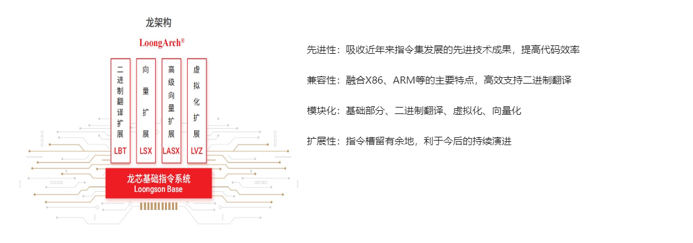

2020年，龙芯中科基于二十年的CPU研制和生态建设积累推出了龙架构（LoongArch™），包括基础架构部分和向量指令、虚拟化、二进制翻译等扩展部分，近2000条指令。

龙架构具有较好的自主性、先进性与兼容性。

龙架构从整个架构的顶层规划，到各部分的功能定义，再到细节上每条指令的编码、名称、含义，在架构上进行自主重新设计，具有充分的自主性。

龙架构摒弃了传统指令系统中部分不适应当前软硬件设计技术发展趋势的陈旧内容，吸纳了近年来指令系统设计领域诸多先进的技术发展成果。同原有兼容指令系统相比，不仅在硬件方面更易于高性能低功耗设计，而且在软件方面更易于编译优化和操作系统、虚拟机的开发。

龙架构在设计时充分考虑兼容生态需求，融合了各国际主流指令系统的主要功能特性，同时依托龙芯团队在二进制翻译方面十余年的技术积累创新，能够实现多种国际主流指令系统的高效二进制翻译。龙芯中科从 2020 年起新研的 CPU 均支持LoongArch™。

龙架构已得到国际开源软件界广泛认可与支持，正成为与X86/ARM并列的顶层开源生态系统。已向GNU组织申请到ELF Machine编号（258号），并获得Linux、Binutils、GDB、.NET、GCC、LLVM、Go、Chromium/V8、Mozilla / SpiderMonkey、Javascript、FFmpeg、libyuv、libvpx、OpenH264、SRS等音视频类软件社区、UEFI（UEFI规范、ACPI规范）以及国内龙蜥开源社区、欧拉openEuler开源社区的支持。

指令系统是软件生态的起点，只有从指令系统的根源上实现自主，才能打破软件生态发展受制于人的锁链。龙架构的推出，是龙芯中科长期坚持自主研发理念的重要成果体现，是全面转向生态建设历史关头的重大技术跨越。

## 2.1 寄存器

LoongArch的寄存器包括通用寄存器（GPRs）、浮点寄存器（FPRs）、向量寄存器（VRs） 和用于特权模式（PLV0）的控制状态寄存器（CSRs）。

### 2.1.1. 通用寄存器

LoongArch包括32个通用寄存器（ `$r0` ~ `$r31` ），LA32中每个寄存器为32位宽， LA64中每个寄存器为64位宽。 `$r0` 的内容总是固定为0，而其他寄存器在体系结构层面 没有特殊功能。（ `$r1` 算是一个例外，在BL指令中固定用作链接返回寄存器。）

内核使用了一套LoongArch寄存器约定，定义在LoongArch ELF psABI规范中。

| 寄存器名      | 别名        | 用途             | 跨调用保持 |
| :------------ | :---------- | :--------------- | :--------- |
| `$r0`         | `$zero`     | 常量0            | 不使用     |
| `$r1`         | `$ra`       | 返回地址         | 否         |
| `$r2`         | `$tp`       | TLS/线程信息指针 | 不使用     |
| `$r3`         | `$sp`       | 栈指针           | 是         |
| `$r4`-`$r11`  | `$a0`-`$a7` | 参数寄存器       | 否         |
| `$r4`-`$r5`   | `$v0`-`$v1` | 返回值           | 否         |
| `$r12`-`$r20` | `$t0`-`$t8` | 临时寄存器       | 否         |
| `$r21`        | `$u0`       | 每CPU变量基地址  | 不使用     |
| `$r22`        | `$fp`       | 帧指针           | 是         |
| `$r23`-`$r31` | `$s0`-`$s8` | 静态寄存器       | 是         |

Note

注意： `$r21` 寄存器在ELF psABI中保留未使用，但是在Linux内核用于保 存每CPU变量基地址。该寄存器没有ABI命名，不过在内核中称为 `$u0` 。在 一些遗留代码中有时可能见到 `$v0` 和 `$v1` ，它们是 `$a0` 和 `$a1` 的别名，属于已经废弃的用法。

### 2.1.2. 浮点寄存器

当系统中存在FPU时，LoongArch有32个浮点寄存器（ `$f0` ~ `$f31` ）。在LA64 的CPU核上，每个寄存器均为64位宽。

浮点寄存器的使用约定与LoongArch ELF psABI规范的描述相同：

| 寄存器名      | 别名           | 用途       | 跨调用保持 |
| :------------ | :------------- | :--------- | :--------- |
| `$f0`-`$f7`   | `$fa0`-`$fa7`  | 参数寄存器 | 否         |
| `$f0`-`$f1`   | `$fv0`-`$fv1`  | 返回值     | 否         |
| `$f8`-`$f23`  | `$ft0`-`$ft15` | 临时寄存器 | 否         |
| `$f24`-`$f31` | `$fs0`-`$fs7`  | 静态寄存器 | 是         |

Note

注意：在一些遗留代码中有时可能见到 `$fv0` 和 `$fv1` ，它们是 `$fa0` 和 `$fa1` 的别名，属于已经废弃的用法。临时寄存器也被称为调用者保存寄存器。 静态寄存器也被称为被调用者保存寄存器。

### 2.1.3. 向量寄存器

LoongArch现有两种向量扩展：

- 128位向量扩展LSX（全称Loongson SIMD eXtention），
- 256位向量扩展LASX（全称Loongson Advanced SIMD eXtention）。

LSX使用 `$v0` ~ `$v31` 向量寄存器，而LASX则使用 `$x0` ~ `$x31` 。

浮点寄存器和向量寄存器是复用的，比如：在一个实现了LSX和LASX的核上， `$x0` 的 低128位与 `$v0` 共用， `$v0` 的低64位与 `$f0` 共用，其他寄存器依此类推。

### 2.1.4. 控制状态寄存器

控制状态寄存器只能在特权模式（PLV0）下访问:

| 地址 | 全称描述               | 简称  |
| :--- | :--------------------- | :---- |
| 0x0  | 当前模式信息           | CRMD  |
| 0x1  | 异常前模式信息         | PRMD  |
| 0x2  | 扩展部件使能           | EUEN  |
| 0x3  | 杂项控制               | MISC  |
| 0x4  | 异常配置               | ECFG  |
| 0x5  | 异常状态               | ESTAT |
| 0x6  | 异常返回地址           | ERA   |
| 0x7  | 出错(Faulting)虚拟地址 | BADV  |
| 0x8  | 出错(Faulting)指令字   | BADI  |
| ……   | ……                     | ……    |

## 2.2. 基础指令集

### 2.2.1. 指令格式

LoongArch的指令字长为32位，一共有9种基本指令格式（以及一些变体）:

| 格式名称 | 指令构成                   |
| :------- | :------------------------- |
| 2R       | Opcode + Rj + Rd           |
| 3R       | Opcode + Rk + Rj + Rd      |
| 4R       | Opcode + Ra + Rk + Rj + Rd |
| 2RI8     | Opcode + I8 + Rj + Rd      |
| 2RI12    | Opcode + I12 + Rj + Rd     |
| 2RI14    | Opcode + I14 + Rj + Rd     |
| 2RI16    | Opcode + I16 + Rj + Rd     |
| 1RI21    | Opcode + I21L + Rj + I21H  |
| I26      | Opcode + I26L + I26H       |

Opcode是指令操作码，Rj和Rk是源操作数（寄存器），Rd是目标操作数（寄存器），Ra是 4R-type格式特有的附加操作数（寄存器）。I8/I12/I14/I16/I21/I26分别是8位/12位/14位/ 16位/21位/26位的立即数。其中较长的21位和26位立即数在指令字中被分割为高位部分与低位 部分，所以你们在这里的格式描述中能够看到I21L/I21H和I26L/I26H这样带后缀的表述。

### 2.2.2 指令列表

为了简便起见，我们在此只罗列一下指令名称（助记符）。

1. 算术运算指令:

   ```
   ADD.W SUB.W ADDI.W ADD.D SUB.D ADDI.D
   SLT SLTU SLTI SLTUI
   AND OR NOR XOR ANDN ORN ANDI ORI XORI
   MUL.W MULH.W MULH.WU DIV.W DIV.WU MOD.W MOD.WU
   MUL.D MULH.D MULH.DU DIV.D DIV.DU MOD.D MOD.DU
   PCADDI PCADDU12I PCADDU18I
   LU12I.W LU32I.D LU52I.D ADDU16I.D
   ```

2. 移位运算指令:

   ```
   SLL.W SRL.W SRA.W ROTR.W SLLI.W SRLI.W SRAI.W ROTRI.W
   SLL.D SRL.D SRA.D ROTR.D SLLI.D SRLI.D SRAI.D ROTRI.D
   ```

3. 位域操作指令:

   ```
   EXT.W.B EXT.W.H CLO.W CLO.D SLZ.W CLZ.D CTO.W CTO.D CTZ.W CTZ.D
   BYTEPICK.W BYTEPICK.D BSTRINS.W BSTRINS.D BSTRPICK.W BSTRPICK.D
   REVB.2H REVB.4H REVB.2W REVB.D REVH.2W REVH.D BITREV.4B BITREV.8B BITREV.W BITREV.D
   MASKEQZ MASKNEZ
   ```

4. 分支转移指令:

   ```
   BEQ BNE BLT BGE BLTU BGEU BEQZ BNEZ B BL JIRL
   ```

5. 访存读写指令:

   ```
   LD.B LD.BU LD.H LD.HU LD.W LD.WU LD.D ST.B ST.H ST.W ST.D
   LDX.B LDX.BU LDX.H LDX.HU LDX.W LDX.WU LDX.D STX.B STX.H STX.W STX.D
   LDPTR.W LDPTR.D STPTR.W STPTR.D
   PRELD PRELDX
   ```

6. 原子操作指令:

   ```
   LL.W SC.W LL.D SC.D
   AMSWAP.W AMSWAP.D AMADD.W AMADD.D AMAND.W AMAND.D AMOR.W AMOR.D AMXOR.W AMXOR.D
   AMMAX.W AMMAX.D AMMIN.W AMMIN.D
   ```

7. 栅障指令:

   ```
   IBAR DBAR
   ```

8. 特殊指令:

   ```
   SYSCALL BREAK CPUCFG NOP IDLE ERTN(ERET) DBCL(DBGCALL) RDTIMEL.W RDTIMEH.W RDTIME.D
   ASRTLE.D ASRTGT.D
   ```

9. 特权指令:

   ```
   CSRRD CSRWR CSRXCHG
   IOCSRRD.B IOCSRRD.H IOCSRRD.W IOCSRRD.D IOCSRWR.B IOCSRWR.H IOCSRWR.W IOCSRWR.D
   CACOP TLBP(TLBSRCH) TLBRD TLBWR TLBFILL TLBCLR TLBFLUSH INVTLB LDDIR LDPTE
   ```

## 2.3 虚拟内存

LoongArch可以使用直接映射虚拟内存和分页映射虚拟内存。

直接映射虚拟内存通过CSR.DMWn（n=0~3）来进行配置，虚拟地址（VA）和物理地址（PA） 之间有简单的映射关系:

```
VA = PA + 固定偏移
```

分页映射的虚拟地址（VA）和物理地址（PA）有任意的映射关系，这种关系记录在TLB和页 表中。LoongArch的TLB包括一个全相联的MTLB（Multiple Page Size TLB，多样页大小TLB） 和一个组相联的STLB（Single Page Size TLB，单一页大小TLB）。

缺省状态下，LA32的整个虚拟地址空间配置如下：

| 区段名     | 地址范围                  | 属性                     |
| :--------- | :------------------------ | :----------------------- |
| `UVRANGE`  | `0x00000000 - 0x7FFFFFFF` | 分页映射, 可缓存, PLV0~3 |
| `KPRANGE0` | `0x80000000 - 0x9FFFFFFF` | 直接映射, 非缓存, PLV0   |
| `KPRANGE1` | `0xA0000000 - 0xBFFFFFFF` | 直接映射, 可缓存, PLV0   |
| `KVRANGE`  | `0xC0000000 - 0xFFFFFFFF` | 分页映射, 可缓存, PLV0   |

用户态（PLV3）只能访问UVRANGE，对于直接映射的KPRANGE0和KPRANGE1，将虚拟地址的第 30~31位清零就等于物理地址。例如：物理地址0x00001000对应的非缓存直接映射虚拟地址 是0x80001000，而其可缓存直接映射虚拟地址是0xA0001000。

缺省状态下，LA64的整个虚拟地址空间配置如下：

| 区段名     | 地址范围                                  | 属性                            |
| :--------- | :---------------------------------------- | :------------------------------ |
| `XUVRANGE` | `0x0000000000000000 - 0x3FFFFFFFFFFFFFFF` | 分页映射, 可缓存, PLV0~3        |
| `XSPRANGE` | `0x4000000000000000 - 0x7FFFFFFFFFFFFFFF` | 直接映射, 可缓存 / 非缓存, PLV0 |
| `XKPRANGE` | `0x8000000000000000 - 0xBFFFFFFFFFFFFFFF` | 直接映射, 可缓存 / 非缓存, PLV0 |
| `XKVRANGE` | `0xC000000000000000 - 0xFFFFFFFFFFFFFFFF` | 分页映射, 可缓存, PLV0          |

用户态（PLV3）只能访问XUVRANGE，对于直接映射的XSPRANGE和XKPRANGE，将虚拟地址的第 60~63位清零就等于物理地址，而其缓存属性是通过虚拟地址的第60~61位配置的（0表示强序 非缓存，1表示一致可缓存，2表示弱序非缓存）。

目前，我们仅用XKPRANGE来进行直接映射，XSPRANGE保留给以后用。

此处给出一个直接映射的例子：物理地址0x00000000_00001000的强序非缓存直接映射虚拟地址 （在XKPRANGE中）是0x80000000_00001000，其一致可缓存直接映射虚拟地址（在XKPRANGE中） 是0x90000000_00001000，而其弱序非缓存直接映射虚拟地址（在XKPRANGE中）是0xA0000000_ 00001000。

# 3. 移植过程

先总的说一下移植过程中需要更改哪些平台相关的代码，按代码架构分章节介绍。

## 3.1 RUST的裸机环境配置

在默认情况下，Rust 尝试适配当前的系统环境，编译可执行程序。为了描述不同的环境，Rust 使 用一个称为目标三元组（target triple）的字符串。要查看当前系统的目标三元组，我们可以运行 rustc --version --verbose 。Rust 编译器尝试为当前系统的三元组编译，并假定底层有一个 类似于 Windows 或 Linux 的操作系统提供C语言运行环境——然而这将导致链接器错误。所以， 为了避免这个错误，需要另选一个底层没有操作系统的运行环境，这样的环境被称为裸机环境。 在 risc-v 平台上，rust原生就有支持相应的 riscv64gc-unknown-none-elf 裸机平台。但对于 loongArch64 平台来说，并没有相应的支持，目前只含有 loongarch64-unknown-linuxgnu``loongarch64-unknown-linux-musl 两个支持，而这个两个三元组都默认底层有linux系统支 持，因此想要编译裸机代码，就需要去掉标准库支持。 通常我们需要在项目根目录下创建 .cargo/config 文件，并写入相应的配置。在当前项目下的内 容如下: 

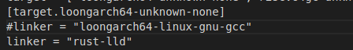

target 指定了编译的目标平台， linker 指定了所用的链接脚本，虽然这里指定了配置，但后续 介绍的 build.rs 会修改相关的规则才能编译裸机代码。 这里出现的一个问题是若像 rCore 官方一样在 config 文件指定链接脚本的话似乎并不会起作用， 需要 build.rs 的帮助。因此上面的 linker 命令也是多余命令 

**Rust的build.rs文件** 

在项目下存在一个build.rs文件。一些项目希望编译第三方的非 Rust 代码，例如 C 依赖库；一些 希望链接本地或者基于源码构建的 C 依赖库；还有一些项目需要功能性的工具，例如在构建之间 执行一些代码生成的工作等。对于这些目标，Cargo 提供了自定义构建脚本的方式，来帮助用户 更好的解决类似的问题。 

只需在项目的根目录下添加一个 build.rs 文件即可。这样一来， Cargo 就会先编译和执行该构 建脚本，然后再去构建整个项目。 

构建脚本如果会产出文件，那么这些文件需要放在统一的目录中，该目录可以通过 OUT_DIR 环境 变量来指定，构建脚本不应该修改该目录之外的任何文件！ 

构建脚本可以通过 println! 输出内容跟 Cargo 进行通信：Cargo 会将每一行带有 cargo: 前缀的输 出解析为一条指令，其它的输出内容会自动被忽略。

## 3.2 qemu平台支持

### 3.2.1 qemu介绍

QEMU （Quick Emulator）是业界主流的设备仿真模拟软件。可以在一种架构（如X86 PC）的物理机上运行支持其它架构的操作系统和程序，从而让软件无感知运行在不同硬件架构下。

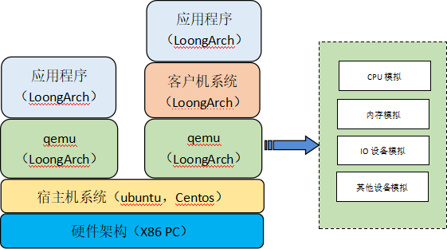

### 3.2.2 platform模块

**首先在axconfig中对计算机系统的硬件参数和属性进行配置**。在modules/axconfig/src/platform/qemu-virt-loongarch64.toml中描述如下：

```
# Architecture identifier.

arch = "loongarch64"

# Platform identifier.

platform = "qemu-virt-loongarch64"

# Base address of the whole physical memory.

phys-memory-base = "0x1be0_0000"

# Size of the whole physical memory.

phys-memory-size = "0x800_0000"     # 128M

# Base physical address of the kernel image.

kernel-base-paddr = "0x1c00_0000"

# Base virtual address of the kernel image.

kernel-base-vaddr = "0x8000_0000_1c00_0000"

# Linear mapping offset, for quick conversions between physical and virtual

# addresses.

phys-virt-offset = "0x8000_0000_0000_0000"

# MMIO regions with format (`base_paddr`, `size`).

mmio-regions = [
    ["0xfec0_0000", "0x1000"],      # IO APIC
    ["0xfed0_0000", "0x1000"],      # HPET
    ["0xfee0_0000", "0x1000"],      # Local APIC
]

# VirtIO MMIO regions with format (`base_paddr`, `size`).

virtio-mmio-regions = []

# Timer interrupt frequency in Hz.

timer_frequency = "10_000_000"      # 10MHz
```

- `arch = "loongarch64"`：指定了计算机系统的体系结构标识为 "loongarch64"。
- `platform = "qemu-virt-loongarch64"`：指定了计算机系统的平台标识为 "qemu-virt-loongarch64"。
- `phys-memory-base = "0x1be0_0000"`：指定了整个物理内存的基地址为 0x1be0_0000。
- `phys-memory-size = "0x800_0000"`：指定了整个物理内存的大小为 0x800_0000，即 128M。
- `kernel-base-paddr = "0x1c00_0000"`：指定了内核镜像的基础物理地址为 0x1c00_0000。
- `kernel-base-vaddr = "0x8000_0000_1c00_0000"`：指定了内核镜像的基础虚拟地址为 0x8000_0000_1c00_0000。
- `phys-virt-offset = "0x8000_0000_0000_0000"`：指定了线性映射偏移量，用于在物理地址和虚拟地址之间进行快速转换。
- `mmio-regions`：定义了一些 MMIO（内存映射输入/输出）区域，每个区域由基地址和大小组成。在这个例子中，有三个 MMIO 区域：IO APIC、HPET 和 Local APIC。
- `virtio-mmio-regions`：定义了一些 VirtIO MMIO 区域，但在这个例子中是空的。
- `timer_frequency = "10_000_000"`：指定了计时器中断的频率为 10,000,000 Hz，即 10MHz。

这些配置参数在构建和配置计算机系统时使用， QEMU模拟特定硬件平台时需要进行这些配置参数进行初始化。不同的硬件平台和体系结构可能会有不同的配置参数。

**接下来是在modules/axhal/src/platform/qemu_virt_loongarch64文件夹中具体配置qemu平台**，文件夹内容如下：


其中，

1、**boot.rs**中定义了一个启动程序的入口点函数 `_start()`，其中包含了一些汇编代码块。该代码的目的是在启动程序的入口点进行一些底层设置和初始化操作，然后将控制权转移到 Rust 代码

2、**apic.rs**主要作用是初始化中断相关的硬件（local APIC 和 I/O APIC）以及提供一些中断处理相关的函数。其中使用了一些外部的模块和结构体来完成相应的功能。

一个典型的 PIC 中断由下述步骤完成：①PIC 控制器向系统发送 PIC 中断请求；②系统向 PIC 控制器发送中断向量查询；③PIC 控制器向系统发送中断向量号；④系统清除 PIC 控制器上的对应中断。只有上述 4 步都完成后，PIC 控制器才会对系统发出下一个中断。对于龙芯 3A5000 HyperTransport 控制器，将自动进行前 3 步的处理，并将 PIC 中断向量写入256 个中断向量中的对应位置。而软件系统在处理了该中断之后，需要进行第 4 步处理，即向 PIC 控制器发出清中断。之后开始下一个中断的处理过程。

PIC 只用于单处理器，对于如今的多核多处理器时代，PIC 无能为力，所以出现了更高级的中断控制器 APIC，**APIC 分成两部分 LAPIC 和 IOAPIC，前者 LAPIC 位于 CPU 内部，每个 CPU 都有一个 LAPIC，后者 IOAPIC 与外设相连**。外设发出的中断信号经过 IOAPIC 处理之后发送某个或多个 LAPIC，再由 LAPIC 决定是否交由 CPU 进行实际的中断处理。

3、**console.rs**实现了一个基于 UART 16550 的串口通信模块。这段代码实现了对 UART 16550 的基本操作，包括初始化、发送和接收数据等功能。它提供了向控制台输出和从控制台读取数据的接口，并使用自旋锁来确保多线程环境下的互斥访问。

4、**irq.rs**实现了对外部中断（IRQ）的处理，其中涉及到了 PLIC（Platform-Level Interrupt Controller）。它提供了注册中断处理程序、启用或禁用中断、调度中断等功能。其中，定时器中断使用了懒初始化的方式进行处理。此外，代码中还涉及到了中断使能的设置和对 PLIC 的操作（TODO 注释部分），但具体的 PLIC 操作实现并未提供，后续需要补充。

5、**mem.rs**代码中，主要关注的是 `memory_region_at` 函数。在函数中，首先使用 `core::cmp::Ordering` 比较索引与 `common_memory_regions_num()` 的大小关系。如果索引小于 `common_memory_regions_num()`，则调用 `common_memory_region_at(idx)` 函数获取相应的物理内存区域信息。如果索引等于 `common_memory_regions_num()`，则表示是自定义的物理内存区域，使用 `extern "C"` 定义的 `ekernel` 符号获取起始地址，并根据 `axconfig::PHYS_MEMORY_END` 定义的结束地址创建一个自由内存区域。最后，根据获取到的起始地址、大小、标志和名称创建一个 `MemRegion` 结构，并返回该结构。总结起来，这段代码提供了获取物理内存区域数量以及根据索引获取对应物理内存区域的功能。其中，除了预定义的物理内存区域外，还提供了一个自由内存区域，该区域的起始地址由 `ekernel` 符号给出，结束地址由 `axconfig::PHYS_MEMORY_END` 定义。

6、**misc.rs**创建了一个无限循环，以模拟系统的关闭，并通过不可达代码来表示系统应该已经关闭。在实际应用中，可能会在循环中执行一些系统关闭的操作，例如发送关闭信号、保存状态等，然后才陷入无限循环状态。这里的代码仅仅是一个示例，实际的系统关闭逻辑需要根据具体的需求来实现。

7、**mod.rs**定义了一个模块与平台初始化相关的函数和外部函数，并导入了其他模块 `boot`、`console`、`mem`、`misc` 和 `time`。还定义了一个外部函数 `trap_vector_base`、`rust_main` 和 `rust_main_secondary`（如果启用了 "smp" 特性）。

8、**mp.rs**定义了一个函数 `start_secondary_cpu`，用于启动给定的次要 CPU，并设置它的引导栈。

9、**time.rs**定义了与定时器相关的函数和常量，并提供了一些辅助函数来进行时钟周期和纳秒数的转换。同时，还定义了平台初始化相关的函数，用于设置定时器和进行校准等工作。具体的实现需要在其他地方提供。

**最后，在modules/axhal/src/platform/mod.rs中使用`cfg_if`宏**，该宏可以根据条件选择执行不同的代码块。

```
if #[cfg(all(
        target_arch = "loongarch64",
        feature = "platform-qemu-virt-loongarch64"
    ))] {
        mod qemu_virt_loongarch64;
        pub use self::qemu_virt_loongarch64::*;
    }
```

通过加入`#[cfg(all(target_arch = "loongarch64", feature = "platform-qemu-virt-loongarch64"))]`判断是否满足目标架构为"loongarch64"并且启用了"platform-qemu-virt-loongarch64"特性的条件。如果满足条件，就引入了名为`qemu_virt_loongarch64`的模块，并将其公开作为公共接口。

## 3.3 寄存器设计

在 `risc-v` 和 `x86` 平台，rust有对应的库支持，里面包含各种寄存器操作或者IO操作的抽象， 而对 `loongarch` 平台的支持的库少之又少，在前面的实验中虽然对loongarch的部分寄存器也进行 了抽象，但使用起来仍然比较不方便，因此在开始这一章的实验前，需要对loongarch平台上的相关寄存器添加支持，类似于建立一个crate，方便后面的代码对寄存器进行操作。

loongarch下的控制状态寄存器包含如下：

| 地址              | 全称描述                        | 简称      |
| :---------------- | :------------------------------ | :-------- |
| 0x0               | 当前模式信息                    | CRMD      |
| 0x1               | 异常前模式信息                  | PRMD      |
| 0x2               | 扩展部件使能                    | EUEN      |
| 0x3               | 杂项控制                        | MISC      |
| 0x4               | 异常配置                        | ECFG      |
| 0x5               | 异常状态                        | ESTAT     |
| 0x6               | 异常返回地址                    | ERA       |
| 0x7               | 出错(Faulting)虚拟地址          | BADV      |
| 0x8               | 出错(Faulting)指令字            | BADI      |
| 0xC               | 异常入口地址                    | EENTRY    |
| 0x10              | TLB索引                         | TLBIDX    |
| 0x11              | TLB表项高位                     | TLBEHI    |
| 0x12              | TLB表项低位0                    | TLBELO0   |
| 0x13              | TLB表项低位1                    | TLBELO1   |
| 0x18              | 地址空间标识符                  | ASID      |
| 0x19              | 低半地址空间页全局目录基址      | PGDL      |
| 0x1A              | 高半地址空间页全局目录基址      | PGDH      |
| 0x1B              | 页全局目录基址                  | PGD       |
| 0x1C              | 页表遍历控制低半部分            | PWCL      |
| 0x1D              | 页表遍历控制高半部分            | PWCH      |
| 0x1E              | STLB页大小                      | STLBPS    |
| 0x1F              | 缩减虚地址配置                  | RVACFG    |
| 0x20              | CPU编号                         | CPUID     |
| 0x21              | 特权资源配置信息1               | PRCFG1    |
| 0x22              | 特权资源配置信息2               | PRCFG2    |
| 0x23              | 特权资源配置信息3               | PRCFG3    |
| 0x30+n (0≤n≤15)   | 数据保存寄存器                  | SAVEn     |
| 0x40              | 定时器编号                      | TID       |
| 0x41              | 定时器配置                      | TCFG      |
| 0x42              | 定时器值                        | TVAL      |
| 0x43              | 计时器补偿                      | CNTC      |
| 0x44              | 定时器中断清除                  | TICLR     |
| 0x60              | LLBit相关控制                   | LLBCTL    |
| 0x80              | 实现相关控制1                   | IMPCTL1   |
| 0x81              | 实现相关控制2                   | IMPCTL2   |
| 0x88              | TLB重填异常入口地址             | TLBRENTRY |
| 0x89              | TLB重填异常出错(Faulting)虚地址 | TLBRBADV  |
| 0x8A              | TLB重填异常返回地址             | TLBRERA   |
| 0x8B              | TLB重填异常数据保存             | TLBRSAVE  |
| 0x8C              | TLB重填异常表项低位0            | TLBRELO0  |
| 0x8D              | TLB重填异常表项低位1            | TLBRELO1  |
| 0x8E              | TLB重填异常表项高位             | TLBEHI    |
| 0x8F              | TLB重填异常前模式信息           | TLBRPRMD  |
| 0x90              | 机器错误控制                    | MERRCTL   |
| 0x91              | 机器错误信息1                   | MERRINFO1 |
| 0x92              | 机器错误信息2                   | MERRINFO2 |
| 0x93              | 机器错误异常入口地址            | MERRENTRY |
| 0x94              | 机器错误异常返回地址            | MERRERA   |
| 0x95              | 机器错误异常数据保存            | MERRSAVE  |
| 0x98              | 高速缓存标签                    | CTAG      |
| 0x180+n (0≤n≤3)   | 直接映射配置窗口n               | DMWn      |
| 0x200+2n (0≤n≤31) | 性能监测配置n                   | PMCFGn    |
| 0x201+2n (0≤n≤31) | 性能监测计数器n                 | PMCNTn    |
| 0x300             | 内存读写监视点整体控制          | MWPC      |
| 0x301             | 内存读写监视点整体状态          | MWPS      |
| 0x310+8n (0≤n≤7)  | 内存读写监视点n配置1            | MWPnCFG1  |
| 0x311+8n (0≤n≤7)  | 内存读写监视点n配置2            | MWPnCFG2  |
| 0x312+8n (0≤n≤7)  | 内存读写监视点n配置3            | MWPnCFG3  |
| 0x313+8n (0≤n≤7)  | 内存读写监视点n配置4            | MWPnCFG4  |
| 0x380             | 取指监视点整体控制              | FWPC      |
| 0x381             | 取指监视点整体状态              | FWPS      |
| 0x390+8n (0≤n≤7)  | 取指监视点n配置1                | FWPnCFG1  |
| 0x391+8n (0≤n≤7)  | 取指监视点n配置2                | FWPnCFG2  |
| 0x392+8n (0≤n≤7)  | 取指监视点n配置3                | FWPnCFG3  |
| 0x393+8n (0≤n≤7)  | 取指监视点n配置4                | FWPnCFG4  |
| 0x500             | 调试寄存器                      | DBG       |
| 0x501             | 调试异常返回地址                | DERA      |
| 0x502             | 调试数据保存                    | DSAVE     |

这些寄存器各个位上的含义各不相同，并且同一个寄存器各个位的读取属性也不一样，具体的读 写属性有四种:

1.  RW——软件可读、可写。除在定义中明确指出的会导致处理器执行结果不确定的非法值， 软件可 以写入任意值。通常情况下，软件对这些域进行先写后读的操作，读出的应该是写入 的值。但是， 当所访问的域可以被硬件更新时，或者执行读、写操作的两条指令之间有中断 发生，则有可能出 现读出值与写入值不一致的情况。
2.  R——软件只读。软件写这些域不会更新其内容，且不产生其它任何副作用
3.  R0——软件读取这些域永远返回 0。但是同时软件必须保证，要么通过设置 CSR 写屏蔽位避 免更新 这些域，要么在更新这些域时必须要写入 0 值。这一要求是为了确保软件向后兼容。 对于硬件实 现来说，标记这种属性的域将禁止软件写入。 
4.  W1——软件写 1 有效。软件对这些域写 0 不会将其清 0，且不产生其它任何副作用。同 时，定义为 该属性的域的读出值没有任何软件意义，软件应该无视这些读出值。 

所有控制状态寄存器的位宽，或者固定为 32 位，或者与所实现的是 LA32 还是 LA64 相关。对于 第一种 类别的寄存器，其在 LA64 架构下被 CSR 指令访问时，读返回的是符号扩展至 64 位后的 值，写的时候高 32 位的值自动被硬件忽略。对于第二种类型，定义将明确指出 LA32 和 LA64 架 构下的差异.当软件使用 CSR 指令访问的 CSR 对象是架构规范中未定义的，或者是架构规范中定义 的可实现项但是具体硬件未实现的，此时读动作返回的可以是任意值，但写动作不应改变软件可 见的处理器状态。 通常，对所有可用的寄存器都会实现 Register trait,其定义如下：

```
pub trait Register {
	fn read() -> Self;
	fn write(&mut self);
}
```

因此，如果想要写一个寄存器必须将其先读出，虽然这可能带来一定的性能损失，因为可能有人 会选择直接设置寄存器的值，但经过思考，大部分控制状态寄存器的值是不会被修改的，只有某些位的值需要我们修改，因此可以在读出其值的情况下再去设置某个位，这样一来就避免了手动查看寄存器各个位的默认值然后再设置整个值带来的复杂性，因此这里选择了这种读出写入的模 式。 比如CRMD寄存器各个位的定义如下:

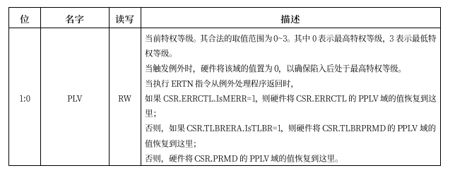

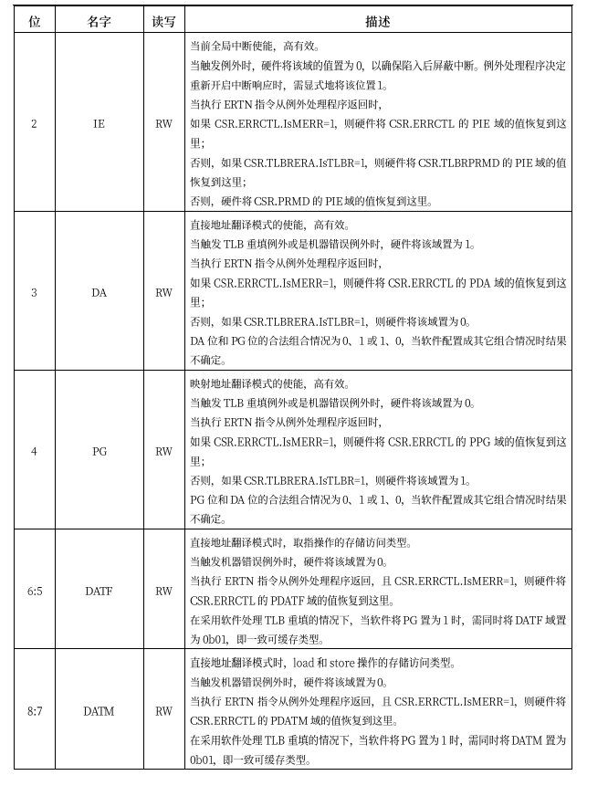

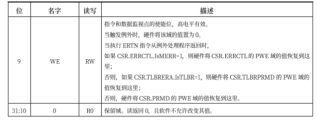

这里给出实验中实现完成的针对CRMD的寄存器如下：

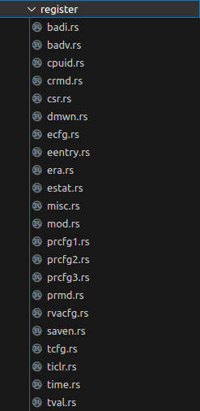

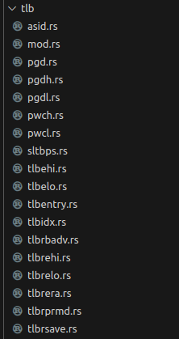


loonarch定义了一个CPUCFG指令，用于软件在执行过程中动态识别所运行的处理器中实现了龙芯架构中的哪些功能特性。这些指令系统功能特性的实现情况记录在一系列配置信息字中， CPUCFG 指令执行一次可以读取一个配置信息字。 配置信息字中包含一系列配置位（域），其记录形式为 CPUCFG.<配置字号>.<配置信息助记名称> [位下 标]，其中单比特配置位的位下标记为 bitXX，表示配置字的第 XX 位；多比特的配置域的位 下标记为 bitXX:YY，表示配置字的第 XX 位到第 YY 位的连续(XX-YY+1)位。例如，1 号配置字中的 第 0 位用以表示是否实现 LA32架构，将这个配置信息记录为 CPUCFG.1.LA32[bit0]，其中 1 表示 配置信息字的字号是 1 号，LA32 表示这个配置信息域所起的助记名称叫做 LA32，bit0 表示 LA32 这个域位于配置字的第 0 位。1 号配置字中第 11位到第 4 位的记录所支持物理地址位数的 PALEN 域则记为 CPUCFG.1.PALEN[bit11:4] 配置字包含的信息很多，可以查看提供的文档了解各个配置字含义，这里给出第1，2个配置字各 位的含义，在本章节中，只实现了几个暂时需要使用的配置字。

## 3.4 中断以及上下文实现

### 中断

LoongArch 指令系统支持中断线的中断传递机制，共定义了 13 个中断，分别是：1 个核间中断 （IPI），1个定时器中断（TI），1个性能监测计数溢出中断（PMI），8个外部硬中断 （HWI0~HWI7），2个软 中断（SWI0~SWI1）。其中所有中断线上的中断信号都采用电平中断， 且都是高电平有效。当有中断发生时，这种高电平有效中断方式输入给处理器的中断线上将维持 高电平状态直至中断被处理器响应处理。无论中断源来自处理器核外部还是内部，是硬件还是软 件置位，这些中断信号都被不间断地采样并记录到 CSR.ESTAT 中 IS 域的对应比特位上。这些中断 均为可屏蔽中断，除了 CSR.CRMD中的全局中断使能位 IE 外，每个中断各自还有其局部中断使能 控制位，在 CSR.ECFG 的 LIE 域中。当CSR.ESTAT 中 IS 域的某位为 1 且对应的局部中断使能和全 局中断使能均有效时，处理器就将响应该中断，并进入中断处理程序入口处开始执行。 在支持多个中断源输入的指令系统中，需要规范在多个中断同时触发的情况下，处理器是否区别 不同来源的中断的优先级。当采用非向量中断模式的时候，处理器通常不区别中断优先级，此时 若需要对中断进行优先级处理，可以通过软件方式予以实现，其通常的实现方案是： 

1. 软件随时维护一个中断优先级（IPL），每个中断源都被赋予特定的优先级。
2. 正常状态下，CPU 运行在最低优先级，此时任何中断都可触发。
3. 当处于最高中断优先级时，任何中断都被禁止。
4. 更高优先级的中断发生时，可以抢占低优先级的中断处理过程。

当采用向量中断模式的时候，处理器通常不可避免地需要依照一套既定的优先级规则来从多个已 生效的中断源中选择一个，跳转到其对应的处理程序入口处。LoongArch 指令系统实现的是向量 中断，采用固定优先级仲裁机制，具体规则是硬件中断号越大优先级越高，即 IPI 的优先级最高， TI 次之，⋯，SWI0 的优先级最低。

#### 实现中断可能需要以下寄存器

##### ECFG例外配置寄存器

该寄存器用于控制例外和中断的入口计算方式以及各中断的局部使能位。

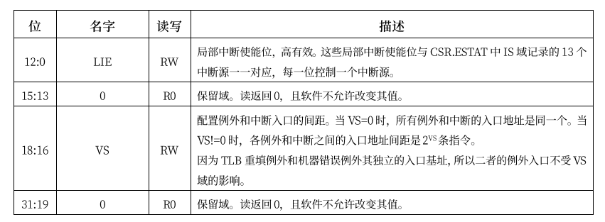

##### ESTAT例外状态寄存器

该寄存器记录例外的状态信息，包括所触发例外的一二级编码，以及各中断的状态。

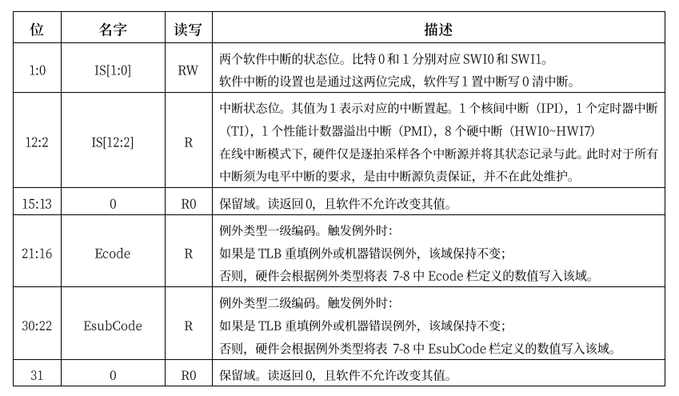

##### LoogArch寄存器

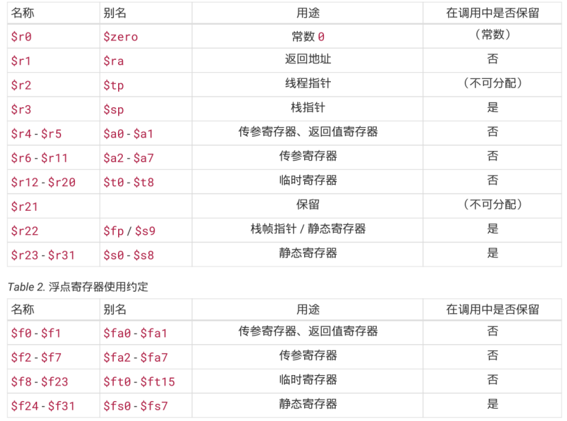

主要实现了两个功能处理任务上下文的结构体和方法，以及处理陷阱的结构体和方法。在这两个方法的基础上通过操作通用寄存器、控制寄存器、TLB等，就可以实现中断处理、页表管理等功能。实现这两个部分使用LoongArch64架构的指令集和寄存器来实现各种操作，下面介绍这两个部分。

```
#[macro_use]
//mod macros;

mod context;
mod trap;

use core::arch::asm;
use loongarch64::asm;
use loongarch64::register::{crmd::Crmd, csr::Register, eentry::Eentry};
use loongarch64::tlb::{Pgd, Pgdl};
use memory_addr::{PhysAddr, VirtAddr};

//pub use self::context::{GeneralRegisters, TaskContext, TrapFrame};

/// Allows the current CPU to respond to interrupts.
#[inline]
pub fn enable_irqs() {
    unsafe { Crmd::read().set_ie(true).write() }
}

/// Makes the current CPU to ignore interrupts.
#[inline]
pub fn disable_irqs() {
    unsafe { Crmd::read().set_ie(false).write() }
}

/// Returns whether the current CPU is allowed to respond to interrupts.
#[inline]
pub fn irqs_enabled() -> bool {
    Crmd::read().get_ie()
}

/// Relaxes the current CPU and waits for interrupts.
///
/// It must be called with interrupts enabled, otherwise it will never return.
#[inline]
pub fn wait_for_irqs() {
    unsafe { asm::wfi() }
}

/// Halt the current CPU.
#[inline]
pub fn halt() {
    disable_irqs();
    unsafe { asm::wfi() } // should never return
}

/// Reads the register that stores the current page table root.
///
/// Returns the physical address of the page table root.
#[inline]
pub fn read_page_table_root() -> PhysAddr {
    PhysAddr::from(Pgd::read().pgd)
}

/// Writes the register to update the current page table root.
///
/// # Safety
///
/// This function is unsafe as it changes the virtual memory address space.
pub unsafe fn write_page_table_root(root_paddr: PhysAddr) {
    let old_root = read_page_table_root();
    trace!("set page table root: {:#x} => {:#x}", old_root, root_paddr);
    if old_root != root_paddr {
        Pgdl::read().set_val(root_paddr.into()).write(); //设置新的页基址
    }
}

/// Flushes the TLB.
///
/// If `vaddr` is [`None`], flushes the entire TLB. Otherwise, flushes the TLB
/// entry that maps the given virtual address.
#[inline]
pub fn flush_tlb(vaddr: Option<VirtAddr>) {
    unsafe {
        if let Some(vaddr) = vaddr {
            asm!("invtlb 0x6,$r0,{}", in(reg) vaddr.as_usize());
        } else {
            asm!("invtlb 0,$r0,$r0");
        }
    }
}

/// Writes Supervisor Trap Vector Base Address Register (`stvec`).
#[inline]
pub fn set_trap_vector_base(eentry: usize) {
    Eentry::read().set_eentry(eentry).write();
}

```

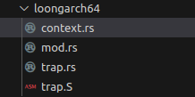

### context

该模块包含与任务上下文相关的结构体和方法。

### trap

该模块包含与陷阱处理相关的结构体和方法。

`enable_irqs()` 允许当前CPU响应中断。

`disable_irqs()` 使当前CPU忽略中断。

`irqs_enabled() -> bool`返回当前CPU是否允许响应中断。

`wait_for_irqs()`使当前CPU处于休眠状态，等待中断。

**注意**：必须在允许中断的情况下调用此函数，否则它将永远不会返回。

`halt()`使当前CPU停止执行。

`read_page_table_root() -> PhysAddr`读取存储当前页表根的寄存器。返回页表根的物理地址。

`unsafe fn write_page_table_root(root_paddr: PhysAddr)`写入寄存器更新当前页表根，函数具有不安全性，因为它会更改虚拟内存地址空间。

`flush_tlb(vaddr: Option<VirtAddr>)`刷新TLB（转换查找缓冲器），如果`vaddr`为[`None`]，则刷新整个TLB。否则刷新映射给定虚拟地址的TLB条目。

`set_trap_vector_base(eentry: usize)`写入Supervisor Trap Vector Base Address Register（`stvec`）。

- 实现任务上下文的保存和切换。
- 实现中断处理相关的函数，包括允许/禁止中断、等待中断等。
- 实现页表管理相关的函数，包括读取/写入页表根、刷新TLB等。
- 实现陷阱处理相关的函数，包括设置陷阱向量基址等。

## 4. 未来工作

简述目前完全了哪些模块，还有哪些待完成（也可以不写，让它自己猜我们完成了哪些）