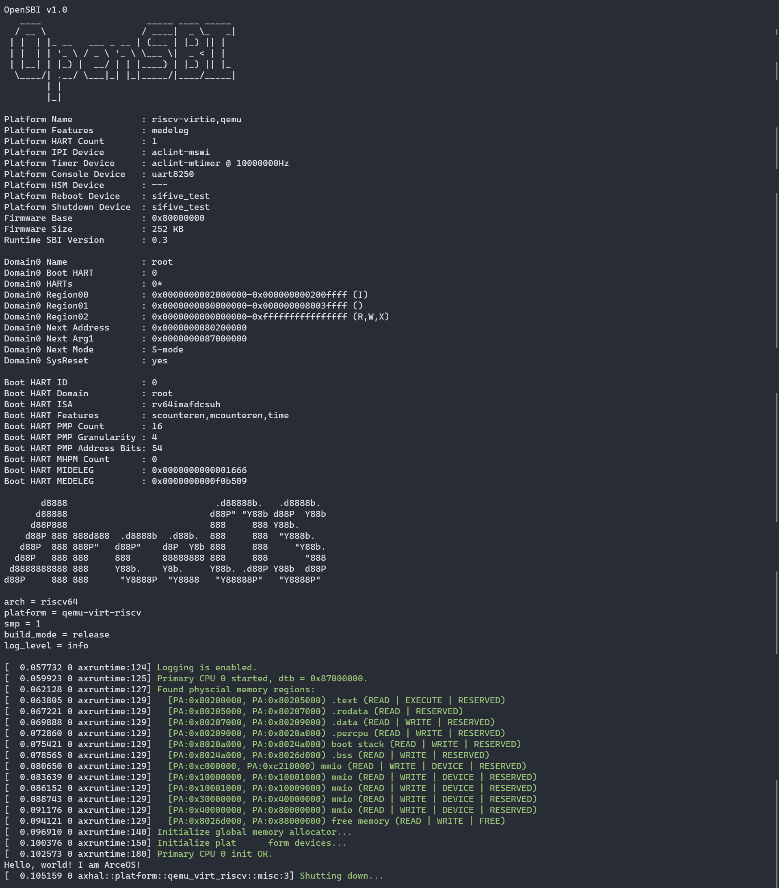

# ArceOS for LoongArch

## 1 项目简介

本文档作为ArceOS的LoongArch版本介绍，对于硬件无关的内容，本文档只会介绍一些抽象细节和思路。文档组织结构为，第一章对ArceOS和LoongArch做一个简单介绍并提供一个在Ubuntu下搭建一个LoongArch的交叉编译环境的方法（可参考https://github.com/aoooos）。后续章节将对应于ArceOS的各个功能模块。

### 1.1 ArceOS介绍

#### 1.1.1 Unikernel 基本概念

**操作系统内核架构**

操作系统内核是计算机系统的核心，负责管理硬件资源，包括处理器、内存、磁盘存储等，并为运行在操作系统上的应用程序提供一组接口（系统调用）来访问这些资源。操作系统内核架构是指操作系统内核设计和实现的方式。以下是几种常见的操作系统内核架构：

1. **宏内核（Monolithic Kernel）：** 宏内核将操作系统的所有服务，如设备驱动、文件系统、网络协议栈和进程调度等都集成在一个大的内核中，运行在内核空间。这种设计使得各个模块可以直接相互通信，因此性能较好。然而，宏内核的缺点是任何一个故障都可能导致整个系统崩溃。另外，由于所有模块都紧密耦合在一起，修改或添加功能也比较困难。Linux和UNIX就是采用宏内核设计的例子。
2. **微内核（Microkernel）：** 微内核只保留最基本的、必要的服务在内核空间，如进程间通信、内存管理和基本的I/O操作等，其他高级服务例如设备驱动、文件系统等都运行在用户空间。这样的设计使得系统更加稳定，因为即使一个服务出现故障也不会影响到整个系统，同时也使得系统更易于维护和扩展。但在性能方面，由于需要频繁地进行用户空间与内核空间之间的上下文切换，微内核的性能通常低于宏内核。Minix和QNX是采用微内核设计的例子。
3. **混合内核（Hybrid Kernel）：** 混合内核是试图结合宏内核和微内核的优点的一种设计方式。它尽量将更多的服务放入内核空间执行以提高性能，同时也尽可能地减少模块之间的依赖以增强稳定性。Windows NT和MacOS X的XNU内核都是混合内核的例子。
4. **外核（Exokernel）：** 外核将传统内核的抽象层次降低，允许应用程序直接管理硬件资源，从而提高效率。在外核架构中，内核仅负责确保资源的安全共享，而具体的资源管理策略则交给应用程序自己去确定。
5. **单内核（Unikernel）：** 单内核是一种新兴的内核架构，它将应用程序和内核捆绑在一起形成一个单一的可执行映像，该映像可以直接运行在虚拟机或裸机上。单内核适用于云计算和物联网环境，它的优点是体积小，启动快，但对开发者的编程要求较高。

**单内核（Unikernel）架构**

单内核（Unikernel）架构有如下特点:

1. 单一镜像：将应用程序代码与操作系统核心功能合并到一个单一的可执行镜像中。这个镜像包含了应用程序所需的所有组件，包括网络协议、文件系统和设备驱动等。因此，每个 Unikernel 实例都是一个独立的、自包含的单元。
2. 定制性：根据应用程序的需求进行定制，只包含必要的组件和库。这种定制性减少了不必要的功能和复杂性，在资源受限的环境下更加高效。
3. 轻量级：相比传统操作系统，内存占用更小，启动时间更短。由于只包含必要的组件，它可以更好地适应嵌入式系统、虚拟化环境和云计算平台等资源受限的场景。
4. 性能效率：通过减少不必要的软件层和系统调用，减少了性能开销，使得应用程序可以更高效地运行。

总的来说，Unikernel 是一种精简、定制化的操作系统构建技术，旨在提供更高的性能、更低的资源消耗和更强的安全性。它适用于各种场景，包括嵌入式系统、云计算平台和容器化环境等。

为了更好的理解Unikernel，我们对 Unikernel（单一内核）、 Micro Kernel（微内核）、Monolithic Kernel（宏内核）进行对比。

|          | Unikernel（单一内核）                                                                    | Micro Kernel（微内核）                                                                                                   | Monolithic Kernel（宏内核）                                                                    |
| -------- | ---------------------------------------------------------------------------------------- | ------------------------------------------------------------------------------------------------------------------------ | ---------------------------------------------------------------------------------------------- |
| 架构     | 将应用程序、操作系统内核、必要的组件紧密集成在一起，以创建一个高度定制化和最小化的镜像。 | 采用模块化设计，将操作系统的核心功能最小化，额外的功能和服务实现为用户空间的服务模块。                                   | 将各种功能和服务集成到一个单体内核中，如进程管理、内存管理、文件系统、网络协议栈等。           |
| 功能分配 | 包含应用程序所需的最小化操作系统功能和库。                                               | 包含基本的操作系统功能，如进程管理、内存管理和进程间通信，而其他功能如文件系统、网络协议栈等被实现为用户空间的服务模块。 | 包含大量的功能和服务，这些功能和服务直接运行在内核空间，具有较高的集成性和内核级别的访问权限。 |
| 性能     | 镜像小，启动速度快，没有额外的组件和系统调用，具有更高的性能和较低的资源消耗。           | 将功能模块化并移至用户空间，其性能相对较低。模块之间需要进行消息传递和系统调用，会引入额外的开销。                       | 内核和服务的紧密集成，有较高的性能                                                             |
| 特权级   | 同一地址空间同一特权级。                                                                 | 只有进程管理和进程间通信在内核态                                                                                         | 所有硬件操作在内核态                                                                           |
| 代表系统 | ArceOS、Unikraft、MirageOS、IncludeOS                                                    | QNX、MINIX、L4微内核系列                                                                                                 | Linux、Windows                                                                                 |


#### 1.1.2 ArceOS设计原则和思路

**ArceOS要解决的问题**

**性能问题**

传统宏内核架构和微内核架构的操作系统在性能上有一些可以优化的地方，但在具体实施上又很难做到。

- 如果OS信任APP，那么没有必要建立特权级隔离，这样可以减少特权级上下文切换和不同特权级间数据拷贝的性能开销
- 如果支持单应用，那么多个地址空间在单个应用程序域中的用处不大，反而会带来性能开销
- 如果支持功能有限的应用，那么与此无关的的内核功能模块也是没有必要的，这样可以减少内核的体积，减少内核启动时间
- 传统操作系统通用性的设计会引入不必要的开销，如虚拟文件系统的通用表示对于网络应用引入了不必要的过长执行路径
- 对于不同应用的需求可以采用不同的内核功能模块，如不同的内存分配算法/调度算法等，以提高整体性能

**安全问题**

ArceOS采用了一系列的新技术来解决传统操作系统的安全问题。

- 采用Rust语言开发内核和应用
- 对于Rust应用，尽量避免采用unsafe code进行编码
- 对于C/C++应用，可以与OS一起整体隔离在一个虚拟机中执行
- 采用单应用的架构，避免了不同应用之间的相互干扰

**生态问题**

ArceOS在架构设计上，虽然目前的重点是基于Unikernel架构，但也通过一系列的架构设计，支持宏内核和微内核架构。

- 在现有unikernel架构上进行扩展，支持宏内核或微内核架构
- 通过支持Linux ABI，形成libc，支持Linux应用
- 通过支持Linux Syscall，直接支持Linux应用运行
- 通过支持Rust std库，直接支持Rust应用运行

**开发问题**

操作系统开发一直是一个比较困难的事情，实际情况是操作系统（如Linux）随着时间的发展越来越庞大臃肿，难以维护和开发。将来的操作系统可能不是像现在统治世界的 Linux、Windows 那样庞大而通用，而是各种可以迅速组合形成的，并且功能丰富多彩的组件化定制操作系统，能够快速适配未来多种多样的处理器、加速器、外设和应用需求，在开发的便捷性、性能和安全性等方面优于已有的通用操作系统。但如何设计组件化定制操作系统是一个需要深入思考的挑战性问题。为此ArceOS的开发者们一直在思考能否通过基于泛型的独立功能组件来快速构建各种领域专用的OS。

开发操作系统的痛点是开发者编写操作系统软件很繁琐，需要关注的细节太多。其根本原因是操作系统内部模块广泛的相互依赖带来的软件复杂性，以及操作系统的自包含性带来的软件不可重用性。应把操作系统看出是一个多层次的软件栈，分析操作系统中各个功能的层次划分，各个功能模块具有独立性，从而形成面向操作系统的层次化软件开发方法。

**ArceOS的设计原则**

操作系统开发者希望能够快速创建一个面向特定领域的操作系统内核，且对于每个应用程序，能确保最佳性能、高安全和高可靠的需求，同时能轻松移植现有的应用程序。为此，需要建立如下一些设计原则：

- 单体执行：应用与内核形成一个整体，运行在裸机或虚拟机上。
- 单地址空间：主要针对单个应用程序方案，不同的应用程序通过共享内存或网络通信交互。
- 单保护域：应用程序与内核运行在同一特权级，应用程序可以直接访问内核的数据结构和硬件资源。
- 与OS无关的内核功能组件：形成广泛的内核功能组件，可在没有OS的情况下独立运行和测试。
- 与硬件无关的内核功能组件：形成广泛的内核功能组件，可在不同的硬件平台上运行。
- 支持Linux ABI：支持Linux应用程序运行。
- 支持Rust std库：支持Rust应用程序运行。
- 架构可扩展：除了单体内核架构，也可扩展为微内核架构和宏内核架构。

简而言之，ArceOS是一个基于Rust语言的Unikernel，它的目标是为云计算平台提供一种高性能、高可靠、高安全、易开发的操作系统解决方案。ArceOS的设计思路是将操作系统的核心功能和应用程序紧密集成在一起，形成一个单一的可执行镜像，这个镜像包含了应用程序所需的所有功能组件，包括网络协议、文件系统和设备驱动等。而组成ArceOS的功能组件是可以独立存在的，并可以与其它功能组件组合，形成新的领域操作系统内核。

#### 1.1.3 ArceOS 框架设计

ArceOS的整体架构如下所示：


ArceOS 是一个开源的、组件化的Unikernel。以组合组件库的方式构建系统。使用Rust开发。

具有一下特点和功能:

- CPU架构: x86_64， riscv64， aarch64， loongarch64
- 运行平台: QEMU pc-q35 (x86_64)， virt (riscv64/aarch64/loongarch64)
- 支持多线程: Multi-thread
- 调度算法: FIFO/RR/CFS scheduler
- 虚拟IO: VirtIO net/blk/gpu drivers
- 网络协议: TCP/UDP net stack using smoltcp
- 同步/互斥: Synchronization/Mutex
- SMP调度: SMP scheduling with single run queue
- 文件系统: File system

**ArceOS 由apps、crates、modules组成**

- apps: 应用程序。它的运行需要依赖于modules组件库。
- modules: ArceOS的组件库。
- crates: 通用的基础库。为modules实现提供支持。

当前ArceOS项目的apps列表如下:

**Applications (Rust)**

| App                                                                          | Extra modules                    | Enabled features                          | Description                                                             |
| ---------------------------------------------------------------------------- | -------------------------------- | ----------------------------------------- | ----------------------------------------------------------------------- |
| [helloworld](https://github.com/aoooos/arceos/tree/main/apps/helloworld)     |                                  |                                           | A minimal app that just prints a string                                 |
| [exception](https://github.com/aoooos/arceos/tree/main/apps/exception)       |                                  | paging                                    | Exception handling test                                                 |
| [memtest](https://github.com/aoooos/arceos/tree/main/apps/memtest)           | axalloc                          | alloc, paging                             | Dynamic memory allocation test                                          |
| [display](https://github.com/aoooos/arceos/tree/main/apps/display)           | axalloc, axdisplay               | alloc, paging, display                    | Graphic/GUI test                                                        |
| [yield](https://github.com/aoooos/arceos/tree/main/apps/task/yield)          | axalloc, axtask                  | alloc, paging, multitask, sched_fifo      | Multi-threaded yielding test                                            |
| [parallel](https://github.com/aoooos/arceos/tree/main/apps/task/parallel)    | axalloc, axtask                  | alloc, paging, multitask, sched_fifo, irq | Parallel computing test (to test synchronization & mutex)               |
| [sleep](https://github.com/aoooos/arceos/tree/main/apps/task/sleep)          | axalloc, axtask                  | alloc, paging, multitask, sched_fifo, irq | Thread sleeping test                                                    |
| [priority](https://github.com/aoooos/arceos/tree/main/apps/task/priority)    | axalloc, axtask                  | alloc, paging, multitask, sched_cfs       | Thread priority test                                                    |
| [shell](https://github.com/aoooos/arceos/tree/main/apps/fs/shell)            | axalloc, axdriver, axfs          | alloc, paging, fs                         | A simple shell that responds to filesystem operations                   |
| [httpclient](https://github.com/aoooos/arceos/tree/main/apps/net/httpclient) | axalloc, axdriver, axnet         | alloc, paging, net                        | A simple client that sends an HTTP request and then prints the response |
| [echoserver](https://github.com/aoooos/arceos/tree/main/apps/net/echoserver) | axalloc, axdriver, axnet, axtask | alloc, paging, net, multitask             | A multi-threaded TCP server that reverses messages sent by the client   |
| [httpserver](https://github.com/aoooos/arceos/tree/main/apps/net/httpserver) | axalloc, axdriver, axnet, axtask | alloc, paging, net, multitask             | A multi-threaded HTTP server that serves a static web page              |
| [udpserver](https://github.com/aoooos/arceos/tree/main/apps/net/udpserver)   | axalloc, axdriver, axnet         | alloc, paging, net                        | A simple echo server using UDP protocol                                 |

**Applications (C)**

| App                                                                        | Extra modules           | Enabled features           | Description                                         |
| -------------------------------------------------------------------------- | ----------------------- | -------------------------- | --------------------------------------------------- |
| [helloworld](https://github.com/aoooos/arceos/tree/main/apps/c/helloworld) |                         |                            | A minimal C app that just prints a string           |
| [memtest](https://github.com/aoooos/arceos/tree/main/apps/c/memtest)       | axalloc                 | alloc, paging              | Dynamic memory allocation test in C                 |
| [sqlite3](https://github.com/aoooos/arceos/tree/main/apps/c/sqlite3)       | axalloc, axdriver, axfs | alloc, paging, fp_simd, fs | Porting of [SQLite3](https://sqlite.org/index.html) |

#### 1.1.4 与具体 OS 无关的 crates

Crates为Modules实现提供更底层的支持，是通用的基础库，与os无关。

**Crates 列表**

- allocator: 内存分配算法，包括：bitmap、buddy、slab。
- arm_gic: ARM通用中断控制器 (GICv2) 。
- arm_pl011: ARM串行通信接口，用于处理器和外部设备之间的串行通信 。
- axerrno: ArceOS的错误码定义。
- axfs_devfs: ArceOS的设备（Device）文件系统，是axfs_vfs一种实现。
- axfs_ramfs: ArceOS的内存（RAM）文件系统，是axfs_vfs一种实现。
- axfs_vfs: ArceOS的虚拟文件系统接口。
- axio: no_std环境下的I/O traits 。
- capability: Capability-based security 通过设置访问权限控制对系统资源的访问。
- crate_interface: 提供一种在 crate 中定义接口（特征）的方法，其目的是解决循环依赖。
- driver_block: 通用的块存储（磁盘）驱动程序的接口定义。
- driver_common: ArceOS的通用设备驱动接口定义，包括：disk、serial port、 ethernet card、GPU。
- driver_display: 通用的图形设备驱动程序接口定义。
- driver_net: 通用的网络设备 (NIC) 驱动程序定义。
- driver_pci: 定义对PCI总线操作。
- driver_virtio: 实现在driver_common定义的驱动。
- flatten_objects: 为每个存储对象分配一个唯一的ID。
- handler_table: 无锁的事件处理程序表。
- kernel_guard: 利用RAII创建具有本地IRQ或禁用抢占的临界区，用于在内核中实现自旋锁。
- lazy_init: 延迟初始化。
- linked_list: 链表。
- memory_addr: 提供理物理和虚拟地址操作的辅助函数。
- page_table: 页表。
- page_table_entry: 页表项。
- percpu: per-CPU的数据结构。
- percpu_macros: per-CPU的数据结构的宏实现。
- ratio: 比率相关计算。
- scheduler: 统一的调度算法接口，包括：cfs、fifo、round_robin。
- slab_allocator: no_std 环境下的 Slab 分配器（一种内存管理算法）。
- spinlock: no_std 环境下的自旋锁实现。
- timer_list: 定时器，在计时器到期时触发。
- tuple_for_each: 提供遍历tuple字段的宏和方法。

#### 1.1.5 与具有 OS 相关的 modules

Modules是AcreOS的组件集合。

**Modules 列表**

- [axalloc](https://github.com/aoooos/arceos/tree/main/modules/axalloc): ArceOS 的全局内存分配器。
- [axconfig](https://github.com/aoooos/arceos/tree/main/modules/axconfig): ArceOS 特定平台编译的常量和参数配置。
- [axdisplay](https://github.com/aoooos/arceos/tree/main/modules/axdisplay): ArceOS 的图形化模块。
- [axdriver](https://github.com/aoooos/arceos/tree/main/modules/axdriver): ArceOS 的设备驱动模块。
- [axfs](https://github.com/aoooos/arceos/tree/main/modules/axfs): ArceOS 的文件系统模块。
- [axhal](https://github.com/aoooos/arceos/tree/main/modules/axhal): ArceOS硬件抽象层，为特定平台的操作提供统一的API。
- [axlog](https://github.com/aoooos/arceos/tree/main/modules/axlog): ArceOS 多个级别日志记录宏，包括：error、warn、info、debug、trace。
- [axnet](https://github.com/aoooos/arceos/tree/main/modules/axnet): ArceOS 的网络模块，包括：IpAddr、TcpSocket、UdpSocket、DnsSocket等。
- [axruntime](https://github.com/aoooos/arceos/tree/main/modules/axruntime): ArceOS 的运行时库，是应用程序运行的基础环境。
- [axsync](https://github.com/aoooos/arceos/tree/main/modules/axsync): ArceOS 提供的同步操作模块，包括：Mutex、spin。
- [axtask](https://github.com/aoooos/arceos/tree/main/modules/axtask): ArceOS 的任务调度管理模块，包括：任务创建、调度、休眠、销毁等。

#### 1.1.6 设计实现 helloworld unikernel

本章节将通过从零开始设计实现一个 helloworld unikernel。

**回顾 ArceOS**

ArceOS 是一个实验性的，基于 unikernel 的组件化操作系统，具有以下特性：

1. 组件化：以组件粒度组装适应各种应用需求的操作系统。
2. 以应用为中心(unikernel)：面向应用，依照依赖链，选出最小的必要组件集合，构造操作系统。
3. 组件区分系统相关和系统无关：识别具有通用功能的组件，可以为其它操作系统所复用。
4. 利用 Rust 机制：以 crate 对应组件，trait 对应接口，dependencies+features 的方式对组件进行组织。

**helloworld unikernel 功能需求分析**

理解helloworld unikernel 是什么；理解其与往常学习编程语言的 helloworld 示例程序之间的区别。

```c
#include <stdio.h>
int main()
{
    printf("hello world!");
    return 0;
}
```

**以这个 C 语言编写的 helloworld 程序为例，可以发现**，无论是这个 helloworld 示例程序，还是现在的 helloworld unikernel，核心功能都是向屏幕打印 ”hello world“ 字符串。

不同的是，在绝大多数情况下（不考虑嵌入式系统），如果尝试把c语言程序编译好的二进制程序直接放在一个裸机环境上是不能够运行的，因为缺少它依赖的各种服务和资源，缺乏和硬件交互的能力。也就是说，如果要在一台裸机上部署这个应用，至少需要安装一个操作系统，然后才能令这个 helloworld 成功运行。

而对于 helloworld unikernel 来讲，它是一个 helloworld 应用+最小支撑运行环境的集合，在一台裸机上进行烧录，就可以执行 helloworld 程序。

总的来说，helloworld unikernel 是一个能够运行 helloworld 程序的 unikernel image。再进一步，结合 unikernel 的定义来讲，helloworld unikernel 是通过打包必要的 ArceOS 组件，专门用来支撑 helloworld 程序运行的单地址空间机器镜像。具备如下功能：

1. 首先，作为 unikernel，或称为 libOS，能够引导本系统运行（在裸机上搭建 helloworld 应用所需的必要运行环境）；
2. 其次，具备 helloworld 的基本功能，能够输出如下信息到屏幕：

```
Hello, world！I am arceOS！
```

**接下来的内容将结合 ArceOS 的特性，从简单到复杂，将 helloworld unikernel 功能逐步分解，从单个组件到三个组件，然后引入分层和 feature 的概念，最终向用户呈现一个简洁、规范的实现过程。**

**1.  依靠 axhal 组件实现从系统引导到输出**

在这一节内容中，尝试单纯借助 axhal 组件实现 helloworld unikernel 从系统引导到输出字符的功能，为此需要对默认的 axhal 代码做一点修改。

**初探 axhal 组件**

我们都知道，输出都是通过硬件完成的，正如你现在正在看的这份文档，它能显示在屏幕上都得益于我们的操作系统为我们封装好了硬件操作并能够执行它。而helloworld unikernel没有这层操作系统的支持，必须添加上与硬件相关的层的封装，axhal 就应运而生了。


在 ArceOS 中，axhal 组件提供了一层针对不同硬件平台的硬件封装，它为指定的操作平台进行引导和初始化过程，并提供对硬件的操作。例如 modules/axhal/src/platform/qemu_virt_riscv/console。rs 里面提供了对字符输出的封装，程序可以直接调用其中的 putchar 函数进行字符的输出，而不是一次又一次地使用 sbi 这样汇编级别的代码进行输出。

其实在 ArceOS 里面，putchar函数经过了许多层的封装已经变成类似于 print 这样方便用户使用的函数了，但其实 helloworld 输出的本质还是调用 axhal 组件的putchar函数，接下来的内容将介绍如何抛掉方便用户调用的封装，通过对 axhal 代码的一些修改，来直观地感受一下系统启动和调用 axhal 所提供的 putchar 函数进行输出的流程。

**动手尝试**

以 qemu_virt_riscv 平台为例， 首先关注 modules/axhal/src/platform/qemu_virt_riscv/boot.rs 这个文件， 其中的 _start() 函数被链接到 ".text.boot" 段， 作为 ArceOS 运行的第一段代码。具体的不同段的分配可以查看 modules/axhal/linker.lds.S 文件。

接下来尝试在里面直接调用 ArceOS 为我们封装好的 sbi 函数进行输出，首先添加 console_putchar 函数方便输出程序想要输出的结果。

```rust
unsafe fn console_putchar() {
  putchar(10); // 打印换行符
  putchar(72); // 打印"H“
  putchar(69); // 打印"E“
  putchar(76); // 打印"L“
  putchar(76); // 打印"L“
  putchar(79); // 打印"O“
  // 下面可以输出任何想要的内容， 只需更改参数即可
}
```

然后需要在代码中加入对 console_putchar 函数的调用， 并在初始化页表之后， 初始化 mmu 之前执行 console_putchar 函数。 并且添加

```rust
console_putchar = sym console_putchar,
```

这一行， 以便汇编代码调用之前写好的console_putchar函数

然后在初始化页表之后和初始化mmu之前调用输出：

```rust
call {init_boot_page_table}
call {console_putchar}
call {init_mmu}
```

此时只需执行:

```shell
make ARCH=riscv64 A=apps/helloworld run
```

如无意外， 在打印 ArceOS 的 LOGO 之前看到了调用 putchar 函数进行的输出 "HELLO FROM SBI"， 当然，每个字符的输出只需要在 console_putchar 中自行添加即可。

至此，已经完成了从系统引导到输出的最小流程， 而且从开机到输出这个过程不依赖于 axhal 外的任一组件，并且是可以在真实的硬件环境中(例如 CV1811H 的 riscv 开发板)进行输出的， 这也体现了 ArceOS 的设计思路， 只需要复用这一个模块，就能很方便地对硬件进行操作了。

**2. helloworld 程序基于 axhal 组件实现输出**

按照上一部分， axhal 组件已经准备好了 putchar 输出函数，接下来可以编写 helloworld 程序进行输出了，如果关注了后续内容中 helloworld 运行的完整流程图就可以发现 helloworld 的运行还依赖于 libax，libax 就是提供一层类似于库函数的封装，它实现输出的本质还是用到 axhal 中的输出，在此部分更多考虑地是 helloworld 与 axhal 组件进行搭配并且输出的过程，libax 可以看成是 helloworld 程序的一部分。

**动手尝试**


在boot.rs 中的汇编代码最后有一段跳转到 entry 的代码， 目前来说，ArceOS 运行到这里之后，就会跳转到 rust_entry 函数（在axhal/src/platform/qemu_virt_riscv/mod.rs 文件中），这个函数会执行一些初始化流程，然后调用rust_main 函数（在 modules/axruntime/src/lib.rs 文件中）， rust_main 函数会根据选择的 feature 进行初始化的流程， 最后会调用应用程序的 main 函数。

为避免引入过多组件， 可以直接将 axhal/src/platform/qemu_virt_riscv/mod.rs 里面 rust_entry 中调用的 rust_main() 函数换成应用程序的 main 函数(记得要在上面 extern 引用 main 函数)， 并加上一行 self::misc::terminate()， 方便 ArceOS 运行完程序后终止，以防止ArceOS卡死不能正常退出（目前退出的功能依赖于下一部分提到的axruntime组件）。

axhal/src/platform/qemu_virt_riscv/mod.rs

```rust
extern "C" {
    fn trap_vector_base();
    fn rust_main(cpu_id: usize, dtb: usize);
    fn main();  // 从外部引入main函数
    #[cfg(feature = "smp")]
    fn rust_main_secondary(cpu_id: usize);
}

unsafe extern "C" fn rust_entry(cpu_id: usize, dtb: usize) {
    crate::mem::clear_bss();
    crate::cpu::init_primary(cpu_id);
    crate::arch::set_trap_vector_base(trap_vector_base as usize);
    // rust_main(cpu_id, dtb);
    main();  // 跳转到应用程序的main函数
    self::misc::terminate();  // 程序运行后终止
}
```

执行:

```shell
make ARCH=riscv64 A=apps/helloworld run
```

如无意外， helloworld成功输出！

其实 helloworld 程序本质还是调用 axhal 的 sbi 输出功能，这里把两个组件结合了起来！这也体现了 ArceOS 的思想，只需要把需要的部分组合起来就能实现程序想要的功能。

**3. 添加 axruntime 组件提供更完整的运行环境**

之所以将 helloworld 的 main 函数和 axhal 组合起来就能实现输出功能，是因为 helloworld 应用程序只用到了 axhal 提供的裸机输出功能， 如果需要支持更复杂的应用，axhal 提供的低级的裸机环境肯定不能满足我们的需求， 那么就需要用到 axruntime 这个更强大的组件了。

axruntime 的主要功能是在进入应用程序的 main 函数之前执行一些初始化操作， 根据所选择的不同 feature 执行相对应的初始化过程。


在接下来的内容中直接使用 ArceOS 的源代码，将之前修改的代码还原，在 axhal 执行完后不是直接跳转到应用程序的 main 函数， 而是跳转到 axruntime 这个组件的 rust_main 函数，再跳转到 helloworld 的 main 函数。

**动手尝试**

运行命令：

```shell
make ARCH= riscv64 A=apps/helloworld run LOG=debug
```

运行结果如下图，下面的调试输出信息绿色字体部分可以为直观地展示 axruntime 做的一些初始化的工作。


有了这三个组件的支持，不仅能运行 helloworld 这样的简单程序，还能运行稍微复杂一些的程序。

例如，运行 yield 应用程序 (FIFO scheduler):

```shell
make A=apps/task/yield ARCH=riscv64 LOG=info NET=y SMP=1 run
```

运行结果:


**运行过程分析**

可以通过下面的流程图看看 ArceOS 的运行逻辑。

第一步是一些初始化函数的调用过程。

**Step 1**


下面是 helloworld 程序的运行流程，实际上 helloworld 程序最后调用的是 axhal 封装好的输出功能，本质还是依靠 sbi 进行输出。

**Step 2**

```mermaid
graph TD;
    A[main] --> B["libax::println!(Hello, world!)"];
    B --> C[libax:io::__print_impl];
    C --> D[INLINE_LOCK=Mutex::new];
    C --> _guard=INLINE_LOCK.lock;
    C --> E["stdout().write_fmt(args)"];
```


**step 2.1**


**step 2.2**


至此，程序完成了从 axhal 到 axruntime 到 helloworld 的组合了，并且将 helloworld unikernel 运行了起来。

#### 1.1.7 由开启动态内存分配特性来初识系统相关和无关

**前三个阶段总结**

在之前的部分中，以向屏幕打印“hello world”为目标，由简入繁，共经历了三个阶段，在此做一个简单的总结：

第一阶段，“未有天地之时，混沌状如鸡子”，构建一个可以与硬件交互的最小运行环境 axhal，也可以理解为，在完成引导和必要功能初始化之后就可以直接调用对应平台的汇编指令来实现打印 helloworld 的功能，此时用户所需功能（向屏幕打印“hello world”）和运行时环境是混合在一起的。

第二阶段，“清轻者上升为天，重浊者下降为地”，上一阶段的程序分裂成 axhal+helloworld， 尝试将打印 helloworld 功能进行分离并扩展，令 helloworld 扩展成一个独立的 app。该阶段需要定义程序入口，在 axhal 中设置入口点，令 axhal 经过引导之后直接跳转到 helloworld 中执行相应功能。

第三阶段，“天生日月星辰，地生山川草木”，第二阶段的两个模块进一步分裂并扩展为 axhal+axruntime+helloworld，将 axhal 包装并扩展成 axruntime 来提供各种运行时必要组件，和 axhal 相比，axruntime 掩盖了与底层硬件交互的复杂原理，此时 helloworld 的运行环境由直接依赖于 axhal 变成了更为高级更为强大的 axruntime。

**系统无关和系统相关**

 ArceOS 具有细胞一样的强大分裂和扩展的功能。前三个阶段打印到屏幕的文字的实际存储位置位于 .text 段，由底层运行环境进行静态分配并管理的，这种管理方式的优势是开销小，性能高，缺点是灵活性不足。

对于动态分配的类型，比如创建一个 String 类型的字符串，然后通过 println 的格式化功能将组装后的字符串打印到屏幕。接下来我们讨论该功能应该如何实现。

进一步分析上述的需求，其目的其实是操作系统 ArceOS 为用户的应用程序 helloworld 提供内存分配支持，那么如何优雅地为用户提供这种支持成了我们目前首要的目标。

结合前文对 Unikernel 这个概念的介绍可知，操作系统种类繁多，但是通过将各个功能进行深入拆分和罗列，发现支撑操作系统的功能模块其实有共性可言，比如一个操作系统想要实现多个任务切换，那这个操作系统一定要涉及到任务（进程）的调度算法，而这种可以分离成单独的模块甚至可以被其他操作系统所复用的特点，在 ArceOS 的设计体系中被称为系统无关；而相反，前面涉及到的 axhal 和 axruntime，是 ArceOS 本身利用系统无关的组件为用户程序打造运行时环境的特定实现方式，这种组合扩展方式是不同于其他操作系统的。所以这类模块被称为系统相关，代表了操作系统通过系统无关组件来打造用户程序运行环境的独特方式，无法被其他系统所复用。

具体到 ArceOS 的源码组成部分来看，目前 crates 文件夹下的模块属于是系统无关的模块，这些库可以理解为构建一个操作系统所需要的底层共性，可以以松耦合，高抽象的方式开发这些库，目的是后续可以为别的系统复用。modules 下的模块是 ArceOS 为了想要实现操作系统的必要功能而对 crates 的各种库组合和扩展后，更加接近用户应用层的抽象模块。

**动手尝试**

讲解完这两个基本概念，回到动态分配内存这个主题上，根据之前分类的标准，很容易发现动态分配特性是属于系统无关的，其调用依赖图如下图所示：


这里进行了必要的简化，没有涉及到其他辅助类的模块的展示，只展示了必要的功能依赖链。

具体体现在代码中，首先，修改 apps/helloworld/Cargo.toml，添加开启动态内存分配的特性：

```toml
[dependencies]
libax = { path = "../../ulib/libax", features=["alloc"]} #尝试添加动态分配内存的feature
```

之后，修改 apps/helloworld/src/main.rs，尝试使用 alloc 特性提供的动态分配内存功能：

```rust
#![no_std]
#![no_main]

use libax::println;
#为 helloworld 提供可以动态内存分配的字符串类型
use libax::string::String;

#[no_mangle]
fn main() {
	# 声明并初始化一个 String 字符串
    let s = String::from("I am ArceOS!");
    println!("Hello, world! {}", s);
}
```

运行```make A=apps/helloworld ARCH=riscv64 LOG=info run```，此时运行结果如下图所示：



打印出”Hello world! I am ArceOS"，说明成功为 helloworld 提供了动态内存分配功能。

ArceOS 在用户看不见的地方根据用户选择的特性需求，组装并扩展各种模块提供定制的运行环境，其实就是 ArceOS 的组件化运作的核心机制。本节内容从最简单的 helloworld 使用动态内存分配特性出发，“窥一斑而知全豹”，来触及 ArceOS 的核心运作机制。在后续的章节中将继续介绍 ArceOS 更为强大的功能特性。

#### 1.1.8 修改命令实现对features的细粒度控制

**动手尝试**

这部分介绍的是用户可以通过修改运行命令的内容，来进一步细粒度的控制特性。

以向屏幕打印日志信息为例，如果想要修改日志的过滤等级，例如，展示出 warn 级以上的日志（info 日志不会打印到屏幕上），可以修改原来的运行命令，这里还是以 qemu risv64 平台为例，原始命令为：

```bash
make A=apps/helloworld ARCH=riscv64 LOG=info run
```

尝试运行一下，发现 info 以上级别的日志会被打印出来（提示：绿色字体所在行为 info 级别的日志信息）：


修改 log 日志等级：

```bash
make A=apps/helloworld ARCH=riscv64 LOG=warn run
```

此时能够展示日志的最低级别提高到 warn，之前 info 级别的日志不会被打印到屏幕中，尝试运行上述命令，运行结果如下：


可以看到之前展示出来绿色字体的 info 日志行都消失了。

**实现原理**

feature 的参数控制也是 ArceOS 的强大功能之一，和之前的部分不同，用户从开启或关闭 feature 变成了具体调整 feature 特性的参数，以达到自己所需要的最佳环境支持。用户通过运行命令来调整 feature 的流程可以用下图来表示：


结合图中展示和具体实现部分，用户 (Client) 通过命令传递想要控制的参数，自顶往下由 helloworld 传递到 modules，最终抵达 modules/axruntime/src/lib.rs(123 行)`axlog::set_max_level(option_env!("LOG").unwrap_or(""));`这行代码， 接收用户在命令上设置的`LOG`控制参数来实现对日志过滤等级的控制。

用户通过命令进行其他参数控制也经历类似于 LOG 的 feature 传递，然后抵达真正的实现位置，将用户设置应用到系统上。虽然可能自顶向下的寻找路线不同（需要达到 不同 feature 对应的功能模块），所需要的路径长短不同（要控制的 feature 可能需要和硬件驱动进行交互），但是核心思想都是一致的。

#### 1.1.9 设计实现协作式多任务unikernel

在操作系统设计中，可以使用线程或进程进行多任务处理实现同时处理多个请求，此外还有一个选择——协作性多任务处理。

这个选项是最困难的。操作系统有调度程序和计划程序，它可以处理进程，线程，组织它们之间的切换，处理锁等，但它仍然不知道应用程序是如何工作的，而这些工作原理应该是开发人员所知道的。

在CPU上会有短暂的时刻执行某些计算操作，但大多数时候我们都期望网络I/O能更清楚何时在处理多个请求之间切换。

从操作系统的角度来看，协作式多任务只是一个执行线程，在其中，应用程序在处理多个请求/命令之间切换。通常情况是：只要一些数据到达，就会读取它们，解析请求，将数据发送到数据库，这是一个阻塞操作；而非堵塞操作时在等待来自数据库的响应时，可以开始处理另一个请求，它被称为“合作或协作”，因为所有任务/命令必须通过合作以使整个调度方案起作用。它们彼此交错，但是有一个控制线程，称为协作调度程序，其角色只是启动进程并让这些线程自动将控制权返回给它。

这比线程的多任务处理更简单，因为程序员总是知道当一个任务执行时，另一个任务不会执行，虽然在单处理器系统中，线程应用程序也将以交错模式执行这种模型，但使用线程的程序员仍应考虑此方法的缺陷，以免应用程序在移动到多处理器系统时工作不正常。但是，即使在多处理器系统上，单线程异步系统也总是以交错方式执行。

编写这样的程序的困难在于，这种切换，维护上下文的过程，将每个任务组织为一系列间歇性执行的较小步骤，落在开发人员身上。另一方面，我们获得了效率，因为没有不必要的切换，例如，在线程和进程之间切换时切换处理器上下文没有问题。

在实现了Hello World编写和运行之后，接下来将简单介绍操作系统内核设计中的第一个重要部分：协作式多任务的实现。

**协作式多任务的主体实现**

协作式多任务是一种任务调度方式，它与抢占式多任务(preemptive)相对应。在本章中，将首先介绍“non-preeptive"——或者说是协作的调度方式。比起抢占，它显得更加友善而不具有侵略性。要设计一个协作式多任务的unikernel，需要满足这些要求：

1. 任务切换机制：实现任务的切换和调度，确保多个任务在适当的时候轮流执行。任务切换应该是协作式的，即任务自愿放弃执行权，而不是由系统强制进行切换。这部分的需求确定了unikernel需要依赖于`axtask`这一module以及`multitask`、`sched_fifo`、`sched_cfs`等任务管理相关的crates。
2. 上下文保存与恢复：在任务切换时，需要保存当前任务的上下文（包括寄存器、程序计数器、堆栈等状态），以便后续能够正确地恢复该任务的执行状态。这也包括了允许任务在运行过程中主动挂起自己，将执行权让给其他任务。同时，需要提供相应的机制来恢复挂起的任务继续执行。
3. 任务优先级管理：支持为不同的任务设置优先级，以确保高优先级的任务在系统资源有限时能够优先得到执行。在ArceOS支持的app中，`apps_priority`实现了这个目标。
4. 任务同步与通信：提供机制来实现任务之间的同步和通信，以防止竞态条件和数据访问冲突。在ArceOS中，我们可以参考app `parallel`了解具体的实现。
5. 定时器和延时：提供定时器功能，允许任务在一定时间后唤醒或执行延时操作。在ArceOS中，我们可以参考app `sleep`了解具体的实现。

比起Hello World，实现协作式多任务涉及到的modules和crates、调用了它们实现的app都大为增加。

**调试和运行需求**

在Hello World的实现过程中，已经初步介绍了ArceOS从代码再到硬件的落地，最后在嵌入式设备实机运行的过程。在本章，将利用上一章的经验，在硬件设备对生成的二进制镜像进行调试。为此，在最终烧录时ArceOS也将实现开发者的调试和改造需求：

1. 异常处理：处理任务执行过程中可能出现的异常情况，例如任务错误、内存越界等情况。这些比较难处理的错误需要日志的打印来实现，具体操作我们沿用了HelloWorld中的处理，同时引入了app `exception`细化异常打印日志。
2. 系统可扩展性：设计具有良好可扩展性的任务管理机制，允许动态地创建和销毁任务，以适应不同应用场景和任务数量的需求。在实现这个unikernel的app中（`parallel`、`priority`、`sleep`、`yield`），我们都进行了编译内核数、架构、日志输出粒度等的自由设置。

这些功能需求可以根据不同的应用场景和系统设计来进行调整和扩展。实现协作式多任务的关键在于任务的合作和互相信任，确保任务在适当的时机让出执行权，以实现良好的系统响应性和资源利用率。

**什么是Crates和Modules**

对于初学Rust的读者来说，在继续探索协作式多任务的具体实现前，最好先理解在Rust模块化编程中常见、并在ArceOS中广泛使用的crates和modules的定义。

**Crate：箱**

Crate 是“箱子”的意思。在 《Rust 权威指南》中被翻译为“单元包”。因为Crate 是 Rust 的最小编译单元。

- Crate 在一个范围内将相关的功能组合在一起，并最终通过编译生成一个二进制文件或库。
- Crate 并不等同于一个 .rs 文件。Crate 可以就是一个 .rs 文件， .rs 文件还可以通过 mod 关键字引入其他 .rs 文件中的模块。

所以 Crate 更严格的定义是一个**用于生成库或可执行文件的树形模块结构**。在上一章里最终实现的.bin文件即是依赖crate实现的。

**Module：模块**

Rust 中，模块和单独的文件不存在必然关联。 在编写 Rust 程序时，可以不使用模块。但是当一个 crate 中的代码越来越多时就会变得不好维护，所以就可以将其拆分成一个个独立的模块，以便于增强于可读性和代码复用。 定义模块使用 mod 关键字。也就是说，一个文件中可以没有模块，也可以有多个模块。文件和模块不是一对一的关系。 Rust 中的模块是一种 同时，Module 还能控制代码的可见性，也就是将代码分为公开代码和私有代码，公开代码可以在项目外被使用，私有代码只能在项目内被访问。

**协作式多任务unikernel依赖modules**

**从优先级的实现看modules**

想要确定一个任务什么时候需要终止运行或是与其它任务共享有限的资源，我们必须首先明确各个任务之间的优先级区别，而优先级一般是由各个任务的到达时间、运行时间等参数确定的。上面这段话涉及到两个关键点——任务本身和ArceOS选择的策略，分别对应到两个module：`axtask`以及`axalloc`；前者负责任务本身（如运行时长等）调配，后者负责操作系统的内存分配策略（cfs、fifo、rr等）的分配。

对于这些分配的算法目前都已经有了成型的实现方法，换句话说它们其实是与操作系统无关的。对于ArceOS，可以借助这个特点将它们封装成与系统无关的modules。

对于不同的任务，在priority中的`main.rs`进行了手动规定：

```rust
const TASK_PARAMS: &[TaskParam] = &[
    // four short tasks
    TaskParam {
        data_len: 40,
        value: 1000000,
        nice: 19,
    },
    TaskParam {
        data_len: 40,
        value: 1000000,
        nice: 10,
    },
    TaskParam {
        data_len: 40,
        value: 1000000,
        nice: 0,
    },
    TaskParam {
        data_len: 40,
        value: 1000000,
        nice: -10,
    },
    // one long task
    TaskParam {
        data_len: 4,
        value: 10000000,
        nice: 0,
    },
];
```


在上面的代码里规定了四个短任务和一个长任务，长度在参数`value`中确定任务的长度。可以在ArceOS的根文件目录下尝试运行以下命令体验不同的分配策略效果。

```rust
test_one "SMP=1 LOG=info" "expect_info_smp1_fifo.out"
test_one "SMP=1 LOG=info APP_FEATURES=sched_cfs" "expect_info_smp1_cfs.out"
test_one "SMP=1 LOG=info APP_FEATURES=sched_rr" "expect_info_smp1_rr.out"
test_one "SMP=4 LOG=info APP_FEATURES=sched_cfs" "expect_info_smp4_cfs.out"
```

通过上面的任务对`axtask`以及`axalloc`的功能进行初步的介绍，接下来将通过ArceOS提供的`yield`app来阐明与实现协作式多任务相关的crates。

**yield：产生多线程的测试**

在上面的app中，实现了任务的调度，下一个目标即是实现任务间的切换。在任务切换中，线程间的切换相较于线程容易不少，所以先从`yield`这一app开始，初步了解实现协作式多任务最终目标前modules和crates是如何衔接的。

现代的任务调度算法基本都是抢占式的，它要求每个应用只能连续执行一段时间，然后内核就会将它强制性切换出去。 一般将 时间片 (Time Slice) 作为应用连续执行时长的度量单位，每个时间片可能在毫秒量级。 一般使用时间片轮转算法 (RR， Round-Robin) 来对应用进行调度。为了实现协作的目标，在运行和测试这个app过程中需要选择传统的cfs或fifo进行测试。

```rust
fn main() {
    for i in 0..NUM_TASKS {
        task::spawn(move || {
            println!("Hello, task {}! id = {:?}", i, task::current().id());
            // 此时已经启动了yield
            // preempt所需要的依赖libax/sched_rr并没有被包含进去,所以这里默认为协作式实现
            #[cfg(not(feature = "preempt"))]
            task::yield_now();

            let order = FINISHED_TASKS.fetch_add(1, Ordering::Relaxed);
            if option_env!("SMP") == Some("1") {
                assert!(order == i); // FIFO scheduler
            }
        });
    }
    println!("Hello, main task{}!");
    while FINISHED_TASKS.load(Ordering::Relaxed) < NUM_TASKS {
        #[cfg(not(feature = "preempt"))]
        task::yield_now();
    }
    println!("Task yielding tests run OK!");
}
```


这是一个利用fifo算法进行线程管理的示例程序。从代码实现细节来看，主要分成两步实现：

1. 操作系统初始化，加载yield app。
2. 使用`task::spawn`循环来生成`NUM_TASKS`任务（类似于线程）。 每个任务执行一个函数，只需打印其ID即可。 如果禁用抢占，也就是应用协作式方法，任务会自动执行`yield`以放弃CPU。如果不使能SMP，使用单核编译，任务的执行顺序必须是`FIFO`。 `main task`将等待所有其他任务完成。如果没有，则继续执行`yield`并等待。

也就是说如果不规定APP_FEATURE内参数为抢占，那么将默认采取协作式进行实现。可以通过运行以下命令进行测试：

```bash
make A=apps/task/yield ARCH=riscv64 LOG=info NET=y SMP=1 run
```


启动yield的同时，实现了更加细节部分的调用，流程图如下：


可以看到，在实现协作式多任务相关的unikernel时，需要在统一的接口实现内存分配的算法，包括了`alloc`和`paging`。实现具体分配算法时，则需要调用多任务相关的`multitask`和`schedule`两个crates。

### 1.2 ArceOS移植到LoongArch架构所需环境

在进行实验之前，需要安装一些基本的工具和搭建实验环境。本实验需要在linux操作系统上进行。下面的操作均在VMware中完成。实验所需环境的版本和构建命令在https://github.com/aoooos中均有提供。

#### 1.2.1 LoongArch GNU 工具链

由于在项目中需要使用 gdb 以及 objdump、readelf 等 LoongArch GNU 工具链中工具，且在交叉编译Rust时也需要用到Loongrch GNU 工具链中多个工具。在https://github.com/aoooos/crosstool-ng-loongarch64中，提供了crosstool-ng-loongarch64的构建流程。

#### 1.2.2 Rust 工具链

这里给出了Rust源码下载和编译的命令，其完整构建过程可参考https://github.com/aoooos/rust-toolchain-for-loongarch64。

```bash
set -ex

git clone https://github.com/aoooos/rust.git
cd rust
#git checkout bd32075934ca2825e6b51d246e19670941598240
cp ../config.toml ./
./x.py build
./x.py install
```

默认的config.toml文件提供的 Rust toolchain for the target：`x86_64-unknown-linux-gnu`， `x86_64-unknown-none`， `riscv64gc-unknown-none-elf`， `riscv64gc-unknown-linux-gnu`，`aarch64-unknown-none-softfloat`， `aarch64-unknown-linux-gnu`， `loongarch64-unknown-none-softfloat`， `loongarch64-unknown-none`， `loongarch64-unknown-linux-gnu`。需要从目标连接下载各个架构的工具链，其构建命令在https://github.com/aoooos/rust-toolchain-for-loongarch64中给出。

#### 1.2.3 qemu

qemu 是一个开源的虚拟化软件，它可以模拟多种硬件架构和设备，从而使您能够在一个平台上运行不同的操作系统和应用程序。其完整构建过程可参考https://github.com/aoooos/qemu-for-loongarch-arceos。

**安装依赖**

在下载安装qemu前，需要先安装相关的动态库。

```bash
apt update
apt install gcc cmake g++ build-essential pkg-config zlib1g-dev libglib2.0-dev meson libpixman-1-dev ninja-build libfdt-dev
```

**源码构建**

```bash
git clone https://github.com/foxsen/qemu.git
cd qemu
git checkout loongarch
mkdir build
cd build
../configure --target-list=aarch64-softmmu,loongarch64-softmmu,riscv64-softmmu,x86_64-softmmu,aarch64-linux-user,loongarch64-linux-user,riscv64-linux-user,x86_64-linux-user --enable-kvm --enable-debug --disable-werror
make -j$(nproc)
make install
```

注意在编译完成后可能仍然无法使用提示缺少相关的动态库，这时可自行上网查看相应的安装方法，对于缺失的库，其安装方式大都是相同的，只是在名字上有一点差异。

#### 1.2.4 GCC工具链

为LoongArch提供gdb和debug功能。其环境构建命令分别在https://github.com/aoooos/gdb-for-loongarch和https://github.com/aoooos/debug-tools-for-loongarch-arceos中提供。

### 1.3 LoongArch介绍


2020年，龙芯中科基于二十年的CPU研制和生态建设积累推出了龙架构（LoongArch™），包括基础架构部分和向量指令、虚拟化、二进制翻译等扩展部分，近2000条指令。

龙架构具有较好的自主性、先进性与兼容性。

龙架构从整个架构的顶层规划，到各部分的功能定义，再到细节上每条指令的编码、名称、含义，在架构上进行自主重新设计，具有充分的自主性。

龙架构摒弃了传统指令系统中部分不适应当前软硬件设计技术发展趋势的陈旧内容，吸纳了近年来指令系统设计领域诸多先进的技术发展成果。同原有兼容指令系统相比，不仅在硬件方面更易于高性能低功耗设计，而且在软件方面更易于编译优化和操作系统、虚拟机的开发。

龙架构在设计时充分考虑兼容生态需求，融合了各国际主流指令系统的主要功能特性，同时依托龙芯团队在二进制翻译方面十余年的技术积累创新，能够实现多种国际主流指令系统的高效二进制翻译。龙芯中科从 2020 年起新研的 CPU 均支持LoongArch™。

龙架构已得到国际开源软件界广泛认可与支持，正成为与X86/ARM并列的顶层开源生态系统。已向GNU组织申请到ELF Machine编号（258号），并获得Linux、Binutils、GDB、.NET、GCC、LLVM、Go、Chromium/V8、Mozilla / SpiderMonkey、Javascript、FFmpeg、libyuv、libvpx、OpenH264、SRS等音视频类软件社区、UEFI（UEFI规范、ACPI规范）以及国内龙蜥开源社区、欧拉openEuler开源社区的支持。

指令系统是软件生态的起点，只有从指令系统的根源上实现自主，才能打破软件生态发展受制于人的锁链。龙架构的推出，是龙芯中科长期坚持自主研发理念的重要成果体现，是全面转向生态建设历史关头的重大技术跨越。

#### 1.3.1 寄存器

LoongArch的寄存器包括通用寄存器（GPRs）、浮点寄存器（FPRs）、向量寄存器（VRs） 和用于特权模式（PLV0）的控制状态寄存器（CSRs）。

##### 通用寄存器

LoongArch包括32个通用寄存器（ `$r0` ~ `$r31` ），LA32中每个寄存器为32位宽， LA64中每个寄存器为64位宽。 `$r0` 的内容总是固定为0，而其他寄存器在体系结构层面 没有特殊功能。（ `$r1` 算是一个例外，在BL指令中固定用作链接返回寄存器。）

内核使用了一套LoongArch寄存器约定，定义在LoongArch ELF psABI规范中。

| 寄存器名      | 别名        | 用途             | 跨调用保持 |
| :------------ | :---------- | :--------------- | :--------- |
| `$r0`         | `$zero`     | 常量0            | 不使用     |
| `$r1`         | `$ra`       | 返回地址         | 否         |
| `$r2`         | `$tp`       | TLS/线程信息指针 | 不使用     |
| `$r3`         | `$sp`       | 栈指针           | 是         |
| `$r4`-`$r11`  | `$a0`-`$a7` | 参数寄存器       | 否         |
| `$r4`-`$r5`   | `$v0`-`$v1` | 返回值           | 否         |
| `$r12`-`$r20` | `$t0`-`$t8` | 临时寄存器       | 否         |
| `$r21`        | `$u0`       | 每CPU变量基地址  | 不使用     |
| `$r22`        | `$fp`       | 帧指针           | 是         |
| `$r23`-`$r31` | `$s0`-`$s8` | 静态寄存器       | 是         |

注意： `$r21` 寄存器在ELF psABI中保留未使用，但是在Linux内核用于保存每CPU变量基地址。该寄存器没有ABI命名，不过在内核中称为 `$u0` 。在 一些遗留代码中有时可能见到 `$v0` 和 `$v1` ，它们是 `$a0` 和 `$a1` 的别名，属于已经废弃的用法。

**浮点寄存器**

当系统中存在FPU时，LoongArch有32个浮点寄存器（ `$f0` ~ `$f31` ）。在LA64 的CPU核上，每个寄存器均为64位宽。

浮点寄存器的使用约定与LoongArch ELF psABI规范的描述相同：

| 寄存器名      | 别名           | 用途       | 跨调用保持 |
| :------------ | :------------- | :--------- | :--------- |
| `$f0`-`$f7`   | `$fa0`-`$fa7`  | 参数寄存器 | 否         |
| `$f0`-`$f1`   | `$fv0`-`$fv1`  | 返回值     | 否         |
| `$f8`-`$f23`  | `$ft0`-`$ft15` | 临时寄存器 | 否         |
| `$f24`-`$f31` | `$fs0`-`$fs7`  | 静态寄存器 | 是         |

注意：在一些遗留代码中有时可能见到 `$fv0` 和 `$fv1` ，它们是 `$fa0` 和 `$fa1` 的别名，属于已经废弃的用法。临时寄存器也被称为调用者保存寄存器。 静态寄存器也被称为被调用者保存寄存器。

**向量寄存器**

LoongArch现有两种向量扩展：

- 128位向量扩展LSX（全称Loongson SIMD eXtention），
- 256位向量扩展LASX（全称Loongson Advanced SIMD eXtention）。

LSX使用 `$v0` ~ `$v31` 向量寄存器，而LASX则使用 `$x0` ~ `$x31` 。

浮点寄存器和向量寄存器是复用的，比如：在一个实现了LSX和LASX的核上， `$x0` 的 低128位与 `$v0` 共用， `$v0` 的低64位与 `$f0` 共用，其他寄存器依此类推。

**控制状态寄存器**

控制状态寄存器只能在特权模式（PLV0）下访问:

| 地址 | 全称描述               | 简称  |
| :--- | :--------------------- | :---- |
| 0x0  | 当前模式信息           | CRMD  |
| 0x1  | 异常前模式信息         | PRMD  |
| 0x2  | 扩展部件使能           | EUEN  |
| 0x3  | 杂项控制               | MISC  |
| 0x4  | 异常配置               | ECFG  |
| 0x5  | 异常状态               | ESTAT |
| 0x6  | 异常返回地址           | ERA   |
| 0x7  | 出错(Faulting)虚拟地址 | BADV  |
| 0x8  | 出错(Faulting)指令字   | BADI  |
| ……   | ……                     | ……    |

#### 1.3.2 基础指令集

**指令格式**

LoongArch的指令字长为32位，一共有9种基本指令格式（以及一些变体）:

| 格式名称 | 指令构成                   |
| :------- | :------------------------- |
| 2R       | Opcode + Rj + Rd           |
| 3R       | Opcode + Rk + Rj + Rd      |
| 4R       | Opcode + Ra + Rk + Rj + Rd |
| 2RI8     | Opcode + I8 + Rj + Rd      |
| 2RI12    | Opcode + I12 + Rj + Rd     |
| 2RI14    | Opcode + I14 + Rj + Rd     |
| 2RI16    | Opcode + I16 + Rj + Rd     |
| 1RI21    | Opcode + I21L + Rj + I21H  |
| I26      | Opcode + I26L + I26H       |

Opcode是指令操作码，Rj和Rk是源操作数（寄存器），Rd是目标操作数（寄存器），Ra是 4R-type格式特有的附加操作数（寄存器）。I8/I12/I14/I16/I21/I26分别是8位/12位/14位/ 16位/21位/26位的立即数。其中较长的21位和26位立即数在指令字中被分割为高位部分与低位 部分，所以你们在这里的格式描述中能够看到I21L/I21H和I26L/I26H这样带后缀的表述。

**指令列表**

为了简便起见，我们在此只罗列一下指令名称（助记符）。

1. 算术运算指令:

   ```
   ADD.W SUB.W ADDI.W ADD.D SUB.D ADDI.D
   SLT SLTU SLTI SLTUI
   AND OR NOR XOR ANDN ORN ANDI ORI XORI
   MUL.W MULH.W MULH.WU DIV.W DIV.WU MOD.W MOD.WU
   MUL.D MULH.D MULH.DU DIV.D DIV.DU MOD.D MOD.DU
   PCADDI PCADDU12I PCADDU18I
   LU12I.W LU32I.D LU52I.D ADDU16I.D
   ```

2. 移位运算指令:

   ```
   SLL.W SRL.W SRA.W ROTR.W SLLI.W SRLI.W SRAI.W ROTRI.W
   SLL.D SRL.D SRA.D ROTR.D SLLI.D SRLI.D SRAI.D ROTRI.D
   ```

3. 位域操作指令:

   ```
   EXT.W.B EXT.W.H CLO.W CLO.D SLZ.W CLZ.D CTO.W CTO.D CTZ.W CTZ.D
   BYTEPICK.W BYTEPICK.D BSTRINS.W BSTRINS.D BSTRPICK.W BSTRPICK.D
   REVB.2H REVB.4H REVB.2W REVB.D REVH.2W REVH.D BITREV.4B BITREV.8B BITREV.W BITREV.D
   MASKEQZ MASKNEZ
   ```

4. 分支转移指令:

   ```
   BEQ BNE BLT BGE BLTU BGEU BEQZ BNEZ B BL JIRL
   ```

5. 访存读写指令:

   ```
   LD.B LD.BU LD.H LD.HU LD.W LD.WU LD.D ST.B ST.H ST.W ST.D
   LDX.B LDX.BU LDX.H LDX.HU LDX.W LDX.WU LDX.D STX.B STX.H STX.W STX.D
   LDPTR.W LDPTR.D STPTR.W STPTR.D
   PRELD PRELDX
   ```

6. 原子操作指令:

   ```
   LL.W SC.W LL.D SC.D
   AMSWAP.W AMSWAP.D AMADD.W AMADD.D AMAND.W AMAND.D AMOR.W AMOR.D AMXOR.W AMXOR.D
   AMMAX.W AMMAX.D AMMIN.W AMMIN.D
   ```

7. 栅障指令:

   ```
   IBAR DBAR
   ```

8. 特殊指令:

   ```
   SYSCALL BREAK CPUCFG NOP IDLE ERTN(ERET) DBCL(DBGCALL) RDTIMEL.W RDTIMEH.W RDTIME.D
   ASRTLE.D ASRTGT.D
   ```

9. 特权指令:

   ```
   CSRRD CSRWR CSRXCHG
   IOCSRRD.B IOCSRRD.H IOCSRRD.W IOCSRRD.D IOCSRWR.B IOCSRWR.H IOCSRWR.W IOCSRWR.D
   CACOP TLBP(TLBSRCH) TLBRD TLBWR TLBFILL TLBCLR TLBFLUSH INVTLB LDDIR LDPTE
   ```

#### 1.3.3 虚拟内存

LoongArch可以使用直接映射虚拟内存和分页映射虚拟内存。

直接映射虚拟内存通过CSR.DMWn（n=0~3）来进行配置，虚拟地址（VA）和物理地址（PA） 之间有简单的映射关系:

```
VA = PA + 固定偏移
```

分页映射的虚拟地址（VA）和物理地址（PA）有任意的映射关系，这种关系记录在TLB和页 表中。LoongArch的TLB包括一个全相联的MTLB（Multiple Page Size TLB，多样页大小TLB） 和一个组相联的STLB（Single Page Size TLB，单一页大小TLB）。

缺省状态下，LA32的整个虚拟地址空间配置如下：

| 区段名     | 地址范围                  | 属性                       |
| :--------- | :------------------------ | :------------------------- |
| `UVRANGE`  | `0x00000000 - 0x7FFFFFFF` | 分页映射， 可缓存， PLV0~3 |
| `KPRANGE0` | `0x80000000 - 0x9FFFFFFF` | 直接映射， 非缓存， PLV0   |
| `KPRANGE1` | `0xA0000000 - 0xBFFFFFFF` | 直接映射， 可缓存， PLV0   |
| `KVRANGE`  | `0xC0000000 - 0xFFFFFFFF` | 分页映射， 可缓存， PLV0   |

用户态（PLV3）只能访问UVRANGE，对于直接映射的KPRANGE0和KPRANGE1，将虚拟地址的第 30~31位清零就等于物理地址。例如：物理地址0x00001000对应的非缓存直接映射虚拟地址 是0x80001000，而其可缓存直接映射虚拟地址是0xA0001000。

缺省状态下，LA64的整个虚拟地址空间配置如下：

| 区段名     | 地址范围                                  | 属性                              |
| :--------- | :---------------------------------------- | :-------------------------------- |
| `XUVRANGE` | `0x0000000000000000 - 0x3FFFFFFFFFFFFFFF` | 分页映射， 可缓存， PLV0~3        |
| `XSPRANGE` | `0x4000000000000000 - 0x7FFFFFFFFFFFFFFF` | 直接映射， 可缓存 / 非缓存， PLV0 |
| `XKPRANGE` | `0x8000000000000000 - 0xBFFFFFFFFFFFFFFF` | 直接映射， 可缓存 / 非缓存， PLV0 |
| `XKVRANGE` | `0xC000000000000000 - 0xFFFFFFFFFFFFFFFF` | 分页映射， 可缓存， PLV0          |

用户态（PLV3）只能访问XUVRANGE，对于直接映射的XSPRANGE和XKPRANGE，将虚拟地址的第 60~63位清零就等于物理地址，而其缓存属性是通过虚拟地址的第60~61位配置的（0表示强序 非缓存，1表示一致可缓存，2表示弱序非缓存）。

目前，我们仅用XKPRANGE来进行直接映射，XSPRANGE保留给以后用。

此处给出一个直接映射的例子：物理地址0x00000000_00001000的强序非缓存直接映射虚拟地址 （在XKPRANGE中）是0x80000000_00001000，其一致可缓存直接映射虚拟地址（在XKPRANGE中） 是0x90000000_00001000，而其弱序非缓存直接映射虚拟地址（在XKPRANGE中）是0xA0000000_ 00001000。

<div STYLE="page-break-after: always;"></div>

## 2 Hello World

在这一章中，介绍了如何进入使用Rust编写内核代码的世界以及在ArceOS中helloworld的字符打印。此外，本章还将简单介绍Rust编程语言中的两个很重要的特性，Trait和macro。

- Rust的裸机环境配置
- qemu平台支持
- 启动过程
- 字符打印
- Trait和macro

<div STYLE="page-break-after: always;"></div>

### 2.1 Rust的裸机环境配置

在默认情况下，Rust 尝试适配当前的系统环境，编译可执行程序。为了描述不同的环境，Rust 使用一个称为目标三元组（target triple）的字符串。要查看当前系统的目标三元组，我们可以运行 rustc --version --verbose 。Rust 编译器尝试为当前系统的三元组编译，并假定底层有一个 类似于 Windows 或 Linux 的操作系统提供C语言运行环境——然而这将导致链接器错误。所以，为了避免这个错误，需要另选一个底层没有操作系统的运行环境，这样的环境被称为裸机环境。 在 risc-v 平台上，Rust原生就有支持相应的 riscv64gc-unknown-none-elf 裸机平台。但对于 LoongArch64 平台来说，并没有相应的支持，目前只含有 loongarch64-unknown-linuxgnu、loongarch64-unknown-linux-musl 两个支持，而这个两个三元组都默认底层有linux系统支持，因此想要编译裸机代码，就需要去掉标准库支持。 通常我们需要在项目根目录下创建 .cargo/config 文件，并写入相应的配置。在当前项目下的内 容如下: 


target 指定了编译的目标平台， linker 指定了所用的链接脚本，虽然这里指定了配置，但后续介绍的 build.rs 会修改相关的规则才能编译裸机代码。 

**Rust的build.rs文件** 

在项目下存在一个build.rs文件。一些项目希望编译第三方的非 Rust 代码，例如 C 依赖库；一些 希望链接本地或者基于源码构建的 C 依赖库；还有一些项目需要功能性的工具，例如在构建之间 执行一些代码生成的工作等。对于这些目标，Cargo 提供了自定义构建脚本的方式，来帮助用户 更好的解决类似的问题。 

只需在项目的根目录下添加一个 build.rs 文件即可。这样一来， Cargo 就会先编译和执行该构 建脚本，然后再去构建整个项目。 

构建脚本如果会产出文件，那么这些文件需要放在统一的目录中，该目录可以通过 OUT_DIR 环境 变量来指定，构建脚本不应该修改该目录之外的任何文件！ 

构建脚本可以通过 println! 输出内容跟 Cargo 进行通信：Cargo 会将每一行带有 cargo: 前缀的输出解析为一条指令，其它的输出内容会自动被忽略。

### 2.2 qemu平台支持

#### 2.2.1 qemu介绍

QEMU （Quick Emulator）是业界主流的设备仿真模拟软件。可以在一种架构（如X86 PC）的物理机上运行支持其它架构的操作系统和程序，从而让软件无感知运行在不同硬件架构下。


#### 2.2.2 platform模块

**首先在axconfig中对计算机系统的硬件参数和属性进行配置**。在modules/axconfig/src/platform/qemu-virt-loongarch64.toml中描述如下：

```rust
# Architecture identifier.
arch = "loongarch64"
# Platform identifier.
platform = "qemu-virt-loongarch64"

# Base address of the whole physical memory.
phys-memory-base = "0x0"
# Size of the whole physical memory.
phys-memory-size = "0x800_0000"     # 128M
# Base physical address of the kernel image.
kernel-base-paddr = "0x000_1000"
# Base virtual address of the kernel image.
kernel-base-vaddr = "0x9000_0000_0000_1000"
# Linear mapping offset, for quick conversions between physical and virtual
# addresses.
phys-virt-offset =  "0x9000_0000_0000_0000"
# MMIO regions with format (`base_paddr`, `size`).
mmio-regions = [
    ["0xfec0_0000", "0x1000"],      # IO APIC
    ["0xfed0_0000", "0x1000"],      # HPET
    ["0xfee0_0000", "0x1000"],      # Local APIC
]
# VirtIO MMIO regions with format (`base_paddr`, `size`).
virtio-mmio-regions = []

# Timer interrupt frequency in Hz.
timer_frequency = "100_000_000"      # 10MHz
```

- `arch = "loongarch64"`：指定了计算机系统的体系结构标识为 "loongarch64"。
- `platform = "qemu-virt-loongarch64"`：指定了计算机系统的平台标识为 "qemu-virt-loongarch64"。
- `phys-memory-base = "0x0"`：指定了整个物理内存的基地址为 0x0。
- `phys-memory-size = "0x800_0000"`：指定了整个物理内存的大小为 0x800_0000，即 128M。
- `kernel-base-paddr = "0x000_1000"`：指定了内核镜像的基础物理地址为 0x000_1000。
- `kernel-base-vaddr = "0x9000_0000_0000_1000"`：指定了内核镜像的基础虚拟地址为 0x9000_0000_0000_1000。
- `phys-virt-offset = "0x9000_0000_0000_0000"`：指定了线性映射偏移量，用于在物理地址和虚拟地址之间进行快速转换。
- `mmio-regions`：定义了一些 MMIO（内存映射输入/输出）区域，每个区域由基地址和大小组成。在这个例子中，有三个 MMIO 区域：IO APIC、HPET 和 Local APIC。
- `virtio-mmio-regions`：定义了一些 VirtIO MMIO 区域，但在这个例子中是空的。
- `timer_frequency = "10_000_000"`：指定了计时器中断的频率为 10,000,000 Hz，即 10MHz。

这些配置参数在构建和配置计算机系统时使用， QEMU模拟特定硬件平台时需要进行这些配置参数进行初始化。不同的硬件平台和体系结构可能会有不同的配置参数。

**接下来是在modules/axhal/src/platform/qemu_virt_loongarch64文件夹中具体配置qemu平台**，文件夹内容如下：


其中，

1、**boot.rs**中定义了一个启动程序的入口点函数 `_start()`，其中包含了一些汇编代码块。该代码的目的是在启动程序的入口点进行一些底层设置和初始化操作，然后将控制权转移到 Rust 代码

2、**apic.rs**主要作用是初始化中断相关的硬件（local APIC 和 I/O APIC）以及提供一些中断处理相关的函数。其中使用了一些外部的模块和结构体来完成相应的功能。

一个典型的 PIC 中断由下述步骤完成：①PIC 控制器向系统发送 PIC 中断请求；②系统向 PIC 控制器发送中断向量查询；③PIC 控制器向系统发送中断向量号；④系统清除 PIC 控制器上的对应中断。只有上述 4 步都完成后，PIC 控制器才会对系统发出下一个中断。对于龙芯 3A5000 HyperTransport 控制器，将自动进行前 3 步的处理，并将 PIC 中断向量写入256 个中断向量中的对应位置。而软件系统在处理了该中断之后，需要进行第 4 步处理，即向 PIC 控制器发出清中断。之后开始下一个中断的处理过程。

PIC 只用于单处理器，对于如今的多核多处理器时代，PIC 无能为力，所以出现了更高级的中断控制器 APIC，**APIC 分成两部分 LAPIC 和 IOAPIC，前者 LAPIC 位于 CPU 内部，每个 CPU 都有一个 LAPIC，后者 IOAPIC 与外设相连**。外设发出的中断信号经过 IOAPIC 处理之后发送某个或多个 LAPIC，再由 LAPIC 决定是否交由 CPU 进行实际的中断处理。

3、**console.rs**实现了一个基于 UART 16550 的串口通信模块。这段代码实现了对 UART 16550 的基本操作，包括初始化、发送和接收数据等功能。它提供了向控制台输出和从控制台读取数据的接口，并使用自旋锁来确保多线程环境下的互斥访问。

4、**irq.rs**实现了对外部中断（IRQ）的处理，其中涉及到了 PLIC（Platform-Level Interrupt Controller）。它提供了注册中断处理程序、启用或禁用中断、调度中断等功能。其中，定时器中断使用了懒初始化的方式进行处理。此外，代码中还涉及到了中断使能的设置和对 PLIC 的操作（TODO 注释部分），但具体的 PLIC 操作实现并未提供，后续需要补充。

5、**mem.rs**代码中，主要关注的是 `memory_region_at` 函数。在函数中，首先使用 `core::cmp::Ordering` 比较索引与 `common_memory_regions_num()` 的大小关系。如果索引小于 `common_memory_regions_num()`，则调用 `common_memory_region_at(idx)` 函数获取相应的物理内存区域信息。如果索引等于 `common_memory_regions_num()`，则表示是自定义的物理内存区域，使用 `extern "C"` 定义的 `ekernel` 符号获取起始地址，并根据 `axconfig::PHYS_MEMORY_END` 定义的结束地址创建一个自由内存区域。最后，根据获取到的起始地址、大小、标志和名称创建一个 `MemRegion` 结构，并返回该结构。总结起来，这段代码提供了获取物理内存区域数量以及根据索引获取对应物理内存区域的功能。其中，除了预定义的物理内存区域外，还提供了一个自由内存区域，该区域的起始地址由 `ekernel` 符号给出，结束地址由 `axconfig::PHYS_MEMORY_END` 定义。

6、**misc.rs**创建了一个无限循环，以模拟系统的关闭，并通过不可达代码来表示系统应该已经关闭。在实际应用中，可能会在循环中执行一些系统关闭的操作，例如发送关闭信号、保存状态等，然后才陷入无限循环状态。这里的代码仅仅是一个示例，实际的系统关闭逻辑需要根据具体的需求来实现。

7、**mod.rs**定义了一个模块与平台初始化相关的函数和外部函数，并导入了其他模块 `boot`、`console`、`mem`、`misc` 和 `time`。还定义了一个外部函数 `trap_vector_base`、`rust_main` 和 `rust_main_secondary`（如果启用了 "smp" 特性）。

8、**mp.rs**定义了一个函数 `start_secondary_cpu`，用于启动给定的次要 CPU，并设置它的引导栈。

9、**time.rs**定义了与定时器相关的函数和常量，并提供了一些辅助函数来进行时钟周期和纳秒数的转换。同时，还定义了平台初始化相关的函数，用于设置定时器和进行校准等工作。具体的实现需要在其他地方提供。

**最后，在modules/axhal/src/platform/mod.rs中使用`cfg_if`宏**，该宏可以根据条件选择执行不同的代码块。

```rust
if #[cfg(all(
        target_arch = "loongarch64",
        feature = "platform-qemu-virt-loongarch64"
    ))] {
        mod qemu_virt_loongarch64;
        pub use self::qemu_virt_loongarch64::*;
    }
```

通过加入`#[cfg(all(target_arch = "loongarch64", feature = "platform-qemu-virt-loongarch64"))]`判断是否满足目标架构为"loongarch64"并且启用了"platform-qemu-virt-loongarch64"特性的条件。如果满足条件，就引入了名为`qemu_virt_loongarch64`的模块，并将其公开作为公共接口。

### 2.3 启动过程

**计算机启动过程**

无论采用何种指令系统的处理器，复位后的第一条指令都会从一个预先定义的特定地址取回。处理器的执行就从这条指令开始。处理器的启动过程，实际上就是一个特定程序的执行过程。这个程序我们称之为固件，又称为 BIOS（Basic Input Output System，基本输入输出系统）。对于LoongArch ，处理器复位后的第一条指令将固定从地址 0x1C000000 的位置获取。这个地址需要对应一个能够给处理器核提供指令的设备，这个设备以前是各种 ROM，现在通常是闪存（Flash）。从获取第一条指令开始，计算机系统的启动过程也就开始了。在 risc-v 体系结构上，通常这个地址是0x80200000。在启动过程中，计算机需要对包括处理器核、内存、外设等在内的各个部分分别进行初始化，再对必要的外设进行驱动管理。

RISC-V架构中，存在着定义于操作系统之下的运行环境。这个运行环境不仅将引导启动RISC-V下的操作系统， 还将常驻后台，为操作系统提供一系列二进制接口，以便其获取和操作硬件信息。RISC-V给出了此类环境和二进制接口的规范，称为“操作系统二进制接口”，即“SBI”，RustSbi 作为其中一种实现。其位于 risc-v 定义的M态下，比操作系统的级别更高，对机器有更大的权限。机器上电时，SBI将配置环境，准备设备树，最终将引导启动操作系统。操作系统需要访问硬件或者特殊的功能，这时候就需要通过ecall指令陷入M层的SBI运行时，由SBI完成这些功能再提供。

在 LoongArch 或者 x86 这些架构下，通常上述工作由BIOS完成，现在一般是UEFI.BIOS和UEFI提供了整个主板，包括主板上外插的设备的软件抽象，通过探测，枚举，找到系统所有的硬件信息，再通过几组详细定义好的接口，把这些信息抽象封装后传递给操作系统，这些信息包括SMBIOS，ACPI表等，通过这层映射，操作系统就能做到在不修改的前提下直接运行在新的硬件上。通常来说，UEFI不会像SBI一样一直位于后台运行，在内核代码中，一般只会去读取UEFI提供的信息而不主动调用其实现的一些功能。

**UEFI/BIOS**

为了在Qemu上启动 LoongArch 的机器，需要一个UEFI启动器，因此在 qemu-loongarch-runenv目录下提供了此文件。UEFI bios装载内核时，会把从内核elf文件获取的入口点地址（可以用readelf -h或者-l vmlinux看到）抹去高32位使用。比如vmlinux链接的地址是0x9000000001034804，实际bios跳转的地址将是0x1034804，代码装载的位置也是物理内存0x1034804。BIOS这么做是因为它逻辑上相当于用物理地址去访问内存，高的虚拟地址空间没有映射不能直接用。

内核启动入口代码需要做两件事：

1. 设置一个直接地址映射窗口（参见LoongArch体系结构手册，5.2.1节），把内核用到的64地址抹去高位映射到物理内存。目前linux内核是设置0x8000xxxx-xxxxxxxx和0x9000xxxx-xxxxxxxx地址抹去最高的8和9为其物理地址，前者用于uncache访问(即不通过高速缓存去load/store)，后者用于cache访问。
2. 做个代码自跳转，使得后续代码执行的PC和链接用的虚拟地址匹配。BIOS刚跳转到内核时，用的地址是抹去了高32位的地址（相当于物理地址），步骤1使得链接时的高地址可以访问到同样的物理内存，这里则换回到原始的虚拟地址。

**在linux源代码中可以得到入口代码如下所示:**

```
SYM_CODE_START(kernel_entry) # kernel entry point
	la.abs 		t0, 0f
	jirl 		zero, t0, 0
0:
	la 			t0, __bss_start 	\# clear .bss
	st.d 		zero, t0, 0
	la 			t1, __bss_stop - LONGSIZE
1:
	addi.d 		t0, t0, LONGSIZE
	st.d 		zero, t0, 0
	bne 		t0, t1, 1b
	\#设置直接地址映射窗口
	li.d 		t0, CSR_DMW0_INIT 	\# UC, PLV0, 0x8000 xxxx xxxxxxxx
	csrwr 		t0, LOONGARCH_CSR_DMWIN0
	li.d 		t0, CSR_DMW1_INIT 	\# CA, PLV0, 0x9000 xxxx xxxxxxxx
	csrwr 		t0, LOONGARCH_CSR_DMWIN1
	\#开启页表
	li.w 		t0, 0xb0 			\# PLV=0, IE=0, PG=1
	csrwr 		t0, LOONGARCH_CSR_CRMD
	li.w 		t0, 0x04 			\# PLV=0, PIE=1, PWE=0
	csrwr 		t0, LOONGARCH_CSR_PRMD
	li.w 		t0, 0x00 			\# FPE=0, SXE=0, ASXE=0, BTE=0
	csrwr 		t0, LOONGARCH_CSR_EUEN
	\#设置栈空间
	PTR_LI 		sp, (_THREAD_SIZE - 32 - PT_SIZE)
	PTR_ADDU 	sp, sp, tp
	set_saved_sp sp, t0, t1
	PTR_ADDIU 	sp, sp, -4 * SZREG 	\# init stack pointer
	\#跳转到内核入口
	bl 			start_kernel

SYM_CODE_END(kernel_entry)
```

### 2.4 字符打印

关于helloworld的打印过程中函数封装调用的过程在1.1.6小节中有较为详细的介绍，这里不再赘述，只给出其部分实现代码。

**helloworld**

```rust
#![no_std]
#![no_main]

#[no_mangle]
fn main() {
    libax::println!("Hello, world!");
}
```

在linker文件中，指定了入口为main函数，因此这里关闭了Rust的函数名重整，这样才能正确链接到符号。

首先在helloworld.rs文件的main函数中，

```rust
fn main() {
    libax::println!("Hello, world!");
}
```

调用了libax模块中的函数println!()

```rust
/// Prints to the standard output, with a newline.
#[macro_export]
macro_rules! println {
    () => { $crate::print!("\n") };
    ($fmt: literal $(, $($arg: tt)+)?) => {
        $crate::io::__print_impl(format_args!(concat!($fmt, "\n") $(, $($arg)+)?));
    }
}

```

### 2.5 trait和macro

首先可以简单了解一下 trait ， trait 告诉 Rust 编译器某个特定类型拥有可能与其他类型共享的功能。可以通过 trait 以一种抽象的方式定义共享的行为。可以使用 trait bounds 指定泛型是任何拥有特定行为的类型。一个类型的行为由其可供调用的方法构成。如果可以对不同类型调用相同的方法的话，这些类型就可以共享相同的行为了。trait 定义是一种将方法签名组合起来的方法，目的是定义一个实现某些目的所必需的行为的集合.从上面的定义可以看到其与其它编程语言中的接口非常类似。下面是使用C++和Rust分别使用接口和 trait 实现打印一个字符串的功能:

```c++
class Display{
    public:
    virtual void display() = 0;
}
class Screen:public Display{
    void display(){
        std::cout << "hello" << std::endl;
    }
}
```

```rust
pub trait Display{
    fn display();
}
struct Screen{};
impl Display for Screen{
    fn display(){
        println!("hello");
    }
}
```

**孤儿规则**: 实现 trait 时需要注意的一个限制是，只有当至少一个 trait 或者要实现 trait 的类型位于crate 的本地作用域时，才能为该类型实现 trait。不能为外部类型实现外部 trait。

trait可以提供默认实现，如果不将其进行覆写，则使用的是默认实现，除了提供接口抽象的能力，在加上泛型机制后，trait的能力就会更加强大，比如当我们在函数传递一个参数时，希望这个参数可以调用某个特定的方法，这个时候函数的声明可能如下:

```rust
pub fn notify(item: &impl Display) {
    item::display();
}
```

对于 item 参数，我们指定了 impl 关键字和 trait 名称，而不是具体的类型。该参数支持任何实现了指定 trait 的类型。注意这里使用了引用，而不是直接使用 impl Display ，因为Rust需要在编译器知道类型的大小，而 impl Display 的大小未知，因此需要使用引用将其转为指针大小。

这个函数声明虽然没有显示出泛型，然后实际上背后就是泛型，其真正的函数定义如下:

```rust
pub fn notify<T:Display>(item: &T) {
    item::display();
}
```

其中T就是泛型参数，这在Rust称为Trait Bound 语法，这意味着传入的类型需要实现相应的trait，可以在一个类型上添加多个trait，从而添加更多的限制。trait还可以约束trait，如下:

```rust
trait Learning {}

trait Teaching: Learning {}
```

如果一个类型需要实现Teaching，则其需要先实现Learning。使用 trait bound 还可以有条件地为类型实现方法:

```rust
struct Pair<T> {
    x: T,
    y: T,
}
impl<T: Display + PartialOrd> Pair<T> {
    fn cmp_display(&self) {
        if self.x >= self.y {
            println!("The largest member is x = {}", self.x);
        } else {
            println!("The largest member is y = {}", self.y);
        }
    }
}
```

只有那些为 T 类型实现了 PartialOrd trait （来允许比较） 和 Display trait （来启用打印）的 Pair<T> 才会实现 cmp_display 方法：

在大致了解了trait的作用后就可以知道在 println! 的实现中需要先自定义一个结构体为其实现Write trait了。此trait包含了三个函数，在将其中的 write_str 函数实现后，另外两个函数就不需要实现了，这时因为另外两个函数只依赖此函数。

当然实现了上述trait之后，确实可以进行打印字符串等等操作了，但是我们仍然无法进行格式化的输出，这就到了实现 println! 宏的部分了。

**marcro**

**宏**（*Macro*）指的是 Rust 中一系列的功能：使用 macro_rules! 的 **声明**（*Declarative*）宏，和三种 **过程**（*Procedural*）宏：

- 自定义 #[derive] 宏在结构体和枚举上指定通过 derive 属性添加的代码
- 类属性（Attribute-like）宏定义可用于任意项的自定义属性
- 类函数宏看起来像函数不过作用于作为参数传递的 token

这里我们主要关注的是声明宏，其它三种过程宏中自定义宏我们会经常使用，其主要用来为自定义类型实现一些基本的trait，比如debug。

声明宏允许我们编写一些类似 Rust match 表达式的代码， match 表达式是控制结构，其接收一个表达式，与表达式的结果进行模式匹配，然后根据模式匹配执行相关代码。宏也将一个值和包含相关代码的模式进行比较；此种情况下，该值是传递给宏的 Rust 源代码字面值，模式用于和前面提到的源代码字面值进行比较，每个模式的相关代码会替换传递给宏的代码。所有这一切都发生于编译时。

一个简单的Rust宏如下:

```rust
macro_rules! create_function {
    // 此宏接受一个 `ident` 指示符表示的参数，并创建一个名为 `$func_name` 的函数。
    // `ident` 指示符用于变量名或函数名
    ($func_name:ident) => (
        fn $func_name() {
            // `stringify!` 宏把 `ident` 转换成字符串。
            println!("You called {:?}()",
                stringify!($func_name))
        }
    )
}
```

宏的参数使用一个美元符号 $ 作为前缀，并使用一个指示符（designator）来 注明类，一些常见的指示符类型如下:

- block
- expr 用于表达式
- ident 用于变量名或函数名
- item
- pat (模式 *pattern*)
- path
- stmt (语句 *statement*)
- tt (标记树 *token tree*)
- ty (类型 *type*)

宏在参数列表中可以使用 + 来表示一个参数可能出现一次或多次，使用 * 来表示该 参数可能出现零次或多次。这里我们直接分析 print 和 println 的官方实现:

```rust
#[macro_export]
macro_rules! print {
    ($($arg:tt)*) => {{
        $crate::io::_print($crate::format_args!($($arg)*));
    }};
}
```

format_args宏从传递给_print的参数中构建一个fmt::Arguments类型，再调用自定义的 _print函数打印，由于我们已经为结构体实现了 Write trait 的 write_str ，因此可以直接调用write_fmt 函数。

```rust
macro_rules! println {
    () => {
        $crate::print!("\n")
    };
    ($($arg:tt)*) => {{
        $crate::io::_print($crate::format_args_nl!($($arg)*));
    }};
}
```

println 的实现中增添了空参数的匹配项，因此当参数为空时会直接打印换行符，而format_args_nl 只是 format_args 的特殊版，其在最后加入了换行符。

<div STYLE="page-break-after: always;"></div>

## 3 Exception

本章任务主要是完成例外处理功能，这里用到了特权级的切换和LoongArch中的一些特权指令。为了完成这个任务，需要了解关于LoongArch的如下部分：

- 例外类型
- 中断类型
- 特权指令
- 寄存器

<div STYLE="page-break-after: always;"></div>

### 3.1 特权级架构

龙芯架构定义了 4 个运行特权等级（Privilege LeVel，简称 PLV），分别是 PLV0~PLV3。应用软件应运行在PLV1~PLV3 这三个非特权的等级上，从而与运行在 PLV0 级上的操作系统等系统软件隔离开。应用软件具体运行在哪个特权等级上是由系统软件在运行时决定的，应用软件对此无法确切感知。龙芯架构下，应用软件通常运行在 PLV3 级上。与risc-v不同，loongarch架构下没有所谓的M态。

刚开机时，CPU 初始化为操作系统核心态对应的运行模式，执行引导程序加载操作系统。操作系统做完一系列初始化后，控制 CPU 切换到操作系统用户态对应的运行模式去执行应用程序。应用程序执行过程中，如果出现用户态对应的运行模式无法处理的事件，则 CPU 会通过异常或中断回到核心态对应的运行模式，执行操作系统提供的服务程序。操作系统完成处理后再控制 CPU 返回用户态对应的运行模式，继续运行原来的应用程序或者调度另一个应用程序。在 LoongArch 指令系统中，CPU 当前所处的运行模式由当前模式信息控制状态寄存器（CSR.CRMD）的 PLV 域的值确定，其值为 0～3 分别表示 CPU 正处于 PLV0～PLV3 四种运行模式。


当前我们只需要关注其低两位，与特权级相关的还有CSR.PRMD的寄存器。当触发例外时，如果例外类型不是TLB重填例外和机器错误例外，硬件会将此时处理器核的特权等级、全局中断使能和监视点使能位保存至例外前模式信息寄存器中，用于例外返回时恢复处理器核的现场。


在后面会介绍如何使用这两个寄存器完成特权级切换。

### 3.2 特权指令

所 有 特 权 指 令 仅 在 PLV0 特 权 等 级 下 才 能 访 问 。 仅 有 一 个 例 外 情 况 ， 当 CSR.MISC中 的 RPCNTL1/RPCNTL2/RPCNTL3 配置为 1 时，可以在 PLV1/PLV2/PLV3 特权等级下执行CSRRD 指令读取性能计数器。在本实验中并不涉及到性能计数器，因此可以不用关注。在实验中，现阶段常用到的特权指令有:

```
csrrd rd, csr_num
csrwr rd, csr_num
ertn
idle
```

CSRRD 指令将指定 CSR 的值写入到通用寄存器 rd 中。CSRWR 指令将通用寄存器 rd 中的旧值写入到指定 CSR 中，同时将指定 CSR 的旧值更新到通用寄存器 rd 中。所有 CSR 寄存器的位宽要么是 32 位，要么与架构中的 GR 等宽，因此 CSR 访问指令不区分位宽。在 LA32架构下，所有 CSR自然都是 32 位宽。在 LA64 架构下，定义中宽度固定为 32 位的 CSR 总是符号扩展后写入到通用寄存器 rd 中的。当 CSR 访问指令访问一个架构中未定义或硬件未实现的 CSR 时，读动作可返回任意值（推荐返回全 0值），写动作不修改处理器的任何软件可见状态。

ertn 指令用于trap上下文切换的处理返回。执行 IDLE 指令后，处理器核将停止取指进入等待状态，直至其被中断唤醒或被复位。从停止状态被中断唤醒后，处理器核执行的第一条指令是 IDLE之后的那一条指令。

在后续实验中，会使用与TLB和IO相关的特权指令，这些后续会进行介绍。

### 3.3 例外

异常与中断是一种打断正常的软件执行流，切换到专门的处理函数的机制。它在各种运行模式的转换中起到关键的纽带作用。比如用户态代码执行过程中，当出现对特权空间的访问，或者访问了虚实地址映射表未定义的地址，或者需要调用操作系统服务等情况时，CPU 通过发出异常来切换到核心态，进入操作系统定义的服务函数。操作系统完成处理后，返回发生异常的代码并同时切换到用户态。通常会将中断也视为一种特殊的异常，不过中断是异步的而普通异常是同步发生的，从来源看，异常可以有以下几种:

- 外部事件：来自 CPU 核外部的事件，通常是中断指令执行中的错误：执行中的指令的操作码或操作数不符合要求，例如不存在的指令、除法除以 0、地址不对齐、用户态下调用核心态专有指令或非法地址空间访问等
- 数据完整性问题：当使用 ECC 等硬件校验方式的存储器发生校验错误时，会产生异常。这个功能可以被关闭。一般不会涉及到这个处理
- 地址转换异常：在存储管理单元需要对一个内存页进行地址转换，而硬件转换表中没有有效的转换对应项可用时，会产生地址转换异常。这部分会在开启页表后进行介绍。
- 系统调用和陷入：由专有指令产生，其目的是产生操作系统可识别的异常，用于在保护模式下调用核心态的相关操作。这个是本节关注的重点。
- 浮点运算错误

LoongArch平台上的例外状态信息保存在ESTAT寄存器中，该寄存器记录例外的状态信息，包括所触发例外的一二级编码，以及各中断的状态。该寄存器的实现在后续小结中会有展示。


### 3.4 中断

LoongArch 指令系统支持中断线的中断传递机制，共定义了 13 个中断，分别是：1 个核间中断（IPI），1个定时器中断（TI），1个性能监测计数溢出中断（PMI），8个外部硬中断（HWI0~HWI7），2个软中断（SWI0~SWI1）。其中所有中断线上的中断信号都采用电平中断，且都是高电平有效。当有中断发生时，这种高电平有效中断方式输入给处理器的中断线上将维持高电平状态直至中断被处理器响应处理。无论中断源来自处理器核外部还是内部，是硬件还是软件置位，这些中断信号都被不间断地采样并记录到 CSR.ESTAT 中 IS 域的对应比特位上。这些中断均为可屏蔽中断，除了 CSR.CRMD中的全局中断使能位 IE 外，每个中断各自还有其局部中断使能控制位，在 CSR.ECFG 的 LIE 域中。当CSR.ESTAT 中 IS 域的某位为 1 且对应的局部中断使能和全局中断使能均有效时，处理器就将响应该中断，并进入中断处理程序入口处开始执行。

在支持多个中断源输入的指令系统中，需要规范在多个中断同时触发的情况下，处理器是否区别不同来源的中断的优先级。当采用非向量中断模式的时候，处理器通常不区别中断优先级，此时若需要对中断进行优先级处理，可以通过软件方式予以实现，其通常的实现方案是：

1. 软件随时维护一个中断优先级（IPL），每个中断源都被赋予特定的优先级。
2. 正常状态下，CPU 运行在最低优先级，此时任何中断都可触发。
3. 当处于最高中断优先级时，任何中断都被禁止。
4. 更高优先级的中断发生时，可以抢占低优先级的中断处理过程。

当采用向量中断模式的时候，处理器通常不可避免地需要依照一套既定的优先级规则来从多个已生效的中断源中选择一个，跳转到其对应的处理程序入口处。LoongArch 指令系统实现的是向量中断，采用固定优先级仲裁机制，具体规则是硬件中断号越大优先级越高，即 IPI 的优先级最高，TI 次之，⋯，SWI0 的优先级最低。

### 3.5 部分控制状态寄存器

处理上述提到的PRMD和CRMD两个寄存器外，实验中还会涉及到其它很多寄存器，下面只会显示本节可能会使用到的寄存器。

**ECFG**

该寄存器用于控制例外和中断的入口计算方式以及各中断的局部使能位。


```rust
impl Ecfg {
    pub fn get_val(&self) -> usize {
        self.bits
    }
    pub fn set_val(&mut self, val: usize) -> &mut Self {
        self.bits = val;
        self
    }
    pub fn get_lie_with_index(&self, index: usize) -> bool {
        // 中断位于0-12位,每一位代表一个局部中断
        assert!(index < 13);
        self.bits.get_bit(index)
    }
    pub fn set_lie_with_index(&mut self, index: usize, val: bool) -> &mut Self {
        // 中断位于0-12位,每一位代表一个局部中断
        assert!(index < 13);
        self.bits.set_bit(index, val);
        self
    }
    // 例外处理中断入口的间距
    // 16-18位
    // 当此值为0 时，例外处理中断入口是同一个地址
    // 不为0时，每个异常有自己的中断入口
    pub fn get_vs(&self) -> usize {
        self.bits.get_bits(16..19)
    }
    pub fn set_vs(&mut self, value: usize) -> &mut Self {
        self.bits.set_bits(16..19, value);
        self
    }
}
```

**ERA**

该寄存器记录普通例外处理完毕之后的返回地址。当触发例外时，如果例外类型既不是TLB重填例外也不是机器错误例外，则触发例外的指令的PC将被记录在该寄存器中。


```rust
impl Era {
    pub fn set_pc(&mut self, pc: usize) -> &mut Self {
        self.bits = pc;
        self
    }
    pub fn get_pc(&self) -> usize {
        // 返回pc
        self.bits
    }
}
```


### 3.6 LoongArch寄存器

LoongArch的寄存器包括通用寄存器（GPRs）、浮点寄存器（FPRs）、向量寄存器（VRs） 和用于特权模式（PLV0）的控制状态寄存器（CSRs）。

**通用寄存器**

LoongArch包括32个通用寄存器（ `$r0` ~ `$r31` ），LA32中每个寄存器为32位宽， LA64中每个寄存器为64位宽。 `$r0` 的内容总是固定为0，而其他寄存器在体系结构层面 没有特殊功能。（ `$r1` 算是一个例外，在BL指令中固定用作链接返回寄存器。）

内核使用了一套LoongArch寄存器约定，定义在LoongArch ELF psABI规范中。

| 寄存器名      | 别名        | 用途             | 跨调用保持 |
| :------------ | :---------- | :--------------- | :--------- |
| `$r0`         | `$zero`     | 常量0            | 不使用     |
| `$r1`         | `$ra`       | 返回地址         | 否         |
| `$r2`         | `$tp`       | TLS/线程信息指针 | 不使用     |
| `$r3`         | `$sp`       | 栈指针           | 是         |
| `$r4`-`$r11`  | `$a0`-`$a7` | 参数寄存器       | 否         |
| `$r4`-`$r5`   | `$v0`-`$v1` | 返回值           | 否         |
| `$r12`-`$r20` | `$t0`-`$t8` | 临时寄存器       | 否         |
| `$r21`        | `$u0`       | 每CPU变量基地址  | 不使用     |
| `$r22`        | `$fp`       | 帧指针           | 是         |
| `$r23`-`$r31` | `$s0`-`$s8` | 静态寄存器       | 是         |

注意： `$r21` 寄存器在ELF psABI中保留未使用，但是在Linux内核用于保 存每CPU变量基地址。该寄存器没有ABI命名，不过在内核中称为 `$u0` 。在 一些遗留代码中有时可能见到 `$v0` 和 `$v1` ，它们是 `$a0` 和 `$a1` 的别名，属于已经废弃的用法。

**浮点寄存器**

当系统中存在FPU时，LoongArch有32个浮点寄存器（ `$f0` ~ `$f31` ）。在LA64 的CPU核上，每个寄存器均为64位宽。

浮点寄存器的使用约定与LoongArch ELF psABI规范的描述相同：

| 寄存器名      | 别名           | 用途       | 跨调用保持 |
| :------------ | :------------- | :--------- | :--------- |
| `$f0`-`$f7`   | `$fa0`-`$fa7`  | 参数寄存器 | 否         |
| `$f0`-`$f1`   | `$fv0`-`$fv1`  | 返回值     | 否         |
| `$f8`-`$f23`  | `$ft0`-`$ft15` | 临时寄存器 | 否         |
| `$f24`-`$f31` | `$fs0`-`$fs7`  | 静态寄存器 | 是         |

注意：在一些遗留代码中有时可能见到 `$fv0` 和 `$fv1` ，它们是 `$fa0` 和 `$fa1` 的别名，属于已经废弃的用法。临时寄存器也被称为调用者保存寄存器。 静态寄存器也被称为被调用者保存寄存器。

**应用程序二进制接口**

ABI定义了应用程序二进制代码中数据结构和函数模块的格式及其访问方式，它使得不同的二进制模块之间的交互成为可能。硬件上并不强制这些内容，因此自成体系的软件可以不遵循部分或者全部 ABI 约定。但通常来说，应用程序至少会依赖操作系统以及系统函数库，因而必须遵循相关约定。

ABI 包括但不限于如下内容：

- 处理器基础数据类型的大小、布局和对齐要求等
- 寄存器使用约定。它约定通用寄存器的使用方法、别名等
- 函数调用约定。它约定参数如何传递给被调用的函数、结果如何返回、函数栈帧如何组织等
- 目标文件和可执行文件格式
- 程序装载和动态链接相关信息
- 系统调用和标准库接口定义
- 开发环境和执行环境等相关约定

LoongArch 的函数调用规范包括了整型调用规范，浮点调用规范，而整型或浮点又会包含复合类型，在实验中，进行系统调用时我们传递都是整数，没有更复杂的类型，因此只需要关注整数部分。

基本整型调用规范提供了 8 个参数寄存器 $a0‑$a7 用于参数传递，前两个参数寄存器 $a0$和$a1$也用于返回值。若一个标量宽度至多 XLEN 位（对于 LP32 ABI，XLEN=32，对于LPX32/LP64，XLEN=64），则它在单个参数寄存器中传递，若没有可用的寄存器，则在栈上传递。若一个标量宽度超过 XLEN 位，不超过 2XLEN 位，则可以在一对参数寄存器中传递，低XLEN 位在小编号寄存器中，高 XLEN 位在大编号寄存器中；若没有可用的参数寄存器，则在栈上传递标量；若只有一个寄存器可用，则低 XLEN位在寄存器中传递，高 XLEN 位在栈上传递。若一个标量宽度大于 2LEN 位，则通过引用传递，并在参数列表中用地址替换。用栈传递的标量会对齐到类型对齐 (Type Alignment) 和 XLEN 中的较大者，但不会超过栈对齐要求。当整型参数传入寄存器或栈时，小于 XLEN 位的整型标量根据其类型的符号扩展至 32 位，然后符号扩展为 XLEN位。以上的说明规定了LoongArch体系结构下传递整数类型的方式，当前我们的系统工作在64位模式下，并且传递的参数不会超过8个，因此可以直接使用8个寄存器传递参数。

### 3.7 特权级切换

通常异常和中断的处理对用户程序来说是透明的，相关软硬件需要保证处理前后原来执行中的代码看到的 CPU 状态保持一致。这意味着开始异常和中断处理程序之前需要保存所有可能被破坏的、原上下文可见的 CPU状态，并在处理完返回原执行流之前恢复。需要保存的上下文包括异常处理代码的执行可能改变的寄存器。发生异常的地址、处理器状态寄存器、中断屏蔽位等现场信息以及特定异常的相关信息（如触发存储访问异常的地址）。异常和中断的处理代码通常在内核态执行，如果它们触发前处理器处于用户态，硬件会自动切换到内核态。这种情况下通常栈指针也会被重新设置为指向内核态代码所使用的栈， 以便隔离不同特权等级代码的运行信息。

在本节中，当 CPU 在用户态特权级（ LoongArch的PLV3模式）运行应用程序，执行到 Trap，切换到内核态特权级（ LoongArch的PLV0模式），批处理操作系统的对应代码响应 Trap，并执行系统调用服务，处理完毕后，从内核态返回到用户态应用程序继续执行后续指令。除了上篇文章提到的几个寄存器外，还需要使用到的寄存器包括:

**BADV**：出错虚地址

该寄存器用于触发地址错误相关例外时，记录出错的虚地址。此类例外包括:

- 取指地址错例外(ADEF)，此时记录的是该指令的PC。
- load/store操作地址错例外(ADEM)
- 地址对齐错例外(ALE)
- 边界约束检查错例外（BCE)
- load操作页无效例外(PIL)
- store操作页无效例外(PIS)
- 取指操作页无效例外(PIF)
- 页修改例外(PME)
- 页不可读例外(PNR)
- 页不可执行例外(PNX)
- 页特权等级不合规例外(PPI)


```rust
impl Badv {
    pub fn get_value(&self) -> usize {
        self.bits
    }
}
```

**EENTRY**：例外入口地址

该寄存器用于配置普通例外和中断的入口地址。


```rust
impl Eentry {
    pub fn get_eentry(&self) -> usize {
        // 12位以后,以页对齐
        self.bits
    }
    pub fn set_eentry(&mut self, eentry: usize) -> &mut Self {
        assert!(eentry & 0xfff == 0);
        self.bits = eentry;
        self
    }
}
```

**SAVE**：数据保存

数据保存控制状态寄存器用于给系统软件暂存数据。每个数据保存寄存器可以存放一个通用寄存器的数据。

数据保存寄存器最少实现1个，最多实现16个。具体实现的个数软件可以从CSR.PRCFG1.SAVENum中获知。从SAVE0开始，各个SAVE寄存器的地址依次为0x30、0x31、.....、0x30+SAVENum-1。

所有数据保存控制状态寄存器的格式均相同，如表7-18所示。

**TICLR**：定时中断清除

软件通过对该寄存器位0写1来清除定时器置起的定时中断信号。


上面的EENTRY是除了TLB重填例外和机器错误的入口地址，TLB 重填例外的入口来自于CSR.TLBRENTRY。机器错误例外的入口来自于 CSR.MERRENTRY。例外的入口地址采用“入口页号| 页内偏移”的计算方式。这里“|”是按位或运算，所有普通例外入口的入口页号相同，自于CSR.EENTRY，入口的偏移由中断偏移的模式和例外号（ecode）共同决定，其值等于：
$$
2^{CSR.ECFG.VS+2} \times (code + 64)
$$
当 CSR.ECFG.VS=0 时，所有普通例外的入口相同，此时需要软件通过 CSR.ESTAT 中的 Ecode、IS域的 信息来判断具体的例外类型。当 CSR.ECFG.VS !=0 时，不同的中断源具有不同的例外入口，软件无需通过 访问 CSR.ESTAT 来确认例外类型。由于例外入口是基址“按位或”上偏移值，当CSR.ECFG.VS !=0 时，软件在分配例外入口基址时需要确保所有可能的偏移值都不会超出入口基址低位所对应的边界对齐空间。在本实验中统一采用同一个入口地址。

当异常发生时，主要会经历下面的阶段:

1. 异常处理准备。当异常发生时，CPU 在转而执行异常处理前，硬件需要进行一系列准备工作。首先，需要记录被异常打断的指令的地址（记为 EPTR），TLB 重填异常发生时，这一信息将被记录在CSR.TLBRBERA 中; 机器错误异常发生时，这一信息将被记录在CSR.MERRERA 中，普通异常在CSR.ERA中。其次，调整 CPU 的权限等级（通常调整至最高特权等级）并关闭中断响应。在 LoongArch 指令 系统中，当异常发生时，硬件会将 CSR.PLV置 0 以进入最高特权等级，并将 CSR.CRMD 的 IE 域置 0 以屏蔽所有中断输入。再次，硬件保存异常发生现场的部分信息。在 LoongArch指令系统中，异常发生时会将 CSR.CRMD中的 PLV 和 IE 域的旧值分别记录到 CSR.PRMD 的 PPLV 和 PIE 域中，供后续异常返回时使用。最后，记录异常的相关信息。异常处理程序将利用这些信息完成或加速异常的处理。最常见的如记录异常编号以用于确定异常来源。在 LoongArch 指令系统中，这一信息将被记录在 CSR.ESTAT的 Ecode 和 EsubCode 域，前者存放异常的一级编号，后者存放异常的二级编号。除此以外，有些情况下还会将引发异常的指令的机器码记录在 CSR.BADI 中，或是将造成异常的访存虚地址记录在CSR.BADV 中。
2. 确定异常来源。不同类型的异常需要各自对应的异常处理。两种处理方式在介绍EENTRY已经说明。
3. 保存执行状态。在操作系统进行异常处理前，软件要先保存被打断的程序状态，通常至少需要将通用寄存器和程序状态字寄存器的值保存到栈中。也就是下文的trap上下文
4. 处理异常。跳转到对应异常处理程序进行异常处理。也就是下文的trap_handler函数
5. 恢复执行状态并返回。在异常处理返回前，软件需要先将前面第 3 个步骤中保存的执行状态从栈中恢复出来，在最后执行异常返回指令。之所以要采用专用的异常返回指令，是因为该指令需要原子地完成恢复权限等级、恢复中断使能状态、跳转至异常返回目标等多个操作。在 LoongArch中，异常返回的指令是 ERTN，该指令会将 CSR.PRMD 的 PPLV 和 PIE 域分别回填至 CSR.CRMD 的 PLV 和IE 域，从而使得 CPU 的权限等级和全局中断响应状态恢复到异常发生时的状态，同时该指令还会将 CSR.ERA 中的值作为目标地址跳转过去。

### 3.8 trap实现（待完善）

检查初始化后的硬件是否正确：

```rust
pub fn checkout_after_init() {
    info!(
        "Direct address translation enabled: {}",
        Crmd::read().get_da()
    ); //是否开启直接地址转换
    info!("Map address translation enabled: {}", Crmd::read().get_pg()); //是否开启映射地址转换
    info!("TLBRENTRY: {:#x}", TLBREntry::read().get_val()); //打印TLB重填异常的处理程序地址
}
```

读取CSR相关的寄存器：

```rust
pub fn test_csr_register() {
    let estat = Estat::read();
    info!("estat = {:#x}", estat.get_val());
    // 打印当前的特权级
    let crmd = Crmd::read();
    let spp = crmd.get_plv();
    info!("Privilege level:{}", spp);
    // 打印是否开启全局中断
    let interrupt = crmd.get_ie();
    info!("global Interrupt:{}", interrupt);
    // 打印中断入口地址是否同一个
    let ecfg = Ecfg::read();
    let add = ecfg.get_vs();
    info!("vs = {}", add);
    // 打印中断入口地址
    let eentry = Eentry::read();
    let add = eentry.get_eentry();
    info!("eentry = {:#x}", add);
    // save 寄存器个数
    let prcfg1 = Prcfg1::read();
    let prc = prcfg1.get_save_num();
    let time_bits = prcfg1.get_timer_bits();
    info!("save register num:{}", prc);
    info!("timer bits:{}", time_bits);
    info!("{:?}", prcfg1);
    ……
    // 查看哪些中断被打开了
    for i in 0..13 {
        let interrupt = ecfg.get_lie_with_index(i);
        info!("local_interrupt {}:{}", i, interrupt);
    }
}
```

在这里，列出estat寄存器的部分实现，更多trap相关的实现参见https://github.com/aoooos/arceos

```rust
impl Estat {
    pub fn get_val(&self) -> usize {
        self.bits
    }
    pub fn set_val(&mut self, val: usize) -> &mut Self {
        self.bits = val;
        self
    }
    pub fn get_is_with_index(&self, index: usize) -> bool {
        // 0-12位为中断
        assert!(index < 13);
        self.bits.get_bit(index)
    }
    // 只有写0和1位有效，这两位控制软件中断
    pub fn set_is_with_index(&mut self, index: usize, value: bool) -> &mut Self {
        assert!(index < 13);
        self.bits.set_bit(index, value);
        self
    }
    // 例外类型一级编码。触发例外时：
    // 如果是 TLB 重填例外或机器错误例外，该域保持不变；
    // 否则，硬件会根据例外类型将表 7- 8 中 Ecode 栏定义的数值写入该域。
    //例外类型一级编号 21-16位
    pub fn get_ecode(&self) -> usize {
        self.bits.get_bits(16..=21)
    }
    //例外类型二级编号 22-30位
    pub fn get_esubcode(&self) -> usize {
        self.bits.get_bits(22..=30)
    }

    pub fn cause(&self) -> Trap {
        // 优先判断是否是重填异常
        let is_tlb_reload = TLBREra::read().get_is_tlbr();
        if is_tlb_reload {
            return Trap::Exception(Exception::TLBRFill);
        }
        let ecode = self.get_ecode();
        if ecode == 0 {
            // 仅当 CSR.ECFG.VS=0 时，表示是中断
            let ecfg_vs = Ecfg::read().get_vs();
            if ecfg_vs == 0 {
                // 读取中断位
                for index in (0..13).rev() {
                    if self.get_is_with_index(index) {
                        return Trap::Interrupt(Interrupt::from_usize(index));
                    }
                }
            }
            return Trap::Unknown;
        }
        let sub_ecode = self.get_esubcode();
        match ecode {
            0x1 => Trap::Exception(Exception::LoadPageInvalid), // load
            0x2 => Trap::Exception(Exception::StorePageInvalid), // store
            0x3 => Trap::Exception(Exception::FetchPageInvalid), //取指操作页面不存在
            0x4 => Trap::Exception(Exception::PageModification), //页修改例外
            0x5 => Trap::Exception(Exception::PageNonReadable), //页不可读
            0x6 => Trap::Exception(Exception::PageNonExecutable), //页不可执行
            0x7 => Trap::Exception(Exception::PagePrivilegeIllegal), //页特权级不合规
            0x8 => {
                match sub_ecode {
                    0x1 => Trap::Exception(Exception::FetchInstructionAddressError), //取指地址错误
                    0x2 => Trap::Exception(Exception::MemoryAccessInstructionAddressError), //访存地址访问错误
                    _ => Trap::Unknown,
                }
            }
            0x9 => Trap::Exception(Exception::AddressAlignmentFault), //地址不对齐
            0xa => Trap::Exception(Exception::BoundCheck),            //越界例外
            0xb => Trap::Exception(Exception::Syscall),               //系统调用
            0xc => Trap::Exception(Exception::Breakpoint),            //调试中断
            0xd => Trap::Exception(Exception::InstructionNonDefined), //指令不合规
            0xe => Trap::Exception(Exception::InstructionPrivilegeError), //指令特权级不合规
            0xf => Trap::Exception(Exception::FloatingPointInstructionDisable), //浮点处理器不可用
            _ => Trap::Unknown,
        }
    }
}
```

trap_handle的实现如下:

```rust
#[no_mangle]
fn loongarch64_trap_handler(tf: &mut TrapFrame) {
    let estat = Estat::read();
    let eentry = Eentry::read();
    match estat.cause() {
        Trap::Exception(Exception::Breakpoint) => handle_breakpoint(&mut tf.era),
        //Trap::Exception(Exception::StorePageInvalid) | Trap::Exception(Exception::LoadPageInvalid) => test_csr_register(), Trap::Interrupt(_) => crate::trap::handle_irq_extern(estat.bits),
        _ => {
            panic!(
                "Unhandled trap {:?} @ {:#x}:\n{:#x?}",
                estat.cause(),
                tf.era,
                tf
            );
        }
    }
}
```

<div STYLE="page-break-after: always;"></div>


## 4 Task

本章内容共包含parallel、sleep、yield三个功能模块。需要了解的LoongArch相关知识有：

- 任务切换与trap上下文切换的区别
- 被调用者保存寄存器
- 时钟中断相关寄存器
- 计时器

<div STYLE="page-break-after: always;"></div>

### 4.1 任务切换

任务切换和Trap 切换进行比较，会有如下异同：

- 与 Trap 切换不同，它不涉及特权级切换；
- 与 Trap 切换不同，它的一部分是由编译器帮忙完成的；
- 与 Trap 切换相同，它对应用是透明的。

大致来看其与一般的函数调用是非常相似的，差别仅仅在于任务切换时会发生栈的替换。根据LoongArch的寄存器规定，32个寄存器中被调用者保存寄存器为s0-s9，还需要保存ra与sp的值，因此任务上下文的定义如下:

ArceOS中关于Trap上下文的定义如下:

```rust
pub struct TaskContext {
    pub ra: usize,      // return address
    pub sp: usize,      // stack pointer
    pub s: [usize; 10], // loongArch need to save 10 static registers from $r22 to $r31
}
```

初始化一个task的context：

```rust
/// Creates a new default context for a new task.
    pub const fn new() -> Self {
        unsafe { core::mem::MaybeUninit::zeroed().assume_init() }
    }
```

```rust
/// Initializes the context for a new task, with the given entry point and
/// kernel stack.
pub fn init(&mut self, entry: usize, kstack_top: VirtAddr) {
    self.sp = kstack_top.as_usize();
    self.ra = entry;
}
```

TaskContext上下文切换：

```rust
/// Switches to another task.
    ///
    /// It first saves the current task's context from CPU to this place, and then
    /// restores the next task's context from `next_ctx` to CPU.
    pub fn switch_to(&mut self, next_ctx: &Self) {
        unsafe {
            // TODO: switch TLS
            context_switch(self, next_ctx)
        }
    }
}
```

这段代码使用内联汇编（asm! 宏）编写了一个汇编语言函数 `context_switch`，用于在两个任务的上下文之间进行切换。

```rust
#[naked]
unsafe extern "C" fn context_switch(_current_task: &mut TaskContext, _next_task: &TaskContext) {
    asm!(
        "
        // save old context (callee-saved registers)
        st.d     $ra, $a0, 0
        st.d     $sp, $a0, 1 * 8
        st.d     $s0, $a0, 2 * 8
        st.d     $s1, $a0, 3 * 8
        st.d     $s2, $a0, 4 * 8
        st.d     $s3, $a0, 5 * 8
        st.d     $s4, $a0, 6 * 8
        st.d     $s5, $a0, 7 * 8
        st.d     $s6, $a0, 8 * 8
        st.d     $s7, $a0, 9 * 8
        st.d     $s8, $a0, 10 * 8
        st.d     $fp, $a0, 11 * 8

        // restore new context
        ld.d     $ra, $a1, 0
        ld.d     $s0, $a1, 2 * 8
        ld.d     $s1, $a1, 3 * 8
        ld.d     $s2, $a1, 4 * 8
        ld.d     $s3, $a1, 5 * 8
        ld.d     $s4, $a1, 6 * 8
        ld.d     $s5, $a1, 7 * 8
        ld.d     $s6, $a1, 8 * 8
        ld.d     $s7, $a1, 9 * 8
        ld.d     $s8, $a1, 10 * 8
        ld.d     $fp, $a1, 11 * 8
        ld.d     $sp, $a1, 1 * 8
    
        jr $ra",
        options(noreturn),
    )

}
```

### 4.2 时钟（注意，实现代码部分需要做调整）

在多道程序和协作式调度的基础上，应用程序可以各自获得处理器的使用权了，但这仍然需要应用程序的编写者主动地去让出处理器，如果某个应用程序不主动让出，那么其它的任务将永远不会获得使用权。为了使得操作系统对应用程序的管理更加公平合理，需要完成

- 分时多任务：操作系统管理每个应用程序，以时间片为单位来分时占用处理器运行应用。
- 时间片轮转调度：操作系统在一个程序用完其时间片后，就抢占当前程序并调用下一个程序执行，周而复始，形成对应用程序在任务级别上的时间片轮转调度。

在前文中已经大致介绍了LoongArch上的中断，各中断源发来的中断信号被处理器采样至CSR.ESTAT.IS 域中，这些信息与软件配置在 CSR.ECFG.LIE域中的局部中断使能信息按位与，得到一个 13 位中断向量int_vec。当 CSR.CRMD.IE=1 且 int_vec 不为全0 时，处理器认为有需要响应的中断，于是从执行的指令流中挑选出一条指令，将其标记上一种特殊的例外——中断例外。随后处理器硬件的处理过程与普通例外的处理过程一样了。LoongArch平台上的时钟中断与risc-v的不相同，与时钟中断相关的寄存器如下:

**TID**：定时器编号

处理器中每个定时器都有一个唯一可识别的编号，由软件配置在该寄存器中。每个定时器也同时唯一对应着一个计时器，当软件使用RDTIME指令读取计时器数值时，一并返回的计时器ID号也就是与之对应的定时器编号。


**TCFG**：定时器配置

该寄存器是软件配置定时器的接口。定时器的有效位数由实现决定，因此该寄存器中TimeVal域的位宽也将随之变化。


**TVAL**：定时器数值

软件可通过读取该寄存器来获知定时器当前的计数值。定时器的有效位数由实现决定，因此该寄存器中TimeVal域的位宽也将随之变化。


为了打开时钟中断，不仅需要开启全局中断和时钟中断对应的局部使能中断，还需要配置CSR.TCFG中的En位。时钟的中断频率由TCFG.Initval位决定，在risc-v中每次发生时钟中断，都需要配置mtimecmp寄存器的值，在LoongArch上，只需要开启TCFG.Periodic位就可以使得在发生时钟中断后不用在手动更新下一次发生中断的时间。

~~开启时钟中断的代码如下：~~

```
pub fn enable_timer_interrupt() {

Ticlr::read().clear(); //清除时钟专断

Tcfg::read()

.set_enable(true) //开启计时

.set_loop(true) //开启循环

.set_tval(0x100000usize) //设置中断间隔时间

.flush(); //写入计时器的配置

Ecfg::read().set_local_interrupt(11, true); //开启局部使能中断

Crmd::read().set_interrupt_enable(true); //开启全局中断

}
```

~~时钟中断对应的处理代码如下：~~

```
fn timer_handler() {

let mut ticlr = Ticlr::read();

ticlr.set_val(ticlr.get_val() | CSR_TICLR_CLR); //清除时钟中断

suspend_current_run_next();

}
```

~~龙芯指令系统定义了一个恒定频率计时器，其主体是一个 64 位的计数器，称为 Stable Counter。Stable Counter 在复位后置为 0，随后每个计数时钟周期自增 1，当计数至全 1 时自动绕回至 0继续自增。同时每 个计时器都有一个软件可配置的全局唯一编号，称为 Counter ID。恒定频率计时器的特点在于其计时频率 在复位后保持不变，无论处理器核的时钟频率如何变化。获取计时器的实现如下:~~

```
pub struct Time {}

impl Time {

pub fn read() -> usize {

let mut counter:usize;

unsafe {

asm!(

"rdtime.d {},{}",

out(reg)counter,

out(reg)_,

);

}

counter

}

}
```


### 4.3 parallel（待写）

### 4.4 sleep（待写）

### 4.5 yield（待写）

<div STYLE="page-break-after: always;"></div>


## 5 Memtest

本章内容是在LoongArch平台上遇到的与大量硬件相关的第一次尝试，这一章中，不仅需要了解LoongArch上大量的寄存器以及其功能，并且需要知道risc-v和其在地址空间管理上的差别，比如映射地址空间，以及手动管理TLB等。而且由于开启了页表的缘故，debug的过程也可能比较艰难，因此需要细细品读相关的细节。

- 了解寄存器设计，为大部分寄存器实现相应的接口，屏蔽掉访问的复杂性
- 介绍内存分配的一点点知识并给出相关知识链接
- 介绍LoongArch的存储管理
- 详细介绍LoongArch的页表机制
- 完成多级页表的软件实现， 需要修改很多代码
- 完成TLB重填和页修改异常的处理
- 介绍如何配置多级页表

<div STYLE="page-break-after: always;"></div>

### 5.1 寄存器设计

在 risc-v 或者 x86 平台，Rust均有对应的库支持，里面包含各种寄存器操作或者IO操作的抽象，而对LoongArch平台的支持的库少之又少，在前面的实验中虽然对LoongArch的部分寄存器也进行了抽象，但使用起来仍然比较不方便，因此在开始这一章的实验前，需要对LoongArch平台上的相关寄存器添加支持，类似于建立一个crate，方便后面的代码对寄存器进行操作。

LoongArch下的控制状态寄存器包含如下：

| 地址              | 全称描述                        | 简称      |
| ----------------- | :------------------------------ | :-------- |
| 0x0               | 当前模式信息                    | CRMD      |
| 0x1               | 异常前模式信息                  | PRMD      |
| 0x2               | 扩展部件使能                    | EUEN      |
| 0x3               | 杂项控制                        | MISC      |
| 0x4               | 异常配置                        | ECFG      |
| 0x5               | 异常状态                        | ESTAT     |
| 0x6               | 异常返回地址                    | ERA       |
| 0x7               | 出错(Faulting)虚拟地址          | BADV      |
| 0x8               | 出错(Faulting)指令字            | BADI      |
| 0xC               | 异常入口地址                    | EENTRY    |
| 0x10              | TLB索引                         | TLBIDX    |
| 0x11              | TLB表项高位                     | TLBEHI    |
| 0x12              | TLB表项低位0                    | TLBELO0   |
| 0x13              | TLB表项低位1                    | TLBELO1   |
| 0x18              | 地址空间标识符                  | ASID      |
| 0x19              | 低半地址空间页全局目录基址      | PGDL      |
| 0x1A              | 高半地址空间页全局目录基址      | PGDH      |
| 0x1B              | 页全局目录基址                  | PGD       |
| 0x1C              | 页表遍历控制低半部分            | PWCL      |
| 0x1D              | 页表遍历控制高半部分            | PWCH      |
| 0x1E              | STLB页大小                      | STLBPS    |
| 0x1F              | 缩减虚地址配置                  | RVACFG    |
| 0x20              | CPU编号                         | CPUID     |
| 0x21              | 特权资源配置信息1               | PRCFG1    |
| 0x22              | 特权资源配置信息2               | PRCFG2    |
| 0x23              | 特权资源配置信息3               | PRCFG3    |
| 0x30+n (0≤n≤15)   | 数据保存寄存器                  | SAVEn     |
| 0x40              | 定时器编号                      | TID       |
| 0x41              | 定时器配置                      | TCFG      |
| 0x42              | 定时器值                        | TVAL      |
| 0x43              | 计时器补偿                      | CNTC      |
| 0x44              | 定时器中断清除                  | TICLR     |
| 0x60              | LLBit相关控制                   | LLBCTL    |
| 0x80              | 实现相关控制1                   | IMPCTL1   |
| 0x81              | 实现相关控制2                   | IMPCTL2   |
| 0x88              | TLB重填异常入口地址             | TLBRENTRY |
| 0x89              | TLB重填异常出错(Faulting)虚地址 | TLBRBADV  |
| 0x8A              | TLB重填异常返回地址             | TLBRERA   |
| 0x8B              | TLB重填异常数据保存             | TLBRSAVE  |
| 0x8C              | TLB重填异常表项低位0            | TLBRELO0  |
| 0x8D              | TLB重填异常表项低位1            | TLBRELO1  |
| 0x8E              | TLB重填异常表项高位             | TLBEHI    |
| 0x8F              | TLB重填异常前模式信息           | TLBRPRMD  |
| 0x90              | 机器错误控制                    | MERRCTL   |
| 0x91              | 机器错误信息1                   | MERRINFO1 |
| 0x92              | 机器错误信息2                   | MERRINFO2 |
| 0x93              | 机器错误异常入口地址            | MERRENTRY |
| 0x94              | 机器错误异常返回地址            | MERRERA   |
| 0x95              | 机器错误异常数据保存            | MERRSAVE  |
| 0x98              | 高速缓存标签                    | CTAG      |
| 0x180+n (0≤n≤3)   | 直接映射配置窗口n               | DMWn      |
| 0x200+2n (0≤n≤31) | 性能监测配置n                   | PMCFGn    |
| 0x201+2n (0≤n≤31) | 性能监测计数器n                 | PMCNTn    |
| 0x300             | 内存读写监视点整体控制          | MWPC      |
| 0x301             | 内存读写监视点整体状态          | MWPS      |
| 0x310+8n (0≤n≤7)  | 内存读写监视点n配置1            | MWPnCFG1  |
| 0x311+8n (0≤n≤7)  | 内存读写监视点n配置2            | MWPnCFG2  |
| 0x312+8n (0≤n≤7)  | 内存读写监视点n配置3            | MWPnCFG3  |
| 0x313+8n (0≤n≤7)  | 内存读写监视点n配置4            | MWPnCFG4  |
| 0x380             | 取指监视点整体控制              | FWPC      |
| 0x381             | 取指监视点整体状态              | FWPS      |
| 0x390+8n (0≤n≤7)  | 取指监视点n配置1                | FWPnCFG1  |
| 0x391+8n (0≤n≤7)  | 取指监视点n配置2                | FWPnCFG2  |
| 0x392+8n (0≤n≤7)  | 取指监视点n配置3                | FWPnCFG3  |
| 0x393+8n (0≤n≤7)  | 取指监视点n配置4                | FWPnCFG4  |
| 0x500             | 调试寄存器                      | DBG       |
| 0x501             | 调试异常返回地址                | DERA      |
| 0x502             | 调试数据保存                    | DSAVE     |

这些寄存器各个位上的含义各不相同，并且同一个寄存器各个位的读取属性也不一样，具体的读写属性有四种:

1.  RW——软件可读、可写。除在定义中明确指出的会导致处理器执行结果不确定的非法值， 软件可 以写入任意值。通常情况下，软件对这些域进行先写后读的操作，读出的应该是写入的值。但是， 当所访问的域可以被硬件更新时，或者执行读、写操作的两条指令之间有中断 发生，则有可能出 现读出值与写入值不一致的情况。
2.  R——软件只读。软件写这些域不会更新其内容，且不产生其它任何副作用
3.  R0——软件读取这些域永远返回 0。但是同时软件必须保证，要么通过设置 CSR 写屏蔽位避 免更新 这些域，要么在更新这些域时必须要写入 0 值。这一要求是为了确保软件向后兼容。 对于硬件实 现来说，标记这种属性的域将禁止软件写入。 
4.  W1——软件写 1 有效。软件对这些域写 0 不会将其清 0，且不产生其它任何副作用。同 时，定义为 该属性的域的读出值没有任何软件意义，软件应该无视这些读出值。 

所有控制状态寄存器的位宽，或者固定为 32 位，或者与所实现的是 LA32 还是 LA64 相关。对于 第一种 类别的寄存器，其在 LA64 架构下被 CSR 指令访问时，读返回的是符号扩展至 64 位后的 值，写的时候高 32 位的值自动被硬件忽略。对于第二种类型，定义将明确指出 LA32 和 LA64 架 构下的差异。当软件使用 CSR 指令访问的 CSR 对象是架构规范中未定义的，或者是架构规范中定义 的可实现项但是具体硬件未实现的，此时读动作返回的可以是任意值，但写动作不应改变软件可 见的处理器状态。

通常，对所有可用的寄存器都会实现 Register trait，其定义如下：

```rust
pub trait Register {
fn read() -> Self;
fn write(&mut self);
}
```

因此，如果想要写一个寄存器必须将其先读出，虽然这可能带来一定的性能损失，因为可能有人会选择直接设置寄存器的值，但经过思考，大部分控制状态寄存器的值是不会被修改的，只有某些位的值需要我们修改，因此可以在读出其值的情况下再去设置某个位，这样一来就避免了手动查看寄存器各个位的默认值然后再设置整个值带来的复杂性，因此这里选择了这种读出写入的模式。

比如CRMD寄存器各个位的定义如下:


那么针对它的寄存器实现如下:

```rust
fn read() -> Self {
    //读取crmd的内容
    let mut crmd;
    unsafe {
        // asm!("csrrd {},{}", out(reg) crmd,const CSR_CRMD);
        asm!("csrrd {},0x0", out(reg) crmd);
    }
    Crmd { bits: crmd }
}
fn write(&mut self) {
    //写入crmd
    unsafe {
        // asm!("csrwr {},{}", in(reg) self.bits,const CSR_CRMD);
        asm!("csrwr {},0x0", in(reg) self.bits);
    }
}
```

```rust
// 返回整个寄存器的内容
    pub fn get_val(&self) -> usize {
        self.bits
    }
    pub fn set_val(&mut self, val: usize) -> &mut Self {
        self.bits = val;
        self
    }
    // 返回当前特权级模式
    // 0-1位
    pub fn get_plv(&self) -> usize {
        self.bits.get_bits(0..2)
    }
    // 设置特权级模式
    pub fn set_plv(&mut self, mode: CpuMode) -> &mut Self {
        self.bits.set_bits(0..2, mode as usize);
        self
    }
	……
	……
    // 获取直接地址翻译模式时，取指操作的存储访问类型
    // 在采用软件处理 TLB 重填的情况下，当软件将 PG 置为 1 时，需同时将 DATF 域置为
    // 0b01，即一致可缓存类型
    pub fn get_datf(&self) -> usize {
        self.bits.get_bits(5..=6)
    }
    pub fn set_datf(&mut self, datf: usize) -> &mut Self {
        self.bits.set_bits(5..=6, datf);
        self
    }
    // 直接地址翻译模式时，load 和 store 操作的存储访问类型
    pub fn get_datm(&self) -> usize {
        self.bits.get_bits(7..=8)
    }
    pub fn set_datm(&mut self, datm: usize) -> &mut Self {
        self.bits.set_bits(7..=8, datm);
        self
    }
```

实现中会针对寄存器的各个有效域和对应的读写属性提供相应的函数，用户在使用时可以直接对想要读写的域进行操作，而且对大多数寄存器而言都会提供 get_val 和 set_val 两个函数，这两个函数通常为直接想要设置寄存器整个值的人使用，在C语言编写的操作系统通常会使用或操作来设置整个寄存器的值。

其它的寄存器与上面的实现是类似的，这里就不再给出各个寄存器的详细实现，可以查看源代码以获取更多详细。实验中实现了图标给出的大部分寄存器，部分未使用到的寄存器也可以按照上述方法较为容易实现。这里给出实验中完成的寄存器:


loonarch定义了一个CPUCFG指令，用于软件在执行过程中动态识别所运行的处理器中实现了龙芯架构中的哪些功能特性。这些指令系统功能特性的实现情况记录在一系列配置信息字中，CPUCFG 指令执行一次可以读取一个配置信息字。

配置信息字中包含一系列配置位（域），其记录形式为 CPUCFG.<配置字号>.<配置信息助记名称>[位下 标]，其中单比特配置位的位下标记为 bitXX，表示配置字的第 XX 位；多比特的配置域的位下标记为 bitXX:YY，表示配置字的第 XX 位到第 YY 位的连续(XX-YY+1)位。例如，1 号配置字中的第 0 位用以表示是否实现 LA32架构，将这个配置信息记录为 CPUCFG.1.LA32[bit0]，其中 1 表示配置信息字的字号是 1 号，LA32 表示这个配置信息域所起的助记名称叫做 LA32，bit0 表示 LA32这个域位于配置字的第 0 位。1 号配置字中第 11位到第 4 位的记录所支持物理地址位数的 PALEN域则记为 CPUCFG.1.PALEN[bit11:4]

配置字包含的信息很多，可以查看提供的文档了解各个配置字含义，这里给出第1，2个配置字各位的含义，在本章节中，只实现了几个暂时需要使用的配置字。


对配置字的抽象如下:

```rust
pub struct CPUCFG {
    bits: usize,
}

impl CPUCFG {
    // 读取index对应字的内容
    pub fn read(index: usize) -> Self {
        let mut bits;
        unsafe {
            asm!("cpucfg {},{}",out(reg) bits,in(reg) index);
        }
        Self { bits }
    }
    pub fn get_bit(&self, index: usize) -> bool {
        self.bits.get_bit(index)
    }
    pub fn get_bits(&self, start: usize, end: usize) -> usize {
        self.bits.get_bits(start..=end)
    }
}
```

当我们想获取对应下标位的信息，如获取支持的虚拟地址位数，需要提供的实现如下:

```rust
// 获取支持的虚拟地址位数
pub fn get_valen() -> usize {
    let cfg = CPUCFG::read(1);
    cfg.get_bits(12, 19) + 1
}
```

亦或者

```rust
// 是否支持非对齐访存
pub fn get_ual() -> bool {
    let cfg = CPUCFG::read(1);
    cfg.get_bit(20)
}
```

在实验中，在完成中断和异常初始化后会打印当前机器的相关信息，从这个函数中我们可以看到各个寄存器和cpu配置字的使用方法。

```rust
// 打印硬件的相关信息
pub fn print_machine_info() {
    info!("PALEN: {}", get_palen()); //支持的物理地址范围
    info!("VALEN: {}", get_valen()); //支持的虚拟地址范围
    info!("Support MMU-Page :{}", get_mmu_support_page());
    info!("Support Read-only :{}", get_support_read_forbid());
    info!(
        "Support Execution-Protect :{}",
        get_support_execution_protection()
    );
    info!("Support RPLV: {}", get_support_rplv()); //是否支持吃rplv页属性
    info!("Support RVA: {}", get_support_rva()); //是否支持虚拟地址缩减
    info!("Support RVAMAX :{}", get_support_rva_len()); //支持的虚拟地址缩减的长度
    info!("Support Page-Size: {:#x}", Prcfg2::read().get_val()); //支持的页大小,
    info!("Support LSPW: {}", get_support_lspw());
    match Prcfg3::read().get_tlb_type() {
        0 => {
            info!("No TLB");
        }
        1 => {
            info!("Have MTLB");
        }
        2 => {
            info!("Have STLB + MTLB");
        }
        _ => {
            info!("Unknown TLB");
        }
    }
    info!("MLTB Entry: {}", Prcfg3::read().get_mtlb_entries()); //MTLB的页数量
    info!("SLTB Ways :{}", Prcfg3::read().get_stlb_ways()); //STLB的路数量
    info!("SLTB Entry: {}", Prcfg3::read().get_sltb_sets()); //STLB每一路的项数
    info!("SLTB Page-size: {}", StlbPs::read().get_page_size()); //STLB的页大小
    info!("PTE-size: {}", Pwcl::read().get_pte_width()); //PTE的大小
    info!("TLB-RFill entry_point: {:#x}", TLBREntry::read().get_val()); //TLB重新加载的入口地址
    info!("TLB-RFill page-size :{}", TlbREhi::read().get_page_size()); //TLB重新加载的页大小
    let pwcl = Pwcl::read();
    info!(
        "PT-index-width: {},{}",
        pwcl.get_ptbase(),
        pwcl.get_ptwidth()
    ); //PT的索引宽度
    info!(
        "dir1-index-width: {},{}",
        pwcl.get_dir1_base(),
        pwcl.get_dir1_width()
    ); //dir1的索引宽度
    let pwch = Pwch::read();
    info!(
        "dir2-index-width: {},{}",
        pwcl.get_dir2_base(),
        pwcl.get_dir2_width()
    ); //dir2的索引宽度
    info!(
        "dir3-index-width: {},{}",
        pwch.get_dir3_base(),
        pwch.get_dir3_width()
    ); //dir3的索引宽度
    info!(
        "dir4-index-width: {},{}",
        pwch.get_dir4_base(),
        pwch.get_dir4_width()
    ); //dir4的索引宽度
    let crmd = Crmd::read();
    info!("DA: {}", crmd.get_da()); //是否支持DA模式
    info!("PG :{}", crmd.get_pg()); //是否支持PG模式
    info!("DATF: {}", crmd.get_datf()); //
    info!("DATM :{}", crmd.get_datm()); //
    info!("CRMD :{:#x}", crmd.get_val()); //
    let misc = Misc::read().get_enable_32_in_plv3();
    info!("MISC: enable_32_in_plv3 :{}", misc); //是否支持32位在PLV3模式下运行
    info!("dmwo: {:#x}", Dmw0::read().get_value());
    info!("dmw1: {:#x}", Dmw1::read().get_value());
    info!("PLV: {}", crmd.get_plv()); //当前的特权等级
}
```

有了上述实现的支持，在后续的实现中就可以很方便地查看和配置LoongArch机器上各种属性了。

### 5.2 存储管理

LoongArch管理的内存物理地址空间范围是：0 − 2 PALEN−1。在 LA32 架构下，PALEN 理论上是一个不超过 36 的正整数，由实现决定其具体的值，通常建议为 32。在 LA64 架构下，PALEN理论上是一个不超过 60 的正整数，由实现决定其具体的值。系统软件可以通过 CPUCFG 读取配置字 0x1 的 PALEN 域来确定 PALEN 的具体值。

LoongArch架构中虚拟地址空间是线性平整的。对于 PLV0 级来说，LA32 架构下虚拟地址空间大小为2^32字节，LA64 架构下虚拟地址空间大小为64字节。不过对于 LA64 架构来说，2^64字节大小的虚拟地址空间并不都是合法的，可以认为存在一些虚拟地址的空洞。合法的虚拟地址空间与地址映射模式紧密相关。并且对于应用程序来说，在 LA32 架构下，应用软件能够访问的内存地址空间范围是：0 − (2^31 − 1)， 在 LA64 架构下，应用软件能够访问的内存地址空间范围是：0 − 2^V ALEN − 1。这里 VALEN 理论上是一个小于 等于 64 的整数，由实现决定其具体的值，应用软件可以通过执行 CPUCFG指令读取 0x1 号配置字的 VALEN 域来确定 VALEN 的具体值。

LoongArch的MMU 支持两种虚实地址翻译模式：直接地址翻译模式和映射地址翻译模式

当 CSR.CRMD 的 DA=1 且 PG=0 时，处理器核的 MMU 处于直接地址翻译模式。在这种映射模式下，物理地址默认直接等于虚拟地址的[PALEN-1:0]位（不足补 0），除非具体实现中采用了其它优先级更高的虚实地址 翻译规则。可以看到此时整个虚拟地址空间都是合法的。处理器复位结束后将进入直接地址翻译模式。当 CSR.CRMD 的 DA=0 且 PG=1 时，处理器核的 MMU 处于映射地址翻译模式。具体又分为直接映射地址翻译模式（简称“直接映射模式”）和页表映射地址翻译模式（简称“页表映射模式”）两种。翻译地址时将优先看其能否按照直接映射模式进行翻译，无法进行后再按照页表映射模式进行翻译。

LoongArch架构下支持三种存储访问类型，分别是：一致可缓存（Coherent Cached，简称CC）、强序非缓存（Strongly-ordered UnCached，简称 SUC）和弱序非缓存（Weakly-orderedUnCached，简称 WUC）。当处理器核 MMU 处于直接地址翻译模式时，所有取指的存储访问类型由 CSR.CRMD.DATF 决定，所有load/store 操作的存储访问类型由 CSR.CRMD.DATM 域决定。当处理器核 MMU 处于映射地址翻译模式时，存储访问类型的确定分为两种情况。如果取指或load/store操作的地址落在某个直接映射配置窗口上，那么该取指或 load/store 操作的存储访问类型由配置该窗口的CSR 寄存器中的 MAT 域决定。如果取指或 load/store 只能通过页表完成映射，那么其存储访问类型由页表项中的 MAT 域决定。无论在哪种情况下，存储访问类型控制值的定义是相同的，均是：

0——强序非缓存，1——一致可缓存，2——弱序非缓存，3——保留。

**直接映射地址翻译模式**

当处理器核的 MMU 处于映射地址模式时，还可以通过直接映射配置窗口机制完成虚实地址的直接映射。直接映射配置窗口共设置有四个，前两个窗口可同时用于取指和 load/store 操作，后两个窗口仅用于load/store 操作。系统软件通过配置 CSR.DMW0~CSR.DMW3 寄存器来分别设置四个直接映射配置窗口。每个窗口除了地址范围信息外，还可以配置该窗口在哪些特权等级下可用，以及虚地址落在该窗口上的访存操作的存储访问类型。


在 LA64 架构下，每一个直接映射配置窗口可以配置一个 2^PALEN 字节固定大小的虚拟地址空间。当虚地址命中某个有效的直接映射配置窗口时，其物理地址直接等于虚地址的[PALEN-1:0]位。命中的判断方式是：虚地址最高 4 位（[63:60]位）与配置窗口寄存器中的 VSEG 域相等，且当前特权等级在该配置窗口中被允许。

举例来说，在 PALEN 等于 48 的情况下，通过将 DMW0 配置为 0x9000000000000011，那么在PLV0 级下，0x9000000000000000 ~ 0x9000FFFFFFFFFFFF 这段原本在页映射模式下不合法的虚地址空间，将被映射到物理地址空间 0x0 ~ 0xFFFFFFFFFFFF 上，且存储访问类型是一致可缓存的。

**页表映射存储管理**

映射地址翻译模式下，除了落在直接映射配置窗口中的地址之外，其余所有合法地址都必须通过页表映射完成虚实地址转换。TLB 作为处理器中存放操作系统页表信息的一个临时缓存，用于加速映射地址翻译模式下的取指和 load/store 操作的虚实地址转换过程。

关于页表的内容在下一小节将着重介绍。

### 5.3 多级页表硬件机制

处理器的存储管理部件（Memory Management Unit，简称 MMU）支持虚实地址转换、多进程空间等功能，是通用处理器体现 “通用性” 的重要单元，也是处理器和操作系统交互最紧密的部分。存储管理构建虚拟的内存地址，并通过 MMU 进行虚拟地址到物理地址的转换。存储管理的作用和意义包括以下方面。

- 隐藏和保护：用户态程序只能访问受限内存区域的数据，其他区域只能由核心态程序访问。引入存储管理后，不同程序仿佛在使用独立的内存区域，互相之间不会影响。此外，分页的存储管理方法对每个页都有单独的写保护，核心态的操作系统可防止用户程序随意修改自己的代码段
- 为程序分配连续的内存空间：MMU 可以由分散的物理页构建连续的虚拟内存空间，以页为单元管理物理内存分配
- 扩展地址空间：在 32 位系统中，如果仅采用线性映射的虚实地址映射方式，则至多访问4GB 物理内存空间，而通过 MMU 进行转换则可以访问更大的物理内存空间
- 节约物理内存：程序可以通过合理的映射来节约物理内存。当操作系统中有相同程序的多个副本在同时运行时，让这些副本使用相同的程序代码和只读数据是很直观的空间优化措施，而通过存储管理可以轻松完成这些。此外，在运行大型程序时，操作系统无须将该程序所需的所有内存都分配好，而是在确实需要使用特定页时再通过存储管理的相关异常处理来进行分配，这种方法不但节约了物理内存，还能提高程序初次加载的速度。

为了提高页表访问的速度，现代处理器中通常包含一个转换后援缓冲器（TranslationLookasideBuffer，简称 TLB）来实现快速的虚实地址转换。TLB 也称页表缓存或快表，借由局部性原理，存储当前处理器中最经常访问页的页表。一般 TLB 访问与 Cache 访问同时进行，而 TLB 也可以被视为页表的 Cache。TLB 中存储的内容包括虚拟地址、物理地址和保护位，可分别对应于 Cache 的Tag、Data 和状态位。

包含 TLB 的地址转换过程如下图所示:


处理器用地址空间标识符（Address Space Identifier，简称 ASID）和虚拟页号（Virtual PageNumber， 简称 VPN）在 TLB 中进行查找匹配，若命中则读出其中的物理页号（Physical PageNumber，简称 PPN） 和标志位（Flag）。标志位用于判断该访问是否合法，一般包括是否可读、是否可写、是否可执行等， 若非法则发出非法访问异常；物理页号用于和页内偏移（Offset）拼接组成物理地址。若未在 TLB 中命中，则需要将页表内容从内存中取出并填入 TLB中，这一过程通常称为 TLB 重填（TLB Refill）。 TLB 重填可由硬件或软件进行，例如 X86、ARM处理器采用硬件 TLB 重填，即由硬件完成页表遍历 （Page Table Walker），将所需的页表项填入 TLB 中；而 MIPS、LoongArch 处理器默认采用软件 TLB 重填，即查找 TLB 发现不命中时，将触发 TLB 重填异常，由异常处理程序进行页表遍历并进行 TLB 填入。

页表映射模式存储管理的核心部件是 TLB。LoongArch 指令系统下 TLB 分为两个部分，一个是所有表项的页大小相同的单一页大小 TLB（Singular‑Page‑Size TLB，简称 STLB），另一个是支持不同表项的页大小可以不同的多重页大小 TLB（Multiple‑Page‑Size TLB，简称 MTLB）。STLB的页大小可通过STLBPS 控制寄存器进行配置。

在虚实地址转换过程中，STLB 和 MTLB 同时查找。相应地，软件需保证不会出现 MTLB 和 STLB同时命中的情况，否则处理器行为将不可知。MTLB 采用全相联查找表的组织形式，STLB 采用多路组相联的组织形式。对于 STLB，如果其有 2^INDEX 组，且配置的页大小为 2^PS 字节，那么硬件查询 STLB的过程中，是将虚地址的PS+index:PS位作为索引来访问各路信息。

**TLB表项**

STLB 和 MTLB 的表项格式基本一致，区别仅在于 MTLB 每个表项均包含页大小信息，而 STLB 因为是同一 页大小所以 TLB 表项中不再需要重复存放页大小信息。


- 存在位(E)，1 比特。为 1 表示所在 TLB 表项非空，可以参与查找匹配。
- 地址空间标识(ASID)，10 比特。地址空间标识用于区分不同进程中的同样的虚地址，避免进程切换时清空整个 TLB 所带来的性能损失。操作系统为每个进程分配唯一的 ASID，TLB 在进行查找时除了比对地址信息一致外，还需要比对 ASID 信息
- 全局标志位(G)，1 比特。当该位为 1 时，查找时不进行 ASID 是否一致性的检查。当操作系统需要在所有进程间共享同一虚拟地址时，可以设置 TLB 页表项中的 G 位置为 1。
- 页大小(PS)，6 比特。仅在 MTLB 中出现。用于指定该页表项中存放的页大小。数值是页大小的 2的幂指数。即对于 16KB 大小的页，PS=14
- 虚双页号(VPPN)，(VALEN-PS-1)比特。在龙芯架构中，每一个页表项存放了相邻的一对奇偶相邻页表信息，所以 TLB 页表项中存放虚页号的是系统中虚页号/2 的内容，即虚页号的最低位不需要存放在 TLB 中。查找 TLB 时在根据被查找虚页号的最低位决定是选择奇数号页还是偶数号页的物理转换信息
- 有效位(V)，1 比特。为 1 表明该页表项是有效的且被访问过的
- 脏位(D)，1 比特。为 1 表示该页表项项所对应的地址范围内已有脏数据。
- 不可读位(NR)，1 比特。为 1 表示该页表项所在地址空间上不允许执行 load 操作。该控制位仅定义在 LA64 架构下。
- 不可执行位(NX)，1 比特。为 1 表示该页表项所在地址空间上不允许执行取指操作。该控制位仅定义在 LA64 架构下
- 存储访问类型(MAT)，2 比特。控制落在该页表项所在地址空间上访存操作的存储访问类型
- 特权等级（PLV），2 比特。该页表项对应的特权等级。当 RPLV=0 时，该页表项可以被任何特权等级不低于 PLV 的程序访问；当 RPLV=1 时，该页表项仅可以被特权等级等于 PLV的程序访问
- 受限特权等级使能（RPLV），1 比特。页表项是否仅被对应特权等级的程序访问的控制位。请参看上面 PLV 中的内容。该控制位仅定义在 LA64 架构下
- 物理页号(PPN)，(PALEN-12)比特。当页大小大于 4KB 的时候，TLB 中所存放的 PPN 的[PS-1:12]位可以是任意值

用 TLB 进行虚实地址翻译时，首先要进行 TLB 查找，将待查虚地址 vaddr 和 CSR.ASID 中 ASID域的值 asid 一起与 STLB 中每一路的指定索引位置项以及 MTLB 中的所有项逐项进行比对。如果TLB 表项的 E 位为 1，且 vaddr 对应的虚双页号 vppn 与 TLB 表项的 VPPN 相等（该比较需要根据 TLB 表项对应的页大小，只比较地址中属于虚页号的部分），且 TLB 表项中的 G 位为 1 或者asid 与 TLB 表项的ASID 域的值相等，那么 TLB 查找命中该 TLB 表项。如果没有命中项，则触发TLB 重填异常（TLBR）。

如果查找到一个命中项，那么根据命中项的页大小和待查虚地址确定 vaddr 具体落在双页中的哪一页，从奇偶两个页表项取出对应页表项作为命中页表项。如果命中页表项的 V 等于 0，说明该页表项无效，将触发页无效异常，具体将根据访问类型触发对应的 load 操作页无效异常（PIL）、store操作页无效异常（PIS）或取指操作页无效异常（PIF）。

如果命中页表项的 V 值等于 1，但是访问的权限等级不合规，将触发页权限等级不合规异常（PPI）。权限等级不合规体现为，该命中页表项的 RPLV 值等于 0 且 CSR.CRMD 中 PLV 域的值大于命中页表项中的 PLV 值，或是该命中页表项的 RPLV=1且 CSR.CRMD 中 PLV 域的值不等于命

中页表项中的 PLV 值。

如果上述检查都合规，还要进一步根据访问类型进行检查。如果是一个 load 操作，但是命中页表项中的 NR 值等于 1， 将触发页不可读异常（PNR）；如果是一个 store 操作，但是命中页表项中的 D 值等于 0， 将触发页修改异常（PME）；如果是一个取指操作，但是命中页表项中的 NX 值等于 1， 将触发页不可执行异常（PNX）。

如果找到了命中项且经检查上述异常都没有触发，那么命中项中的 PPN 值和 MAT 值将被取出，前者用于和 vaddr中提取的页内偏移拼合成物理地址 paddr，后者用于控制该访问操作的内存访问类型属性。

LoongArch 指令系统中用于访问和控制 TLB 的控制状态寄存器大致可以分为三类：第一类用于非TLB 重填异常处理场景下的 TLB 访问和控制，包括 TLBIDX、TLBEHI、TLBELO0、TLBELO1、ASID 和BADV；第二类用于 TLB 重填异常处理场景，包括此场景下 TLB 访问控制专用的TLBREHI、TLBRELO0、TLBRELO1 和 TLBRBADV 以及此场景下保存上下文专用的 TLBRPRMD、TLBRERA 和 TLBRSAVE；第三类用于控制页表遍历过程，包括 PGDL、PGDH、PGD、PWCL 和PWCH。


上述寄存器中，第二类专用于 TLB 重填异常处理场景（CSR.TLBRERA 的 IsTLBR 域值等于 1）的控制寄存器，其设计目的是确保在非 TLB 重填异常处理程序执行过程中嵌套发生 TLB 重填异常处理。后，原有异常处理程序的上下文不被破坏。例如，当发生 TLB 重填异常时，其异常处理返回地址将填入 CSR.TLBRERA 而非 CSR.ERA，这样被嵌套的异常处理程序返回时所用的返回目标就不会被破坏。因硬件上只维护了这一套保存上下文专用的寄存器，所以需要确保在 TLB 重填异常处理过程中不再触发 TLB 重填异常，为此，处理器因 TLB 重填异常触发而陷入异常处理后，硬件会自动将虚实地址翻译模式调整为直接地址翻译模式，从而确保 TLB 重填异常处理程序第一条指令的取指和访存6一定不会触发 TLB 重填异常，与此同时，软件设计人员也要保证后续 TLB 重填异常处理返回前的所有指令的执行不会触发 TLB 重填异常。

当触发 TLB 重填异常时，除了更新 CSR.CRMD 外，CSR.CRMD 中 PLV、IE 域的旧值将被记录到CSR。TLBRPRMD 的相关域中，异常返回地址也将被记录到 CSR.TLBRERA 的 PC 域中，处理器还会将引发该异常的访存虚地址填入 CSR.TLBRBAV 的 VAddr 域并从该虚地址中提取虚双页号填入CSR.TLBREHI的 VPPN 域。当触发非 TLB 重填异常的其他 TLB 类异常时，除了像普通异常发生时一样更新 CRMD、PRMD 和 ERA 这些控制状态寄存器的相关域外，处理器还会将引发该异常的访存虚地址填入CSR.BADV 的 VAddr 域并从该虚地址中提取虚双页号填入 CSR.TLBEHI 的 VPPN域。

为了对 TLB 进行维护，除了上面提到的 TLB 相关控制状态寄存器外，LoongArch 指令系统中还定义了一系列 TLB 访问和控制指令，主要包括 TLBRD、TLBWR、TLBFILL、TLBSRCH 和 INVTLB。

TLBSRCH为 TLB查找指令，其使用 CSR.ASID中 ASID域和 CSR.TLBEHI中 VPPN域的信息（当处于TLB重填异常处理场景时，这些值来自 CSR.ASID 和 CSR.TLBREHI）去查询 TLB。如果有命中项，那么将命中项的索引值写入 CSR.TLBIDX 的 Index 域，同时将其 NE 位置为 0；如果没有命中项，那么将该寄存器的 NE 位置 1。

TLBRD 是读 TLB 的指令，其用 CSR.TLBIDX 中 Index 域的值作为索引读出指定 TLB 表项中的值并将其写入 CSR.TLBEHI、CSR.TLBELO0、CSR.TLBELO1 以及 CSR.TLBIDX 的对应域中。

TLBWR 是写 TLB 的指令，其用 CSR.TLBIDX 中 Index 域的值作为索引将 CSR.TLBEHI、CSR.TLBELO0、 CSR.TLBELO1以及 CSR.TLBIDX相关域的值（当处于 TLB重填异常处理场景时，这些值来自 CSR.TLBREHI、 CSR.TLBRELO0 和 CSR.TLBRELO1）写到对应的 TLB 表项中。

在实验中，上述三个指令用于TLB页修改异常的处理中。

TLBFILL 是填入 TLB 的指令，其将 CSR.TLBEHI、CSR.TLBELO0、CSR.TLBELO1 以及CSR.TLBIDX 相关域 的值（当处于 TLB 重填异常处理场景时，这些值来自 CSR.TLBREHI、CSR.TLBRELO0 和 CSR.TLBRELO1）填 入 TLB 中的一个随机位置。该位置的具体确定过程是，首先根据被填入页表项的页大小来决定是写入 STLB 还是 MTLB。当被填入的页表项的页大小与STLB 所配置的页大小（由 CSR.STLBPS 中 PS 域的值决定）相等时将被填入 STLB，否则将被填入MTLB。页表项被填入 STLB 的哪一路，或者被填入MTLB 的哪一项，是由硬件随机选择的。

INVTLB 指令用于无效 TLB 中符合条件的表项，即从通用寄存器 rj 和 rk 得到用于比较的 ASID 和虚地址信息，依照指令 op 立即数指示的无效规则，对 TLB 中的表项逐一进行判定，符合条件的TLB表项将被无效掉。

**多级页表结构**

LoongArch处理器与risc-v处理器不同之处在于risc-v是根据satp寄存器的Mode域决定分页机制，而LoongArch上在获取到其虚拟地址位宽后可以设置不同的页大小从而得到不同的多级页表结构，如果其有效虚地址位宽为 48 位，那么当 操作系统采用 16KB 页大小时，其页表为三级结构，如下图所示:


33 位的虚双页号（VPPN）分为三个部分：最高 11 位作为一级页表（页目录表 PGD）索引，一级页表中每 一项保存一个二级页表（页目录表 PMD）的起始地址；中间 11 位作为二级页表索引，二级页表中每一项保存一个三级页表（末级页表 PTE）的起始地址；最低 11 位作为三级页表索引。每个三级页表包含 2048 个页表项，每个页表项管理一个物理页，大小为 8 字节，包括RPLV、NX、NR、PPN、W、P、G、MAT、PLV、D、V 的信息。“P” 和 “W” 两个域分别代表物理页是否存在，以及该页是否可写。这些信息虽然不填入 TLB 表项中，但用于页表遍历的处理过程。每个进程的 PGD 表基地址放在进程上下文中，内核进程进行切换时把 PGD 表的基地址写到CSR.PGDH 的 Base 域中，用户进程进行切换时把 PGD 表的基地址写到 CSR.PGDL 的 Base 域中。在实验中我们只会使用PGDL，上述说明用于完善的操作系统中，因为完善的操作系统内核会被放置于内存的高位区域中，应用程序位于低地址区域中，但本实验中内核与应用程序都位于同一段物理内存区间。

页表项的定义总共包含两种，上图是其中一种：


这里我们不关注大页页表项格式。

因此除了三级页表外，如果设置页大小不同，那么得到的多级页表页不相同，但总体而言，多级页表的格式如下:


本实验会采用该四级页表完成。

### 5.5 多级页表实现（看一下代码）

通过CPUCFG指令获取系统配置后，在将页大小规定位4kb后，将会构成四级页表。

在地址相关的数据结构抽象与类型定义中，我们可以定义页的大小：

```rust
/// The size of a 4K page (4096 bytes).
pub const PAGE_SIZE_4K: usize = 0x1000;
```

在页表项的实现中，由于不同平台差异较大，因此许多结构需要重新定义，对于页表项中的标志位，重新定义如下:

```rust
bitflags::bitflags! {
    /// Page-table entry flags.
    #[derive(Debug)]
    pub struct PTEFlags: usize {
        /// Whether the PTE is valid.
        const V = 1 << 0;
        /// Indicates the virtual page has been written since the last time the
        /// D bit was cleared.
        const D = 1 << 1;
        /// Privilege Level with 2 bits.
        const PLVL = 1 << 2;
        const PLVH = 1 << 3;
        /// Memory Access Type controls the type of access, such as whether it
        /// can be cached by Cache, etc.
        const MATL = 1 << 4;
        const MATH = 1 << 5;
        /// Designates a global mapping OR Whether the page is huge page.
        const GH = 1 << 6;
        /// Whether the physical page is exist.
        const P = 1 << 7;
        /// Whether the page is writable.
        const W = 1 << 8;
        /// Designates a global mapping when using huge page.
        const G = 1 << 12;
        /// Whether the page is not readable.
        const NR = 1 << 61;
        /// Whether the page is not executable.
        const NX = 1 << 62;
        /// Whether the privilege Level is restricted. When RPLV is 0, the PTE
        /// can be accessed by any program with privilege Level highter than PLV.
        const RPLV = 1 << 63;
    }
}
```

上述所有位都不会被硬件自动修改，在发生TLB相关的异常时，我们可能需要手动查找到页表项并进行修改，:

这段代码是在实现一个用于页表管理的元数据类型 `PagingMetaData` 的 trait 为 `LA64MetaData` 结构体。这个 trait 定义了用于管理页表的一些元数据，如页表的级数、物理地址和虚拟地址的最大位数等。

- `LEVELS: usize = 4;`：这个常量定义了页表的级数，表示页表的层次数。在这里，`LEVELS` 设置为 4，表示有四级页表。

- `PA_MAX_BITS: usize = 48;`：这个常量定义了物理地址的最大位数，用于确定物理地址的范围。在这里，物理地址最大为 48 位。

- `VA_MAX_BITS: usize = 48;`：这个常量定义了虚拟地址的最大位数，用于确定虚拟地址的范围。在这里，虚拟地址最大为 48 位。

  

对页表项相关的函数也做了修改，给出部分函数实现：

下面代码实现了一个用于调试目的的 Rust 特性（trait），即 `fmt::Debug`，用于格式化打印一个名为 `PageTable64` 的泛型类型的实例。通过实现这个特性，可以以易于理解的格式将类型实例的字段信息打印出来，有助于调试和理解代码的执行过程。在实现中，使用了格式化器来准备和处理输出，将实例的字段和对应的值添加到输出中，最终生成可读性强的调试信息。这段代码使得通过 `println!` 或 `format!` 宏可以方便地输出 `PageTable64` 实例的内容，便于开发者检查和定位问题

```rust
impl<M: PagingMetaData, PTE: GenericPTE, IF: PagingIf> fmt::Debug for PageTable64<M, PTE, IF> {
    fn fmt(&self, f: &mut fmt::Formatter) -> fmt::Result {
        let mut f = f.debug_struct("PageTable64");
        f.field("root_paddr", &self.root_paddr)
            .field("intrm_tables", &self.intrm_tables)
            .finish()
    }
}
```

定义了一个名为 `try_new` 的公共方法，目的是创建一个新的页表实例。这个方法是为了泛型类型 `PageTable64<M, PTE, IF>` 而设计的。该方法的核心目标是在操作系统中管理内存分页的过程中，为新的页表创建一个起始点。

```rust
impl<M: PagingMetaData, PTE: GenericPTE, IF: PagingIf> PageTable64<M, PTE, IF> {
    /// Creates a new page table instance or returns the error.
    /// It will allocate a new page for the root page table.
    pub fn try_new() -> PagingResult<Self> {
        let root_paddr = Self::alloc_table()?;
        Ok(Self {
            root_paddr,
            intrm_tables: vec![rootfmt(&_paddr],
                _phantom: PhantomData,
            })
        }
```

定义了一个名为 `root_paddr` 的方法，目的是返回根页表的物理地址。

```rust
/// Returns the physical address of the root page table.
pub const fn root_paddr(&self) -> PhysAddr {
    self.root_paddr
}
```

下面代码在内存分页管理中为页表分配一个新的页，将其清零，并返回物理地址。这对于操作系统来说是非常重要的，因为它为分页系统的构建提供了所需的内存空间。

```rust
// Private implements.
impl<M: PagingMetaData, PTE: GenericPTE, IF: PagingIf> PageTable64<M, PTE, IF> {
    fn alloc_table() -> PagingResult<PhysAddr> {
        if let Some(paddr) = IF::alloc_frame() {
            let ptr = IF::phys_to_virt(paddr).as_mut_ptr();
            unsafe { core::ptr::write_bytes(ptr, 0, PAGE_SIZE_4K) };
            Ok(paddr)
        } else {
            Err(PagingError::NoMemory)
        }
    }
```

`table_of` 方法的作用是接受一个物理地址作为输入，将其转换为虚拟地址，并将其解释为页表项数组的起始地址。通过返回这个数组的引用，方法提供了一种简便的方式来访问页表中的页表项，用于操作系统的内存分页管理和地址转换过程。注意，使用不安全的操作来处理指针和地址需要谨慎，因为它们可能导致内存安全问题。

```rust
fn table_of<'a>(&self, paddr: PhysAddr) -> &'a [PTE] {
    let ptr = IF::phys_to_virt(paddr).as_ptr() as _;
    unsafe { core::slice::from_raw_parts(ptr, ENTRY_COUNT) }
}
```

类似于 `table_of`，但它返回一个可变的引用，允许对页表项进行修改。通过这个方法，操作系统可以对页表进行动态的修改，以适应内存管理需求。然而，使用可变引用时要格外小心，以防止并发问题和不安全操作。

```rust
fn table_of_mut<'a>(&self, paddr: PhysAddr) -> &'a mut [PTE] {
    let ptr = IF::phys_to_virt(paddr).as_mut_ptr() as _;
    unsafe { core::slice::from_raw_parts_mut(ptr, ENTRY_COUNT) }
}
```

下述方法的作用是在内存分页管理中，基于页表项的状态，获取下一级页表的可变引用。这对于操作系统的地址转换和内存管理非常重要，因为它允许操作系统在需要时动态地修改页表，实现映射和取消映射操作。

```rust
fn next_table_mut<'a>(&self, entry: &PTE) -> PagingResult<&'a mut [PTE]> {
    if !entry.is_present() {
        Err(PagingError::NotMapped)
    } else if entry.is_huge() {
        Err(PagingError::MappedToHugePage)
    } else {
        Ok(self.table_of_mut(entry.paddr()))
    }
}
```

下述方法的作用是在内存分页管理中，基于给定的页表项，获取下一级页表的可变引用。如果页表项尚未映射，它会分配一个新的页作为下一级页表，并返回可变引用。如果页表项已经映射，它将返回现有下一级页表的可变引用，以便在需要时进行修改。这种方法在动态管理页表结构方面非常有用，用于实现操作系统的内存分页管理和地址映射。

```rust
fn next_table_mut_or_create<'a>(&mut self, entry: &mut PTE) -> PagingResult<&'a mut [PTE]> {
    if entry.is_unused() {
        let paddr = Self::alloc_table()?;
        self.intrm_tables.push(paddr);
        *entry = GenericPTE::new_table(paddr);
        Ok(self.table_of_mut(paddr))
    } else {
        self.next_table_mut(entry)
    }
}
```

综上所述，`next_table_mut` 方法的作用是在内存分页管理中，基于给定的页表项，获取下一级页表的可变引用。通过条件判断，它确保页表项的状态满足要求，然后返回对应下一级页表的引用，以供操作系统动态地管理和修改页表。这对于操作系统的地址映射和内存管理非常重要。

```rust
fn next_table_mut<'a>(&self, entry: &PTE) -> PagingResult<&'a mut [PTE]> {
    if !entry.is_present() {
        Err(PagingError::NotMapped)
    } else if entry.is_huge() {
        Err(PagingError::MappedToHugePage)
    } else {
        Ok(self.table_of_mut(entry.paddr()))
    }
}
```


上述用于创建、映射和管理虚拟内存与物理内存之间的映射关系。以下是主要组成部分的功能解释：

1. `impl PageTable64<M, PTE, IF> { ... }`: 为 `PageTable64` 结构实现一系列方法来创建、映射和操作页表。
   - `try_new()`: 尝试创建一个新的页表实例。会分配一个根页表，并初始化一些字段。
   - `root_paddr()`: 返回根页表的物理地址。
   - `map()`: 将虚拟地址映射到物理地址。会创建页表项并进行映射。
   - `unmap()`: 取消虚拟地址的映射。会释放页表项。
   - `query()`: 查询虚拟地址的映射信息，包括物理地址和映射标志。
   - `map_region()`: 将连续的虚拟内存区域映射到连续的物理内存区域。
   - `unmap_region()`: 取消连续的虚拟内存区域的映射。
   - `walk()`: 递归遍历页表，调用提供的函数。
2. `impl<M: PagingMetaData, PTE: GenericPTE, IF: PagingIf> PageTable64<M, PTE, IF> { ... }`: 在私有部分实现了一些辅助方法来处理页表的内部细节。
   - `alloc_table()`: 分配一个新的页表。会初始化页表内容。
   - `table_of()` 和 `table_of_mut()`: 获取指定物理地址对应的页表的引用。
   - `next_table_mut()` 和 `next_table_mut_or_create()`: 获取下一级页表的可变引用，如果不存在则创建。
   - `get_entry_mut()` 和 `get_entry_mut_or_create()`: 获取虚拟地址对应的页表项的可变引用，如果不存在则创建。
   - `walk_recursive()`: 递归遍历页表，调用提供的函数。
3. `impl Drop for PageTable64<M, PTE, IF> { ... }`: 在页表结构被释放时，释放页表占用的内存。

这段代码实现了一个通用的64位页表结构，可以用于操作系统中的虚拟内存管理。它提供了映射、查询、取消映射、遍历等操作，并支持分配和释放页表等功能。这是操作系统中重要的组成部分，用于实现虚拟地址到物理地址的映射和管理。

### 5.6 地址空间（待写）

在ArceOS中，当开启页表机制后，内核代码与应用程序代码均需要通过地址转换，因此在开启页表前需要为内核构建好地址空间。但是在LoongArch平台上，有了前文所述的直接映射窗口机制，就可以免去构建内核地址空间的工作，只为用户程序构建地址空间。

我们知道，内核与应用程序使用着BIOS提供的便利，直接访问着物理内存，因此应用程序就可以无视限制直接修改内存的内容。因此我们可以充分利用LoongArch提供的直接映射窗口机制和页表对应用程序的内存访问做出限制，并且降低构建内核地址空间和应用地址空间的难度。

### 5.7 TLB重填（待写）


